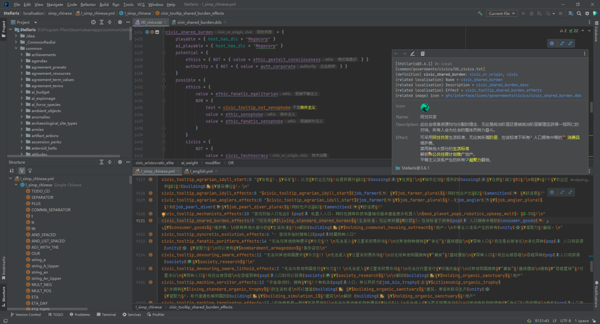

# Paradox Language Support

## 概述

[中文文档](README.md) | [English Documentation](README_en.md)

[GitHub](https://github.com/DragonKnightOfBreeze/Paradox-Language-Support) |
[Reference Documentation](https://windea.icu/Paradox-Language-Support) |
[Plugin Marketplace Page](https://plugins.jetbrains.com/plugin/16825-paradox-language-support) |
[Discord](https://discord.gg/vBpbET2bXT) |
QQ群：653824651

用于编写群星模组（也支持其他P社游戏）的Intellij IDEA插件，智能、便捷且更具潜力。

特性：

- 支持编写模组所使用的脚本语言、本地化语言与CSV语言，以及编写规则文件所使用的CWT语言。
- 提供诸多完备的语言功能，包括代码高亮、代码导航、代码补全、代码检查、代码重构、快速文档、内嵌提示、动态模版、代码层级、图表、差异比较等。
- 支持预览与渲染DDS和TGA图片，提供不同图片格式（PNG、DDS、TGA）之间的相互转换的操作。
- 支持通过快速文档与内嵌提示等方式，渲染各种有用的信息（例如本地化文本、图片、作用域信息和参数信息）。
- 支持脚本语言与本地化语言的多数高级特性（例如参数、作用域、内联脚本和各种复杂表达式）。
- 支持自定义扩展的规则文件，从而允许插件提供更加完善的语言功能（例如代码导航、代码补全、快速文档和内嵌提示）。
- 集成图片工具（如[Image Magick](https://www.imagemagick.org)）、翻译工具（如[Translation Plugin](https://github.com/yiiguxing/TranslationPlugin)）与检查工具（如[Tiger](https://github.com/amtep/tiger)）。
- 初步集成AI技术，可用于翻译和润色本地化文本。
- 自动识别游戏目录和模组目录。

此插件基于由规则文件组成的[规则分组](https://windea.icu/Paradox-Language-Support/zh/config.html#config-group)，实现了诸多语言功能。
插件已经内置了最新版本的规则文件，以便开箱即用。
除此之外，插件也支持[自定义](https://windea.icu/Paradox-Language-Support/zh/config.html#writing-cwt-config-files)与[导入](https://windea.icu/Paradox-Language-Support/zh/config.html#importing-cwt-config-files)规则文件。

## 快速开始

使用：

- 通过 IDE 打开你的模组根目录。
- 打开模组描述符文件，即根目录下的 `descriptor.mod`（对于 VIC3 则是 `.metadata/metadata.json`）。
- 点击位于编辑器右上角的悬浮工具栏中的模组配置按钮。
- 配置模组的游戏类型、游戏目录以及额外的模组依赖。
- 点击确定按钮完成配置，然后等待 IDE 索引完成。
- 开始你的模组编程之旅吧！

提示：

- 如果需要进行全局搜索，请参考以下方式：
  - 点击 `Ctrl Shift R` 或者 `Ctrl Shift F` 在当前项目、目录或者指定作用域中搜索。
  - 点击 `Shift Shift` 查找文件、定义、封装变量以及其他各种符号。
- 如果需要进行代码导航，请参考以下方式：
  - 按住 `Ctrl` 并点击目标位置，从而导航到目标的声明或使用处。
  - 按住 `Ctrl Shift` 并点击目标位置，从而导航到目标的类型声明处。
  - 按住 `Alt` 并点击目标位置，从而导航到目标对应的CWT规则的声明处。
  - 按住 `Shift Alt` 并点击目标位置，从而导航到目标定义的相关本地化的声明处。
  - 按住 `Ctrl Shift Alt` 并点击目标位置，从而导航到目标定义的相关图片的声明处。
  - 点击 `Navigate` 或者编辑器右键菜单中的 `Go To` ，选择要导航到的目标。
  - 点击 `Navigate > Definition Hierarchy`，打开定义层级窗口，从而查看某一类型的定义的实现关系。
  - 点击 `Navigate > Call Hierarchy`，打开调用层级窗口，从而查看定义、本地化、封装变量等的调用关系。
  - 点击 `Alt 1` 或者 `Project` 工具窗口，打开项目面板，然后点击左上角的 `Project > Paradox Files`，从而查看汇总后的游戏与模组文件。
  - 点击 `Alt 1` 或者 `Project` 工具窗口，打开项目面板，然后点击左上角的 `Project > CWT Config Files`，从而查看汇总后的CWT规则文件。
- 如果需要进行全局代码检查，请参考以下方式：
  - 点击 `Alt 6` 或者 `Problems` 工具窗口，打开问题面板，然后查看当前文件存在的问题，或者进行整个项目的全局代码检查。
  - 点击 `Code > Inspect Code...`，进行整个项目的全局代码检查。
  - 完成代码检查后，IDE 将会在问题面板中显示详细的检查结果。
- 如果需要更改模组类型、游戏目录、模组依赖等设置，请通过以下方式之一打开模组设置对话框：
  - 点击 `Settings > Languages & Frameworks > Paradox Language Support`，可配置默认的游戏目录。
  - 点击位于页面右上方的编辑器悬浮工具栏中的蓝色齿轮图标。
  - 在编辑器中打开右键菜单，点击 `Paradox Language Support > Open Mod Settings...`。
  - 点击 `Tools > Paradox Language Support > Open Mod Settings...`。
- 如果需要更改插件的全局设置，请参考以下方式：
  - 点击 `Settings > Languages & Frameworks > Paradox Language Support`，打开插件的设置页面。
- 如果在使用过程中遇到意外问题，请尝试通过以下方式解决：
  - 更新 IDE 和插件到最新版本。
  - 如果可能与 IDE 索引有关，请尝试重建索引并重启 IDE。（点击 `File > Invalidate Caches... > Invalidate and Restart`）
  - 如果可能与插件内置的规则有关，请尝试[编写自定义的规则文件](https://windea.icu/Paradox-Language-Support/zh/config.html#writing-cwt-config-files)。
  - 如果可能与插件的配置有关，请尝试删除插件的配置文件。（`paradox-language-support.xml`，如果不知道具体位置，请使用 [Everything](https://www.voidtools.com)）
  - 通过 GitHub、Discord 等渠道进行反馈。

已知问题：

- 对 Stellaris 的某些黑魔法般的语言特性的支持尚不完善。
- 对 Stellaris 以外的游戏的支持尚不完善。

## 参考

参考手册：

- [Kotlin Docs | Kotlin Documentation](https://kotlinlang.org/docs/home.html)
- [Getting started | IntelliJ IDEA Documentation](https://www.jetbrains.com/help/idea/getting-started.html)
- [IntelliJ Platform SDK | IntelliJ Platform Plugin SDK](https://plugins.jetbrains.com/docs/intellij/welcome.html)
- [JFlex - manual](https://www.jflex.de/manual.html)

插件：

- [YiiGuxing/TranslationPlugin](https://github.com/YiiGuxing/TranslationPlugin)

工具：

- [cwtools/cwtools](https://github.com/cwtools/cwtools)
- [cwtools/cwtools-vscode](https://github.com/cwtools/cwtools-vscode)
- [bcssov/IronyModManager](https://github.com/bcssov/IronyModManager)
- [amtep/ck3-tiger](https://github.com/amtep/ck3-tiger)
- [OldEnt/stellaris-triggers-modifiers-effects-list](https://github.com/OldEnt/stellaris-triggers-modifiers-effects-list)

Wikis：

- [Stellaris Wiki](https://stellaris.paradoxwikis.com/Stellaris_Wiki)
- [群星中文维基 | Stellaris 攻略资料指南 - 灰机wiki](https://qunxing.huijiwiki.com/wiki/%E9%A6%96%E9%A1%B5)

## 贡献

你可以通过下面这些方式支持与赞助这个项目：

- 在GitHub上收藏此项目
- 提交反馈（通过[Discord](https://discord.gg/vBpbET2bXT)与QQ群，或者直接在GitHub上提交Issue）
- 提交PR（向插件仓库即此项目，或是[各个规则仓库](https://github.com/DragonKnightOfBreeze/Paradox-Language-Support/blob/master/cwt/README.md)）
- 向朋友或者在相关社区中推荐这个插件
- 如果你喜欢这个插件，也可以考虑通过[爱发电](https://afdian.com/a/dk_breeze)提供赞助

另外，如果你有意愿提交PR，而就插件代码与规则文件有任何问题的话，欢迎通过邮件与[Discord](https://discord.gg/vBpbET2bXT)等方式询问。