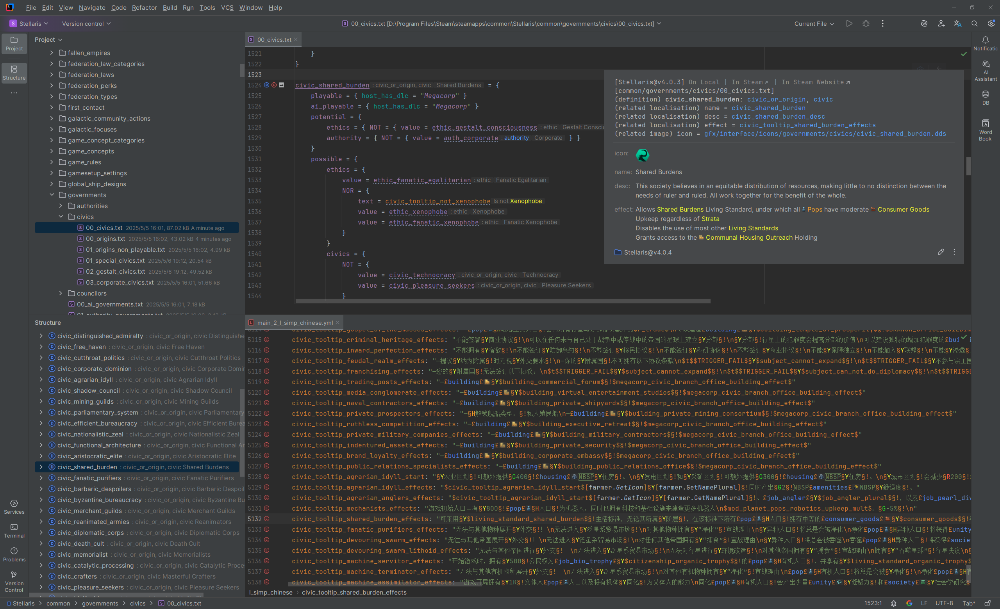

# Paradox Language Support

## Overview

Paradox Language Support (PLS) is the IntelliJ IDEA plugin designed specifically for Paradox game mod developers, which provides an intelligent, efficient and feature-rich development experience to help you easily achieve creativity.

**Core Features:**

- **Multi-Language Support**: Full support for the script language, localization language and CSV language used in mod development, as well as the CWT language for writing configs.
- **Rich Language Features**: Provides syntax highlighting, code navigation, code completion, code inspection, code refactoring, quick documentation, inlay hints, live templates, code hierarchy, diagrams, diff viewing and many other features.
- **Image Processing**: Supports previewing and rendering DDS and TGA images, and allows conversion between different image formats (PNG, DDS and TGA).
- **Enhanced Information Hints**: Displays key information such as localisation text, images, scopes, and parameters intuitively through quick documentation and inlay hints.
- **Advanced Language Features Support**: Compatible with various advanced features in script and localization languages, including parameters, scopes, inline scripts and complex expressions.
- **Extensible Config System**: Supports customizing and importing config files to enhance features like code navigation, code completion and documentation hints.
- **Tool Integrations**: Integrates practical tools like [Image Magick](https://www.imagemagick.org), [Translation Plugin](https://github.com/yiiguxing/TranslationPlugin) and [Tiger](https://github.com/amtep/tiger) to boost development efficiency.
- **AI Assistance**: Preliminary integration of AI technology for translating and polishing localisation text.
- **Directory Detection**: Automatically detects game and mod directories, reducing manual configuration.

PLS implements its core language features based on its own [config system](https://windea.icu/Paradox-Language-Support/en/config.html). The CWT config files it uses adhere to the same syntax and format as [CWTools](https://github.com/cwtools/cwtools), with certain improvements and extensions. The plugin comes with the latest built-in configs, ready to use out-of-the-box. It also supports to [customize](https://windea.icu/Paradox-Language-Support/en/config.html#write-cwt-config-files) and [import](https://windea.icu/Paradox-Language-Support/en/config.html#import-cwt-config-files) config files to meet personalized development needs.

## Getting Started

**Usage Steps:**

1. Open your mod's root directory in the IDE.
2. Open the mod descriptor file (`descriptor.mod`, or `.metadata/metadata.json` for VIC3).
3. Click the *Mod Settings* button in the floating toolbar at the top right of the editor.
4. Configure the mod's game type, game directory, and required mod dependencies.
5. Confirm the configuration and wait for the IDE to finish indexing.
6. Begin your mod development voyage!

**Practical Tips:**

- **Global Search**:
  - Use `Ctrl + Shift + R` or `Ctrl + Shift + F` to search within the current project, directory, or a specified scope.
  - Use `Shift + Shift` (Search Everywhere) to quickly find files, definitions, scripted variables, and other symbols.
- **Code Navigation**:
  - Use `Ctrl + Click` to jump to the declaration or usage of a target.
  - Use `Ctrl + Shift + Click` to jump to the type declaration of a target.
  - Use `Alt + Click` to jump to the declaration of the relevant config for a target.
  - Use `Shift + Alt + Click` to jump to the declaration of the relevant localization for a target.
  - Use `Ctrl + Shift + Alt + Click` to jump to the declaration of the relevant image for a target.
  - Use the `Navigate` menu (or the `Go To` option in the editor's right-click menu) for quick navigation.
  - Use `Navigate > Definition Hierarchy` to open the type hierarchy window and view definitions of specific types.
  - Use `Navigate > Call Hierarchy` to open the call hierarchy window and view the call relationships of definitions, localizations, scripted variables, etc.
  - Select the `Paradox Files` view in the project panel to browse aggregated game and mod files.
  - Select the `CWT Config Files` view in the project panel to browse aggregated config files.
- **Code Inspection**:
  - View issues in the current file within the Problems panel.
  - Use `Code > Inspect Code…` to perform a global code inspection and view the detailed report in the Problems panel upon completion.
- **Modifying Settings**:
  - Access the plugin's global settings page via:
    - `Settings > Languages & Frameworks > Paradox Language Support`
  - Open the mod settings dialog via:
    - Clicking the blue gear icon in the editor's top-right floating toolbar.
    - Selecting `Paradox Language Support > Open Mod Settings...` from the editor's right-click menu.
    - Selecting `Tools > Paradox Language Support > Open Mod Settings...` from the main menu.
  - Modify preferred locale, default game type, default game directory and other functional details in the global settings.
  - Adjust game directory, mod dependencies and other configurations in the mod settings.
- **Troubleshooting**:
  - Ensure both the IDE and the plugin are updated to the latest versions.
  - If the issue might be index-related, try to [invalidate caches and restart the IDE](https://www.jetbrains.com/help/idea/invalidate-caches.html).
  - If the issue might be config-related, try to [write custom config files](https://windea.icu/Paradox-Language-Support/en/config.html#write-cwt-config-files).
  - If the issue might be plugin configuration-related, try deleting the plugin's configuration file (`paradox-language-support.xml`, recommended to locate using [Everything](https://www.voidtools.com)).
  - Feedback is welcome through GitHub, Discord and other channels.

**Known Limitations:**

- Support for some complex language features in Stellaris is still being improved.
- Support for unique language features in non-Stellaris games is not yet complete. Feedback and contributions are welcome.
- Currently, only Stellaris and Victoria 3 have relatively comprehensive built-in config files. Pull Requests are welcome.

## Technical Details

- Built on the IntelliJ Platform SDK, developed with Kotlin, and utilizes [PSI](https://plugins.jetbrains.com/docs/intellij/psi.html) (rather than [LSP](https://microsoft.github.io/language-server-protocol)) for deep language parsing and manipulation.
- Uses BNF for grammar parsing and JFlex for lexical analysis.
- Employs an extension point mechanism for dynamic functional expansion, facilitating customization and enhancement of plugin behavior by both the plugin itself and mod developers.
- Includes a built-in custom code injectors for achieving IDE features that cannot be accomplished by conventional means.
- Integrates image processing, translation and lint tools to optimize and extend plugin capabilities.
- Preliminary integration of AI technology for translating and polishing localisation text.

## Reference Links

**Official Documentation:**

- [Kotlin Docs | Kotlin Documentation](https://kotlinlang.org/docs/home.html)
- [Getting started | IntelliJ IDEA Documentation](https://www.jetbrains.com/help/idea/getting-started.html)
- [IntelliJ Platform SDK | IntelliJ Platform Plugin SDK](https://plugins.jetbrains.com/docs/intellij/welcome.html)
- [LangChain4j | LangChain4j](https://docs.langchain4j.dev/)

**Tools & Plugins:**

- [YiiGuxing/TranslationPlugin: Translation plugin for IntelliJ-based IDEs/Android Studio.](https://github.com/YiiGuxing/TranslationPlugin)
- [cwtools/cwtools: A library for parsing, editing, and validating Paradox Interactive script files.](https://github.com/cwtools/cwtools)
- [cwtools/cwtools-vscode: A VS Code extension providing language server support for paradox script files using cwtools](https://github.com/cwtools/cwtools-vscode)
- [bcssov/IronyModManager: Mod Manager for Paradox Games. Official Discord: https://discord.gg/t9JmY8KFrV](https://github.com/bcssov/IronyModManager)
- [amtep/tiger: Checks game mod files for common mistakes and warns about them. Supports Crusader Kings 3, Victoria 3, and Imperator: Rome.](https://github.com/amtep/tiger)
- [OldEnt/stellaris-triggers-modifiers-effects-list: List of Stellaris triggers, modifiers and effects for most game versions since launch.](https://github.com/OldEnt/stellaris-triggers-modifiers-effects-list)

**Game Wikis:**

- [Stellaris Wiki](https://stellaris.paradoxwikis.com/Stellaris_Wiki)
- [群星中文维基 | Stellaris 攻略资料指南 - 灰机wiki](https://qunxing.huijiwiki.com/wiki/%E9%A6%96%E9%A1%B5) (Stellaris Chinese Wiki)

## Contribution & Support

We welcome all forms of support and contribution, including but not limited to:

- ⭐ Star the project on GitHub.
- 🐛 Submit feedback and issues (via [Discord](https://discord.gg/vBpbET2bXT) or [GitHub Issues](https://github.com/DragonKnightOfBreeze/Paradox-Language-Support/issues)).
- 🔧 Submit code or config file Pull Requests (can be submitted to the [plugin repository](https://github.com/DragonKnightOfBreeze/Paradox-Language-Support) (this project) or to the [config repositories](https://github.com/DragonKnightOfBreeze/Paradox-Language-Support/blob/master/cwt/README.md)).
- 📢 Recommend this plugin to friends or in the community.
- 💝 Sponsor the project via [Afdian](https://afdian.com/a/dk_breeze).

If you are interested in submitting a PR but have any questions about plugin development or config writing, please feel free to contact us via email or [Discord](https://discord.gg/vBpbET2bXT)!