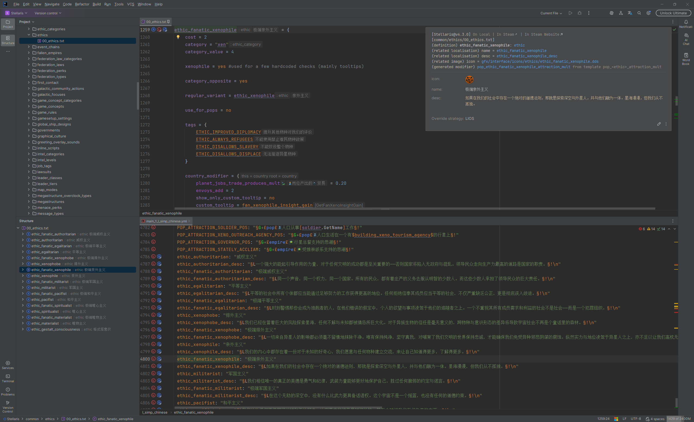

# Paradox Language Support

### -— The Paradox Chronicle Project

<!-- Here we carve the whispers from the old era, concerning the truths and realities of this land. -->

[![中文文档][badge:doc-zh]](README_zh.md)
[![English Documentation][badge:doc-en]](README.md)
[![参考文档][badge:doc-ref]][url:doc-ref]
[![Discord][badge:discord]][url:discord]
[![群聊][badge:qq-group]][url:qq-group]
 
[![GitHub][badge:github]][url:github]
[![Release][badge:release]][url:release]
[![License][badge:license]][url:license]
[![Plugin Homepage][badge:plugin-homepage]][url:plugin-homepage]
[![Plugin Version][badge:plugin-version]][url:plugin-versions]
[![Plugin Downloads][badge:plugin-downloads]][url:plugin-homepage]
[![Plugin Rating][badge:plugin-rating]][url:plugin-homepage]
 
[![Supported by JetBrains][badge:jetbrains]][url:jetbrains]

## 概述

Paradox Language Support 是专为 Paradox 游戏模组开发者设计的 IntelliJ IDEA 插件，提供智能、高效且功能全面的开发体验，助你轻松实现创意。

**核心特性：**

- **多语言支持**：完整支持模组开发所需的脚本语言、本地化语言与 CSV 语言，以及用于编写规则的 CWT 语言。
- **丰富的语言功能**：提供代码高亮、代码导航、代码补全、代码检查、代码重构、快速文档、内嵌提示、动态模板、代码层级、差异比较和图表等多项功能。
- **图像处理**：支持预览与渲染 DDS 和 TGA 图片，并可在不同图片格式（PNG、DDS、TGA）之间互相转换。
- **信息增强提示**：通过快速文档和内嵌提示，直观展示本地化文本、图片、作用域和参数等关键信息。
- **高级语言特性支持**：兼容脚本与本地化语言中的多种高级特性，包括参数、作用域、复杂表达式、内联脚本和定义注入等。
- **可扩展的规则系统**：支持自定义和导入规则文件，强化代码导航、代码补全、文档提示等功能。
- **工具集成**：集成 [Image Magick](https://www.imagemagick.org)、[Translation Plugin](https://github.com/yiiguxing/TranslationPlugin)、[Tiger](https://github.com/amtep/tiger) 等实用工具，提升开发效率。
- **AI 辅助**：初步集成 AI 技术，可用于本地化文本的翻译与润色。
- **目录检测**：自动检测游戏目录与模组目录。

插件基于自身的[规则系统](https://windea.icu/Paradox-Language-Support/zh/config.html)实现核心语言功能。
其所使用的 CWT 规则文件与 [CWTools](https://github.com/cwtools/cwtools) 遵循基本一致的语法与格式，并进行了一定的改进与扩展。
插件内置最新版本规则，开箱即用，同时也支持[自定义](https://windea.icu/Paradox-Language-Support/zh/config.html#write-config-files)与[导入](https://windea.icu/Paradox-Language-Support/zh/config.html#import-config-files)规则文件，满足个性化开发需求。

## 安装

**使用 IDE 内置插件系统**

`Settings/Preferences` > `Plugins` > `Marketplace` > 搜索 "Paradox Language Support" > `Install`

**使用 JetBrains Marketplace**

前往 [JetBrains Marketplace][url:plugin-homepage]，点击 `Install to ...` 按钮进行安装。

**手动安装**

下载[最新版本][url:release-latest]并手动安装（无需解压）：`Settings/Preferences` > `Plugins` > `⚙️` > `Install plugin from disk...`

## 快速开始

**使用步骤：**

1. 在 IDE 中打开你的模组根目录。
2. 打开模组描述符文件（`descriptor.mod`，VIC3 和 EU5 中为 `.metadata/metadata.json`）。
3. 点击编辑器右上角的悬浮工具栏中的模组设置按钮。
4. 配置模组的游戏类型、游戏目录及所需的模组依赖。
5. 确认配置，等待 IDE 完成索引。
6. 开启你的模组开发之旅。

**实用技巧：**

- **全局搜索**：
  - 使用 `Ctrl + Shift + R` 或 `Ctrl + Shift + F` 在当前项目、目录或指定查询作用域中搜索。
  - 使用 `Shift + Shift` 快速查找文件、定义、封装变量及其他符号。
- **代码导航**：
  - 使用 `Ctrl + 点击` 跳转到目标的声明或使用位置。
  - 使用 `Ctrl + Shift + 点击` 跳转到目标的类型声明。
  - 使用 `Alt + 点击` 跳转到目标的相关规则的声明。
  - 使用 `Shift + Alt + 点击` 跳转到目标相关本地化的声明。
  - 使用 `Ctrl + Shift + Alt + 点击` 跳转到目标的相关图片的声明。
  - 通过 `Navigate` 菜单（或者编辑器右键菜单中的 `Go To` 选项）快速定位。
  - 使用 `Navigate > Definition Hierarchy` 打开定义的类型层级窗口，从而查看特定类型的定义。
  - 使用 `Navigate > Call Hierarchy` 打开定义的调用层级窗口，从而查看定义、本地化、封装变量等的调用关系。
  - 在项目面板中选择 `Paradox Files` 视图，浏览汇总后的游戏与模组文件。
  - 在项目面板中选择 `CWT Config Files` 视图，浏览汇总后的规则文件。
- **代码检查**：
  - 在问题面板中查看当前文件的问题。
  - 使用 `Code > Inspect Code…` 执行全局代码检查，并在问题面板中查看详细报告。
- **设置修改**：
  - 可通过以下方式打开插件的全局设置页面：
    - 点击设置页面中的 `Languages & Frameworks > Paradox Language Support`。
  - 可通过以下方式打开模组设置对话框：
    - 点击编辑器右上角的悬浮工具栏中的蓝色齿轮图标。
    - 点击编辑器右键菜单中的 `Paradox Language Support > Open Mod Settings...`。
    - 点击主菜单中的 `Tools > Paradox Language Support > Open Mod Settings...`。
  - 可在全局设置中修改偏好语言环境、默认游戏类型、默认游戏目录等配置，以及其他功能细节。
  - 可在模组设置中调整游戏目录、模组依赖等配置。
- **问题排查**：
  - 确保 IDE 和插件均为最新版本。
  - 如果问题可能与索引有关，可尝试[清除缓存并重启 IDE](https://www.jetbrains.com/help/idea/invalidate-caches.html)。
  - 如果问题可能与规则有关，可尝试[编写自定义的规则文件](https://windea.icu/Paradox-Language-Support/zh/config.html#write-config-files)。
  - 如果问题可能与插件配置有关，可尝试删除插件的配置文件（`paradox-language-support.xml`，推荐使用 [Everything](https://www.voidtools.com) 搜索定位）。
  - 欢迎通过 GitHub、Discord 等渠道反馈问题。

**已知限制：**

- 插件对脚本文件与本地化文件的部分复杂语言特性的支持尚不完整，并仍在完善中，欢迎反馈。
- 插件内置的规则文件仍需持续完善，并随游戏版本更新而持续维护更新，欢迎反馈与贡献。

## 技术细节

- 基于 IntelliJ Platform SDK 构建，采用 Kotlin 开发，基于 [PSI](https://plugins.jetbrains.com/docs/intellij/psi.html)（而非 [LSP](https://microsoft.github.io/language-server-protocol)）实现深度的语言解析与操作。
- 使用 BNF 进行语法解析，JFlex 进行词法分析。
- 通过扩展点机制实现功能的动态扩展，便于插件自身及模组开发者定制与增强插件行为。
- 内置自定义的代码注入器，用于实现常规手段无法达成的 IDE 功能。
- 内置与图片处理、翻译和检查工具的集成，以优化和扩展插件能力。
- 初步集成 AI 技术，为本地化文本提供翻译和润色支持。

## 参考链接

**官方文档：**

- [Kotlin Docs | Kotlin Documentation](https://kotlinlang.org/docs/home.html)
- [Getting started | IntelliJ IDEA Documentation](https://www.jetbrains.com/help/idea/getting-started.html)
- [IntelliJ Platform SDK | IntelliJ Platform Plugin SDK](https://plugins.jetbrains.com/docs/intellij/welcome.html)
- [LangChain4j | LangChain4j](https://docs.langchain4j.dev/)

**工具与插件：**

- [cwtools/cwtools: A library for parsing, editing, and validating Paradox Interactive script files.](https://github.com/cwtools/cwtools)
- [cwtools/cwtools-vscode: A VS Code extension providing language server support for paradox script files using cwtools](https://github.com/cwtools/cwtools-vscode)
- [bcssov/IronyModManager: Mod Manager for Paradox Games. Official Discord: https://discord.gg/t9JmY8KFrV](https://github.com/bcssov/IronyModManager)
- [amtep/tiger: Checks game mod files for common mistakes and warns about them. Supports Crusader Kings 3, Victoria 3, and Imperator: Rome.](https://github.com/amtep/tiger)
- [nickbabcock/jomini: Parses Paradox files into javascript objects](https://github.com/nickbabcock/jomini)
- [OldEnt/stellaris-triggers-modifiers-effects-list: List of Stellaris triggers, modifiers and effects for most game versions since launch.](https://github.com/OldEnt/stellaris-triggers-modifiers-effects-list)
- [YiiGuxing/TranslationPlugin: Translation plugin for IntelliJ-based IDEs/Android Studio.](https://github.com/YiiGuxing/TranslationPlugin)

**教程与百科：**

- [Stellaris Wiki](https://stellaris.paradoxwikis.com/Stellaris_Wiki)
- [群星中文维基 | Stellaris 攻略资料指南 - 灰机wiki](https://qunxing.huijiwiki.com/wiki/%E9%A6%96%E9%A1%B5)
- [Stellaris Mod 教程](https://main--pdxdoc-next.netlify.app)

## 贡献与支持

欢迎任何形式的贡献与支持，包括但不限于：

- ⭐ 在 GitHub 上收藏项目。
- 🐛 提交问题反馈（通过 [Discord][url:discord]、[群聊][url:qq-group] 或 [GitHub Issues][url:issues]）。
- 🔧 提交 Pull Request（提交至[插件仓库][url:github]（即此项目），或者[各个规则仓库](https://github.com/DragonKnightOfBreeze/Paradox-Language-Support/blob/master/cwt/README.md)）。
- 📢 向朋友或社区推荐本插件。
- 💝 通过[爱发电][url:afdian]赞助项目。

如果你对提交 PR 感兴趣，但就插件开发或规则编写有任何疑问，欢迎通过[邮件][mailto]或 [Discord][url:discord] 进行联系。

## 致谢

### Powered by

[plugin-logo]: https://github.com/DragonKnightOfBreeze/Paradox-Language-Support/blob/master/pluginIcon.svg

[badge:doc-zh]: https://img.shields.io/badge/中文文档-2f89d7.svg
[badge:doc-en]: https://img.shields.io/badge/English%20Documentation-2f89d7.svg
[badge:doc-ref]: https://img.shields.io/badge/参考文档-2f89d7.svg
[badge:github]: https://img.shields.io/badge/GitHub-blue.svg?logo=github
[badge:release]: https://img.shields.io/github/release/DragonKnightOfBreeze/Paradox-Language-Support.svg?sort=semver
[badge:license]: https://img.shields.io/github/license/DragonKnightOfBreeze/Paradox-Language-Support.svg
[badge:plugin-homepage]: https://img.shields.io/badge/Plugin%20Homepage-orange.svg?logo=jetbrains
[badge:plugin-version]: https://img.shields.io/jetbrains/plugin/v/16825.svg?label=version
[badge:plugin-downloads]: https://img.shields.io/jetbrains/plugin/d/16825.svg
[badge:plugin-rating]: https://img.shields.io/jetbrains/plugin/r/rating/16825.svg
[badge:discord]: https://img.shields.io/badge/Discord-社区-blue.svg?logo=discord
[badge:qq-group]: https://img.shields.io/badge/群聊-653824651-blue.svg?logo=qq
[badge:jetbrains]: https://img.shields.io/badge/Supported%20by-JetBrains-000000.svg?style=flat&logo=jetbrains

[url:doc-ref]: https://windea.icu/Paradox-Language-Support
[url:github]: https://github.com/DragonKnightOfBreeze/Paradox-Language-Support
[url:issues]: https://github.com/DragonKnightOfBreeze/Paradox-Language-Support/issues
[url:release]: https://github.com/DragonKnightOfBreeze/Paradox-Language-Support/rleeases
[url:release-latest]: https://github.com/DragonKnightOfBreeze/Paradox-Language-Support/rleeases/latest
[url:license]: https://github.com/DragonKnightOfBreeze/Paradox-Language-Support/blob/master/LICENSE
[url:plugin-homepage]: https://plugins.jetbrains.com/plugin/16825-paradox-language-support
[url:plugin-versions]: https://plugins.jetbrains.com/plugin/16825-paradox-language-support/versions
[url:discord]: https://discord.gg/vBpbET2bXT
[url:qq-group]: https://qm.qq.com/q/oRPgLwrTZm
[url:afdian]: https://afdian.com/a/dk_breeze
[url:jetbrains]: https://jb.gg/OpenSource

[mailto]: mailto:dk_breeze@qq.com