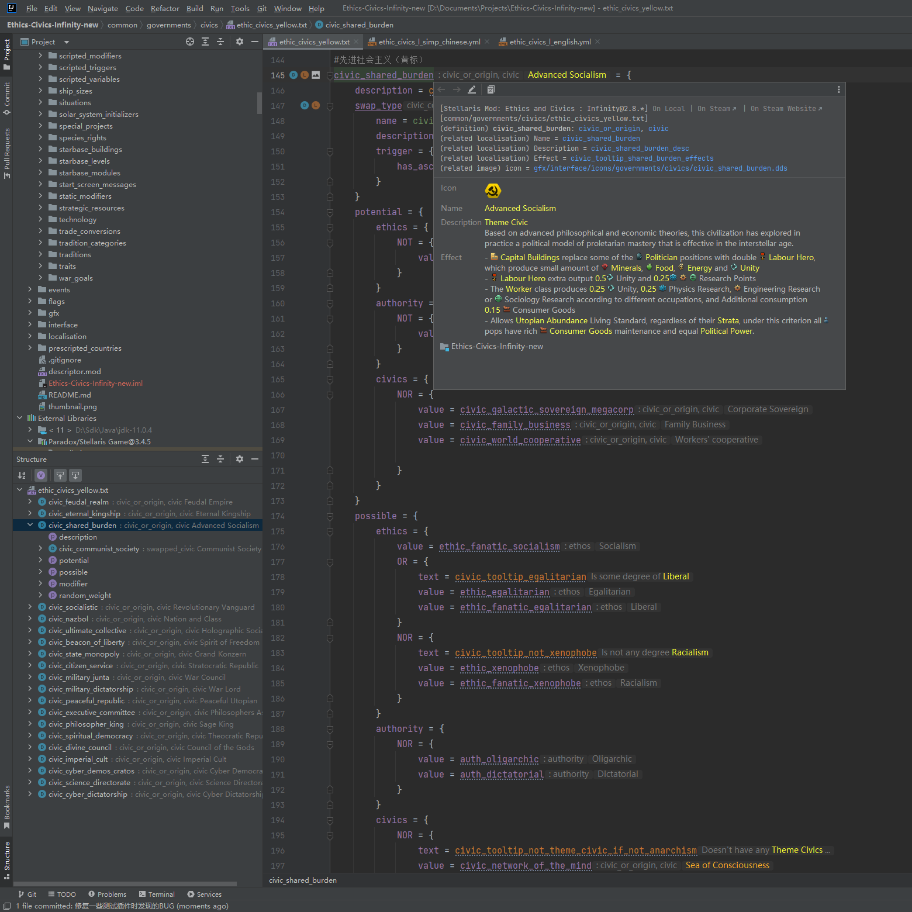
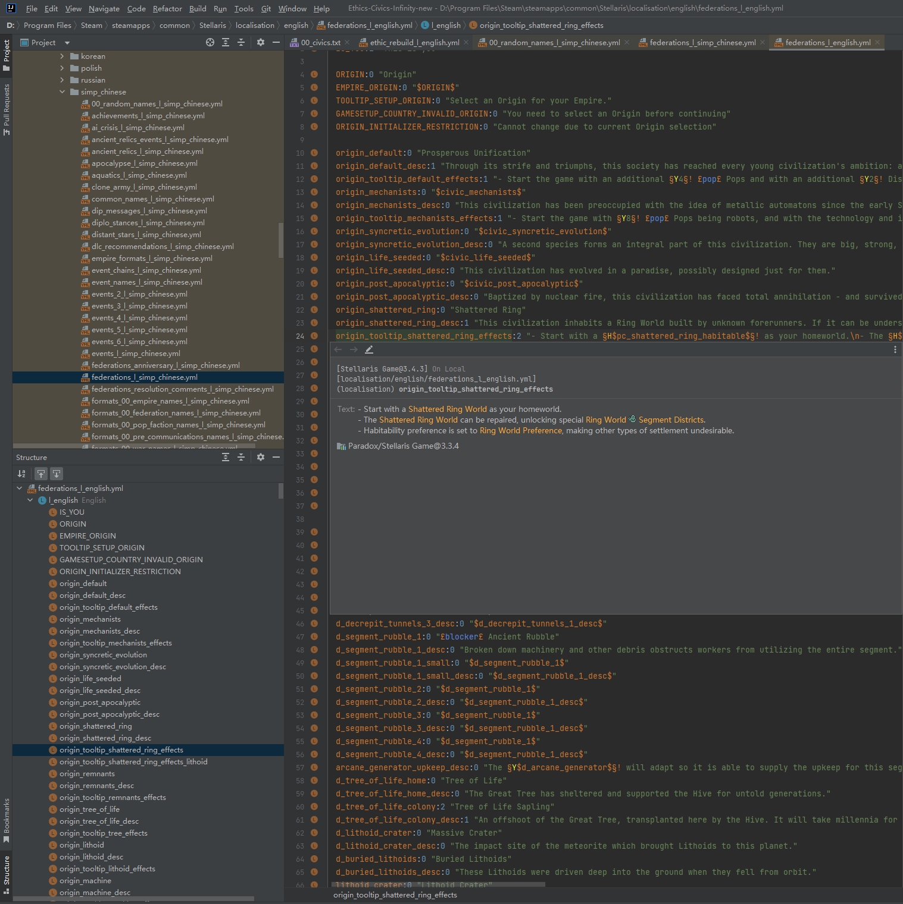

# Summary

[Github](https://github.com/DragonKnightOfBreeze/Paradox-Language-Support)

[Plugin Marketplace Page](https://plugins.jetbrains.com/plugin/16825-paradox-language-support)

IDEA Plugin: Support for Paradox Language.

Provider syntax parsing, code validation, code completion, navigation, documentation, inlay hints,
localisation text rendering, DDS image rendering and many other functions for
paradox script language (mainly `*.txt` files) and paradox localisation language (`*.yml` files).
Also provider such functions for cwt language (`*.cwt` files),
and some convenient functions for DDS image files.

Enable language support by create the descriptor file `descriptor.mod` in the root directory of your Mod,
and can import game directory and third party mod as dependencies
by adding related libraries to the module of your Mod in the `Project Structure` page.

This plugin is under developing, some complex functions may not be implemented yet,
some functions, like code validation, code completion, may work incorrectly, and may cause unexpected bugs.
The plugin has not yet been fully debugged and validated for Paradox games except Stellaris,
due to the possible necessity to write specific parsers, rule files and so on,
when write a mod for other Paradox games, this plugin may cause unexpected bugs.
If you want more perfect script language support, or write a mod for Paradox games except Stellaris,  
please consider using [VSCode](https://code.visualstudio.com) with [CWTools](https://github.com/cwtools/cwtools-vscode) plugin.

This plugin shares rule files (`*.cwt`) with [CWTools](https://github.com/cwtools/cwtools-vscode), but related functions has not been fully implemented yet.
These rule files are currently build-in provided by this plugin, with some modifications and extensions, and will be automatically synchronized to the latest version when published.

By also install [Translation](https://github.com/YiiGuxing/TranslationPlugin), this plugin will provide [additional functions](https://windea.icu/Paradox-Language-Support/#/end/plugin-integration.md)。

Introduction:

* Create the descriptor file `descriptor.mod` in the root directory of your Mod to provide language support.
* Create the mark file `.${gameType}` in the root directory of your Mod to specify game type. (e.g. `.stellaris`)  
* Supported game types: ck2 / ck3 / eu4 / hoi4 / ir / stellaris / vic2.
* Supported paradox games: Crusader Kings II / Crusader Kings III / Europa Universalis IV / Hearts of Iron IV / Imperator: Rome / Stellaris / Victoria II.

Tips:

* If you want to add game directory and third party mod as dependencies, just add them as libraries to the project module of your mod, like what Java and Kotlin does.
* If you have met some IDE problems about indices, please try to rebuild indices. (Click `File -> Invalidate Caches... -> Invalidate and Restart`)

# Reference

Tools and plugins:

* [cwtools/cwtools](https://github.com/cwtools/cwtools)
* [cwtools/cwtools-vscode](https://github.com/cwtools/cwtools-vscode)
* [OldEnt/stellaris-triggers-modifiers-effects-list](https://github.com/OldEnt/stellaris-triggers-modifiers-effects-list)
* [vincentzhang96/DDS4J](https://github.com/vincentzhang96/DDS4J)
* [YiiGuxing/TranslationPlugin](https://github.com/YiiGuxing/TranslationPlugin)

Wiki:

* [Stellaris Wiki](https://stellaris.paradoxwikis.com/Stellaris_Wiki)
* [群星中文维基 | Stellaris 攻略资料指南 - 灰机wiki](https://qunxing.huijiwiki.com/wiki/%E9%A6%96%E9%A1%B5)
