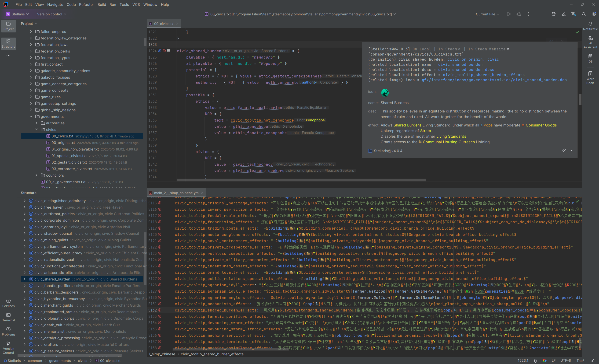

# Introduce

## Summary

[GitHub](https://github.com/DragonKnightOfBreeze/Paradox-Language-Support) |
[Plugin Marketplace Page](https://plugins.jetbrains.com/plugin/16825-paradox-language-support) |
[Discord](https://discord.gg/vBpbET2bXT)

The Intellij IDEA plugin for Stellaris modding (also supports other Paradox Interactive games), which is smart, convenient and with more potential.

Features:

- Supports the script language, localisation language and csv languages used to write mods, and the CWT language used to write config files.
- Provides a wide range of powerful language features. Including code highlight, code navigation, code completion, code inspection, code refactoring, quick documentation, inlay hints, live templates, code hierarchy, diagram, diff and more.
- Supports previewing and rendering DDS and TGA pictures, and provides actions to convert image formats (PNG, DDS, TGA).
- Supports rendering various useful information via quick documentation and inlay hints (such as localisation text, image, scope information and parameter information).
- Supports most advanced features of script and localisation languages (such as parameters, scopes, inline scripts and various complex expressions).
- Supports customizing extended config files, allowing plugin to provide more perfect language features (such as code navigation, code completion, quick documentation and inlay hints).
- Integrates image tools (such as [Image Magick](https://www.imagemagick.org)), translation tools (such as [Translation Plugin](https://github.com/yiiguxing/TranslationPlugin)) and linting tools (such as [Tiger](https://github.com/amtep/tiger)).
- Integrates AI technologies initially, make it available to translating and polishing localisation text.
- Recognizes game directories and mod directories automatically.

This plugin has implemented various advanced language features based on [config groups](config.md#config-group), which consists of CWT config files.
The latest-version config files are already built into this plugin, make it works right out of the box.
Besides, [customizing](config.md#writing-cwt-config-files) and [importing](config.md#importing-cwt-config-files) local config files are also supported.

## References

Reference manuals:

- [Kotlin Docs | Kotlin Documentation](https://kotlinlang.org/docs/home.html)
- [Getting started | IntelliJ IDEA Documentation](https://www.jetbrains.com/help/idea/getting-started.html)
- [IntelliJ Platform SDK | IntelliJ Platform Plugin SDK](https://plugins.jetbrains.com/docs/intellij/welcome.html)
- [JFlex - manual](https://www.jflex.de/manual.html)

Plugins:

- [YiiGuxing/TranslationPlugin](https://github.com/YiiGuxing/TranslationPlugin)

Tools:

- [cwtools/cwtools](https://github.com/cwtools/cwtools)
- [cwtools/cwtools-vscode](https://github.com/cwtools/cwtools-vscode)
- [bcssov/IronyModManager](https://github.com/bcssov/IronyModManager)
- [amtep/ck3-tiger](https://github.com/amtep/ck3-tiger)
- [OldEnt/stellaris-triggers-modifiers-effects-list](https://github.com/OldEnt/stellaris-triggers-modifiers-effects-list)

Wikis:

- [Stellaris Wiki](https://stellaris.paradoxwikis.com/Stellaris_Wiki)
- [群星中文维基 | Stellaris 攻略资料指南 - 灰机wiki](https://qunxing.huijiwiki.com/wiki/%E9%A6%96%E9%A1%B5)
