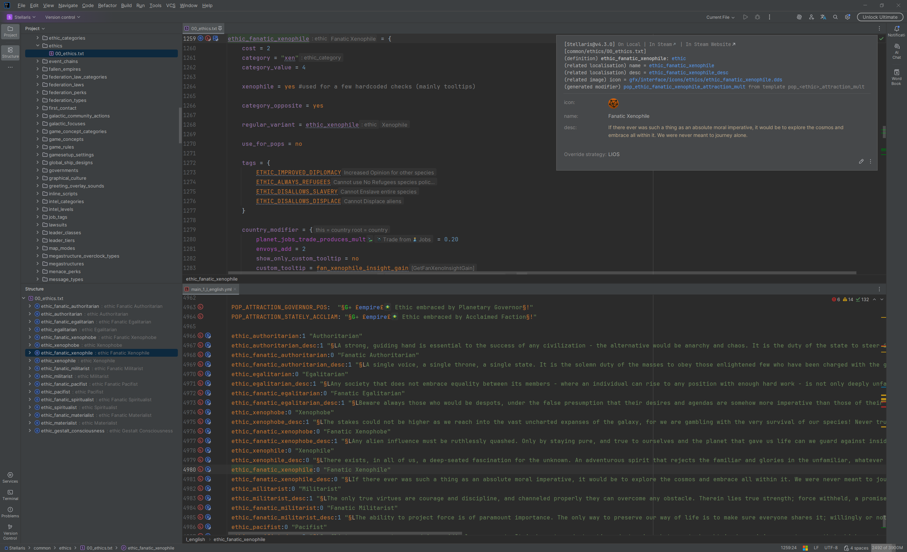

# Introduce

[GitHub](https://github.com/DragonKnightOfBreeze/Paradox-Language-Support) |
[Plugin Marketplace Page](https://plugins.jetbrains.com/plugin/16825-paradox-language-support) |
[Discord](https://discord.gg/vBpbET2bXT)

## Overview

Paradox Language Support is the IntelliJ IDEA plugin designed for Paradox game mod developers, which provides an intelligent, efficient and feature-rich development experience to help you easily achieve creativity.

**Core Features:**

- **Multi-Language Support**: Full support for the script language, localization language and CSV language used in mod development, as well as the CWT language for writing configs.
- **Rich Language Features**: Provides code highlighting, code navigation, code completion, code inspection, code refactoring, quick documentation, inlay hints, live templates, code hierarchy, diff viewing, diagrams and many other features.
- **Image Processing**: Supports previewing and rendering DDS and TGA images, and allows conversion between different image formats (PNG, DDS and TGA).
- **Enhanced Information Hints**: Displays key information such as localisation text, images, scopes, and parameters intuitively through quick documentation and inlay hints.
- **Advanced Language Features Support**: Compatible with various advanced features in script and localization languages, including parameters, scopes, complex expressions, inline scripts, definition injections, etc.
- **Extensible Config System**: Supports customizing and importing config files to enhance features like code navigation, code completion and documentation hints.
- **Tool Integrations**: Integrates practical tools like [Image Magick](https://www.imagemagick.org), [Translation Plugin](https://github.com/yiiguxing/TranslationPlugin) and [Tiger](https://github.com/amtep/tiger) to boost development efficiency.
- **AI Assistance**: Preliminary integration of AI technology for translating and polishing localisation text.
- **Directory Detection**: Automatically detects game and mod directories.

The plugin implements its core language features based on its own [config system](config.md).
The CWT config files it uses follow basically the same syntax and format as [CWTools](https://github.com/cwtools/cwtools), with certain improvements and extensions.
The plugin comes with the latest built-in configs, ready to use out-of-the-box. It also supports to [customize](config.md#write-config-files) and [import](config.md#import-config-files) config files to meet personalized development needs.

## Installation

**Using the IDE built-in plugin system**

`Settings/Preferences` > `Plugins` > `Marketplace` > Search for "Paradox Language Support" > `Install`

**Using JetBrains Marketplace**

Go to [JetBrains Marketplace][url:plugin-homepage] and install it by clicking the `Install to ...` button.

**Manual Installation**

Download the [latest release][url:release-latest] and install it manually (No need to unzip): `Settings/Preferences` > `Plugins` > `⚙️` > `Install plugin from disk...`

## Reference Links

**Official Documentation:**

- [Kotlin Docs | Kotlin Documentation](https://kotlinlang.org/docs/home.html)
- [Getting started | IntelliJ IDEA Documentation](https://www.jetbrains.com/help/idea/getting-started.html)
- [IntelliJ Platform SDK | IntelliJ Platform Plugin SDK](https://plugins.jetbrains.com/docs/intellij/welcome.html)
- [LangChain4j | LangChain4j](https://docs.langchain4j.dev/)

**Tools & Plugins:**

- [cwtools/cwtools: A library for parsing, editing, and validating Paradox Interactive script files.](https://github.com/cwtools/cwtools)
- [cwtools/cwtools-vscode: A VS Code extension providing language server support for paradox script files using cwtools](https://github.com/cwtools/cwtools-vscode)
- [bcssov/IronyModManager: Mod Manager for Paradox Games. Official Discord: https://discord.gg/t9JmY8KFrV](https://github.com/bcssov/IronyModManager)
- [amtep/tiger: Checks game mod files for common mistakes and warns about them. Supports Crusader Kings 3, Victoria 3, and Imperator: Rome.](https://github.com/amtep/tiger)
- [nickbabcock/jomini: Parses Paradox files into javascript objects](https://github.com/nickbabcock/jomini)
- [OldEnt/stellaris-triggers-modifiers-effects-list: List of Stellaris triggers, modifiers and effects for most game versions since launch.](https://github.com/OldEnt/stellaris-triggers-modifiers-effects-list)
- [YiiGuxing/TranslationPlugin: Translation plugin for IntelliJ-based IDEs/Android Studio.](https://github.com/YiiGuxing/TranslationPlugin)

**Tutorials & Wikis:**

- [Stellaris Wiki](https://stellaris.paradoxwikis.com/Stellaris_Wiki)
- [群星中文维基 | Stellaris 攻略资料指南 - 灰机wiki](https://qunxing.huijiwiki.com/wiki/%E9%A6%96%E9%A1%B5) (Stellaris Chinese Wiki)
- [Stellaris Mod 教程](https://main--pdxdoc-next.netlify.app) (Stellaris Mod Tutorial, written in Simplified Chinese)

## Contribution & Support

All forms of contribution and support are welcomed, including but not limited to:

- ⭐ Star the project on GitHub.
- 🐛 Submit feedback and issues (via [Discord][url:discord] or [GitHub Issues][url:issues]).
- 🔧 Submit Pull Requests (to the [plugin repository][url:github] (this project), or to the [config repositories](https://github.com/DragonKnightOfBreeze/Paradox-Language-Support/blob/master/cwt/README.md)).
- 📢 Recommend this plugin to friends or in the community.
- 💝 Sponsor the project via [Afdian][url:afdian].

If you are interested in submitting a PR, but have any questions about plugin development or config writing, feel free to contact us via [email][mailto] or [Discord][url:discord].

**Contributing to Config Files:**

Given the plugin's config-driven architecture, contributing to the CWT config files is one of the most impactful ways to improve support for a specific game.
Config files define the semantics (definitions, modifiers, scopes, effects, triggers, etc.) that power code completion, code inspection and documentation — keeping them up to date directly improves the experience for all users of that game.

See the [config repositories](https://github.com/DragonKnightOfBreeze/Paradox-Language-Support/blob/master/cwt/README.md) for links, and the [config documentation](config.md) for guidance on the config format.

For a list of current maintainers and contributors, see [CONTRIBUTORS.md](https://github.com/DragonKnightOfBreeze/Paradox-Language-Support/blob/master/CONTRIBUTORS.md).

## Acknowledgments

### Powered by

[url:github]: https://github.com/DragonKnightOfBreeze/Paradox-Language-Support
[url:issues]: https://github.com/DragonKnightOfBreeze/Paradox-Language-Support/issues
[url:release-latest]: https://github.com/DragonKnightOfBreeze/Paradox-Language-Support/rleeases/latest
[url:plugin-homepage]: https://plugins.jetbrains.com/plugin/16825-paradox-language-support
[url:discord]: https://discord.gg/vBpbET2bXT
[url:qq-group]: https://qm.qq.com/q/oRPgLwrTZm
[url:afdian]: https://afdian.com/a/dk_breeze

[mailto]: mailto:dk_breeze@qq.com