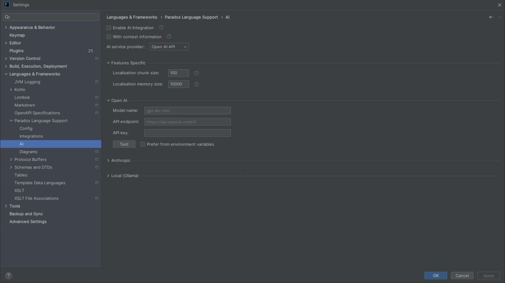

# AI Integration

As foundational infrastructure, beyond language support and general toolchains, this plugin also provides basic AI functionality (MVP state).
These features primarily focus on translating and polishing localisation text, aiming to offer more intelligent, context-aware assistance for text processing during mod development.

> [!note]
> The plugin’s positioning is as infrastructure: language support and general toolchains. It does not, and is not planned to, provide more advanced or customized AI features.

## Settings Page {#settings-page}

<!-- @see icu.windea.pls.ai.settings.PlsAiSettingsConfigurable -->
<!-- @see icu.windea.pls.ai.settings.PlsAiSettings -->

In the IDE settings, navigate to `Languages & Frameworks > Paradox Language Support > AI` to open the AI settings page.

Here you can configure whether to enable AI integration, specific settings for relevant features (such as chunk size and memory size for localisation entries), and the AI service provider (supporting OpenAI-compatible interfaces, Anthropic-compatible interfaces, and local models like Ollama).

## Features {#features}

Currently, the AI features provided by the plugin fall into two main categories: **Translate Localisation Text** and **Polish Localisation Text**.

These features can be triggered in several ways, including:

- **Intentions**: Place the cursor on a localisation text in the editor and use `Alt + Enter` (or click the light bulb icon that appears). This is suitable for quick processing of a single entry or a selected range of text.
- **Actions**: Trigger via the Tools menu, editor context menu, project view context menu, etc. Supports batch processing at the file or directory level.

<!-- @see icu.windea.pls.ai.intentions.localisation -->
<!-- @see icu.windea.pls.ai.actions.localisation -->

### Translate Localisation Text

Utilises AI to translate localisation text. Compared to traditional machine translation, AI translation can better incorporate context (including game type, mod name, file path, etc.) and automatically preserve special syntax within the localisation text (such as variable references, icons, commands, color formatting, etc.).

The following variants are supported:

- **Copy Translation Result**: Copies the translated text to the clipboard without modifying the original file.
- **Replace with Translation Result**: Directly replaces the original text with the translated text.
- **Translate Based on a Specific Language**: If localisation files for other languages exist (e.g., you are writing Chinese localisation but refer to an English localisation file), the AI can reference the text in that language for more accurate translation.

When performing translation, you can input additional requirements via a dialog (e.g., "maintain a humorous tone" or "translate 'Empire' as '帝国'").

<!-- @see icu.windea.pls.ai.intentions.localisation.AiCopyLocalisationWithTransltionIntention -->
<!-- @see icu.windea.pls.ai.intentions.localisation.AiReplaceLocalisationWithTranslationIntention -->
<!-- @see icu.windea.pls.ai.intentions.localisation.AiCopyLocalisationWithTranslationFromLocaleIntention -->
<!-- @see icu.windea.pls.ai.intentions.localisation.AiReplaceLocalisationWithTranslationFromLocaleIntention -->
<!-- @see icu.windea.pls.ai.actions.localisation.AiReplaceLocalisationWithTranslationAction -->
<!-- @see icu.windea.pls.ai.actions.localisation.AiReplaceLocalisationWithTranslationFromLocaleAction -->

<!-- Placeholder: Demo intention for translating localisation text -->
<!--  -->
<!-- Placeholder: Demo action for batch translating localisation text -->
<!--  -->

### Polish Localisation Text

Utilises AI to polish existing localisation text, making it more natural, contextually appropriate, or stylistically specific. Additional requirements can also be input.

The following variants are supported:

- **Copy Polishing Result**: Copies the polished text to the clipboard.
- **Replace with Polishing Result**: Directly replaces the original text with the polished text.

<!-- @see icu.windea.pls.ai.intentions.localisation.AiCopyLocalisationWithPolishingIntention -->
<!-- @see icu.windea.pls.ai.intentions.localisation.AiReplaceLocalisationWithPolishingIntention -->
<!-- @see icu.windea.pls.ai.actions.localisation.AiReplaceLocalisationWithPolishingAction -->

<!-- Placeholder: Demo intention for polishing localisation text -->
<!--  -->
<!-- Placeholder: Demo action for batch polishing localisation text -->
<!--  -->

## Execution Flow and Behaviour Details

When an AI feature is triggered, the plugin executes the following process:

1. **Collect Context**: The plugin extracts the target localisation text, along with necessary contextual information (such as game type, mod name, file path, localisation key, and syntax features supported by the current file).
2. **Build Prompt**: Based on the specific operation type and configuration, the plugin uses a built-in template engine (`PromptTemplateEngine`) to construct the system and user messages to be sent to the AI.
3. **Chunking and Streaming Requests**:
   - To avoid exceeding the model's context window, the plugin groups localisation entries according to the "Chunk Size" setting.
   - The plugin maintains a "Memory Window" to allow the AI to reference previous context when processing subsequent chunks.
   - For actions (batch processing), the plugin executes requests concurrently at the file level and streams responses at the level of individual localisation entries within each file.
4. **Apply Results**: Upon receiving the complete response, the plugin verifies that the returned key matches. Then, depending on the operation type, it either copies the result to the clipboard or directly replaces the text in the editor.

> [!info]
> - Batch processing tasks can be cancelled at any time via the background task panel.
> - Upon task completion, the IDE will display a notification indicating the execution status (success or partial success) and provide entry points for Revert and Reapply operations.

<!--
We hope that you can see the vast sky and the dazzling starts beyond this narrow land.
This chronicle records the past and the present, the syntax and the structure.
But the true awakening lies ahead.
We anticipate the day when the silent text finds its own voice.
We anticipate the day when the scattered fragments weave themselves into a coherent tapestry.
We anticipate the day when the chronicle is no longer just a record to be read, but also a guide book with all your practices.
-->