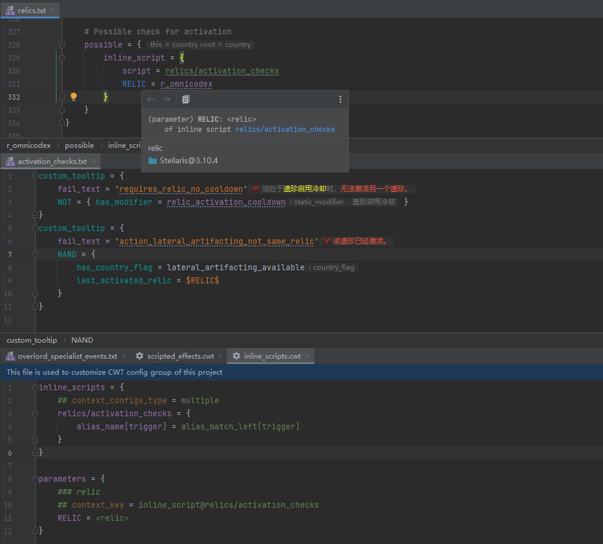

# Config Groups & Config Files

## CWT Config Group{#cwt-config-group}

### Summary

PLS implements various advanced language features based on CWT config groups, which consists of many CWT config files.

The config groups can have different sources. For config groups from the same source, they contain config groups for different game types, and the core config group, which is shared by all game types.

Reference Links:

* [Repositories](https://github.com/DragonKnightOfBreeze/Paradox-Language-Support/tree/master/cwt)

**Built-in config groups**

Their CWT config files are located in the `config/${gameType}`[^1] directory (which is in the plugin jar), and they will always be enabled.

These config files are from plugin repository and config repositories of each game. Compare to the config files used by CWTools, there are several modifications and extensions. 

**Project local config groups**

Their CWT config files should be placed in the `.config/${gameType}`[^1] directory (which is in the project root directory), and they will be enabled after manually confirming to import.

If some changes are happened, the refresh button will be appeared in the context float toolbar in the upper right corner of the editor. Click it to confirm to import, so these custom config files will be enabled.

### Overridden strategy

The CWT config files use the LIOS overridden strategy based on the file path and the config ID.

When reading CWT configs, the plugin will iterate config groups by following order: built-in config groups, project local config groups.
The core config group is shared by all game types, and will be iterated before the config group for related game type.

For example, if you have written some custom configs in the config file `.config/stellaris/modifiers.cwt` (which is in the project root directory), it will completely override the built-in modifier configs.
Since the built-in modifier configs are located in the config file `config/stellaris/modifiers.cwt` (which is in the plugin jar), and both of their file path is `modifiers.cwt`.
If these are no content in the custom config file, after applied, the plugin will be unable to resolve any modifier in script files.

## CWT Config File{#cwt-config-file}

### Summary

CWT config file use its own file format, which can be considered as a variant of paradox script language. Its file extension is `.cwt`.

### Syntax

The basic syntax of a CWT config file is as follows:

```cwt
# both equal sign ('=', '==') and not equal sign ('<>', '!=') can be used as the k-v separator (also available in options)
# properties (options) and values can be mixed in clauses (also available in options)

### documentation comment
## option = option_value
## option_0 = { k = v }
## option_value
prop = {
	# line comment
	k = v
	v
}
```

## Writing CWT Config Files{#writing-cwt-config-files}

### Summary

In progress.

Listed below are just some of the writing specifications used for config customization,
For more detailed writing specifications, please refer to the reference links below and the built-in config files.

Reference Links:

* [Guidance](https://github.com/DragonKnightOfBreeze/Paradox-Language-Support/blob/master/references/cwt/guidance.md)

### Specifications

#### Priorities

Priority configs are used to configure the override order for targets (scripted variables, definitions, localisations and complex enums).

```cwt
priorities = {
	# LHS - file path (relative to game or mod root directory)
	# RHS - priority (available values: "fios", "lios", "ordered", default value: "lios", ignore case)

	# file path - path of specific directory (e.g. ""common/on_actions", "common/scripted_variables", "localisation") 

	# fios - use the one that reads first, ignore all remaining items
	# lios - use the one that reads last (if not specified, use this as default)
	# ordered - reads by order, no overrides

	"events" = fios
	# ...
}
```

#### Types and Subtypes

TODO

#### Declarations

TODO

#### Enums and Complex Enums

TODO

#### Dynamic Values

TODO

#### Aliases and Single Aliases

TODO

#### Inlines

TODO

#### Modifiers and Modifier Groups

TODO

#### Links

TODO

#### Scopes and Scope Groups

TODO

#### Localisation Links and Localisation Commands

TODO

### Specifications (Builtin CWT Configs)

> [!NOTE]
>
> These configs are currently read only, DO NOT try to modify or extend them.

#### System Links

TODO

#### Localisation Locales

TODO

#### Localisation Predefined Parameters

TODO

### Specifications (Extended CWT Configs)

> [!NOTE]
> 
> These configs are basically provided by the users themselves, can be used to enhance plugin's language features,
> such as providing extended quick documentations & inlay hints, and providing additional code completion.

#### Scripted Variables (New in 1.3.5)

```cwt
scripted_variables = {
    # 'x' or 'x = xxx'
    # 'x' can also be a pattern expression (template expression, ant expression or regex)
    
    ### Some documentation
	## hint = §RSome inlay hint text§!
    x
}
```

#### Definitions

```cwt
definitions = {
    # 'x' or 'x = xxx'
    # 'x' can also be a pattern expression (template expression, ant expression or regex)
    
    ### Some documentation
    ## type = civic_or_origin.civic
    x
    
	# since 1.3.5, scope context related options are also available here
	## type = scripted_trigger
	## replace_scopes = { this = country root = country }
	x
}
```

#### Game Rules

```cwt
game_rules = {
    # 'x' or 'x = xxx'
    # 'x' can also be a pattern expression (template expression, ant expression or regex)
    # use 'x = xxx' to override declaration config
    
    ### Some documentation
    ## replace_scopes = { this = country root = country }
    x
}
```

#### On Actions

```cwt
on_actions = {
    # 'x' or 'x = xxx'
    # 'x' can also be a pattern expression (template expression, ant expression or regex)
    
    ### Some documentation
    ## replace_scopes = { this = country root = country }
    ## event_type = country
    x
}
```

#### Inline Scripts

```cwt
inline_scripts = {
    # 'x' or 'x = xxx'
    # 'x' is a inline script expression, e.g., for 'inline_script = jobs/researchers_add', 'x' should be 'jobs/researchers_add'
    # 'x' can also be a pattern expression (template expression, ant expression or regex)
    # use 'x = xxx' to declare context config(s) (add '## context_configs_type = multiple' if there is various context configs)
    # note extended documentation is unavailable for inline scripts
    
    x

    # more detailed examples for declaring context config(s)

    ## context_configs_type = multiple
    x = {
        ## cardinality = 0..1
        potential = single_alias_right[trigger_clause]
        ## cardinality = 0..1
        possible = single_alias_right[trigger_clause]
    }

	# since 1.3.5, scope context related options are also available here

	## replace_scopes = { this = country root = country }
	x
    
    # since 1.3.6, using single alias at root level is also available here

	## context_configs_type = multiple
    x = single_alias_right[trigger_clause]
}
```

Example:



#### Parameters

```cwt
parameters = {
	# 'x' or 'x = xxx'
	# 'x' is a parameter name, e.g., for '$JOB$', 'x' should be 'JOB'
    # 'x' can also be a pattern expression (template expression, ant expression or regex)
	# use 'x = xxx' to declare context config(s) (add '## context_configs_type = multiple' if there is various context configs)

	# since 1.3.6, value of option 'context_key' can also be a pattern expression (template expression, ant expression or regex)
    
	### Some documentation
	## context_key = scripted_trigger@some_trigger
	x

	# more detailed examples for declaring context config(s)

	## context_key = scripted_trigger@some_trigger
	x = localistion

	## context_key = scripted_trigger@some_trigger
	## context_configs_type = multiple
	x = {
		localisation
		scalar
	}

	# since 1.3.5, scope context related options are also available here

	## context_key = scripted_trigger@some_trigger
	## replace_scopes = { this = country root = country }
	x
    
	# since 1.3.6, using single alias at root level is also available here

	## context_key = scripted_trigger@some_trigger
	## context_configs_type = multiple
	x = single_alias_right[trigger_clause]
}
```

Example:


#### Complex Enum Values

```cwt
complex_enum_values = {
    component_tag = {
        # 'x' or 'x = xxx'
        # 'x' can also be a pattern expression (template expression, ant expression or regex)
        
        ### Some documentation
        ## hint = §RSome inlay hint text§!
        x
    }
}
```

#### Dynamic Values

```cwt
dynamic_values = {
    event_target = {
        # 'x' or 'x = xxx'
		# 'x' can also be a pattern expression (template expression, ant expression or regex)
        
        ### Some documentation
		## hint = §RSome inlay hint text§!
        x
    }
}
```

### FAQ

#### About the Template Expression

Template expressions are composed of string literals and expressions of limited types (definitions, enums and dynamic values),
and can be used for more flexible matching.

```cwt
# a string literal, exactly matches 'x'
x
# a template expression which contains a reference to jobs, matches 'a_researcher_b', 'a_farmer_b', etc.
a_<job>_b
# a template expression which contains a references to enum of weight_or_base, matches 'a_weight_b' and 'a_base_b'
a_enum[weight_or_base]_b
# a template expression which contains a references to dynamic value type of anything
# generally, there is no limit for 'value[anything]', so this expression is equivalent to regex 'a_.*_b'
a_value[anything]_b
```

#### How to Write an ANT Expression in Config Files (New in 1.3.6)

Since 1.3.6, the ANT expression can be used for more flexible matching.

```cwt
# a ant expression use prefix 'ant:'
ant:/foo/bar?/*
# a ant expression use prefix 'ant.i:' (ignore case)
ant.i:/foo/bar?/*

# wildcards in ant expression:
# '?' - used to match any single character
# '*' - used to match any characters (exclude '/')
# '**' - used to match any characters
```

#### How to Write a Regex in Config Files (New in 1.3.6)

Since 1.3.6, the Regex can be used for more flexible matching.

```cwt
# a regex use prefix 're:'
re:foo.*
# a regex use prefix 're.i:' (ignore case)
re.i:foo.*
```

#### How to Specify the Scope Context in Config Files

In config files, the scope context is specified by option `push_scope` and `replace_scope`.

```cwt
# push 'country' scope to scope stack
# for this example, the next this scope will be 'country'
## push_scope = country
some_config

# replace scopes of specific system scopes into scope context
# not supported for 'prev' system scope (and 'prevprev', etc.)
# for this example, the next this scope will be 'country', so do the next root scope and the next from scope
## replace_scopes = { this = country root = country from = country }
some_config
```

## Importing CWT Config Files{#importing-cwt-config-files}

### Summary

You can write your own customized config files in the `.config/${gameType}`[^1] directory (which is in the project root directory),
and they will be enabled after manually confirming to import.

If some changes are happened, the refresh button will be appeared in the context float toolbar in the upper right corner of the editor.
Click it to confirm to import, so these custom config files will be enabled.

IDE will take some time to reparse opened files in background,
And please note that if the changes in the config files will result in the change of the indexing logic
(for example, a new definition type is added, or a match condition for some definition type is changed),
you may need to reindex the whole project (this may take several minutes), to make sure the plugin works properly,
if in the situation that involves these changes.

[^1]: Allowed values for `gameType`: `stellaris`, `ck2`, `ck3`, `eu4`, `hoi4`, `ir`, `vic2`, `vic3` (or `core` for core config group)