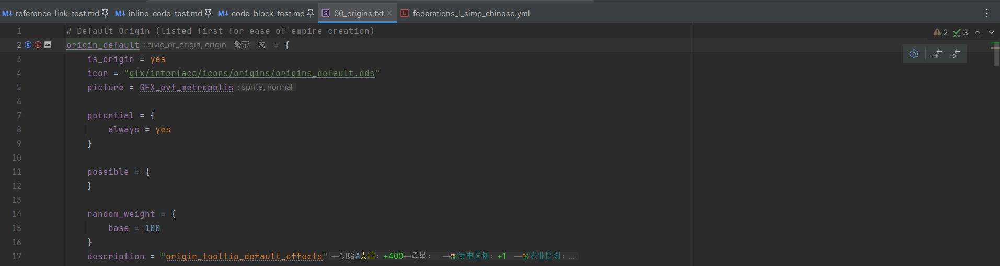
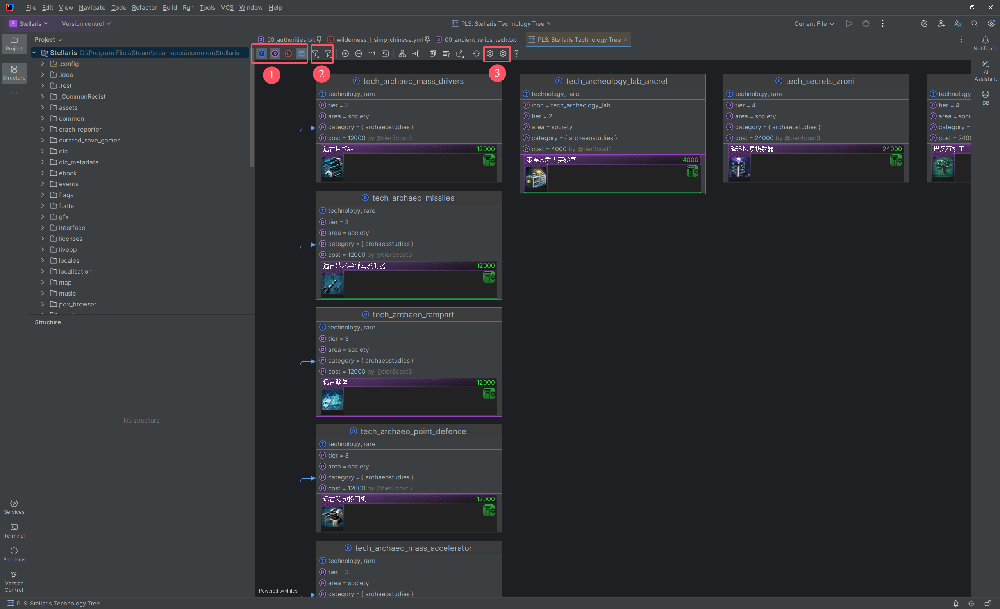

# Extensions

## Markdown {#md}

> [!note]
> The features mentioned in this section require installation and activation of the official [Markdown](https://plugins.jetbrains.com/plugin/7793-markdown) plugin.

PLS deeply integrates Markdown support, optimizing the handling of links, inline code, and code blocks for mod development scenarios.

### Links

Through specially formatted link text, PLS can parse Markdown links into matching target references (definitions, localizations, etc.), 
providing language features such as code navigation and quick documentation in the editor, offering powerful support for mod documentation writing.

This functionality also applies to HTML links and PSI element navigation (definitions, localizations, etc.) in quick documentation.


For different types of reference links, the formats and examples are as follows:

**CWT Rules** (limited support only)

- Format
  - `cwt:{gameType}:{parts}`
- Examples
  - `cwt:stellaris:types/civic_or_origin`
  - `cwt:stellaris:types/civic_or_origin/origin`
  - `cwt:stellaris:values/some_dynamic_value_type`
  - `cwt:stellaris:values/some_dynamic_value_type/some_value`
  - `cwt:stellaris:enums/some_enum`
  - `cwt:stellaris:enums/some_enum/some_value`
  - `cwt:stellaris:complex_enums/some_complex_enum`
  - `cwt:stellaris:complex_enums/some_complex_enum/some_value`
  - `cwt:stellaris:scopes/some_scope`
  - `cwt:stellaris:system_scopes/some_system_scope`
  - `cwt:stellaris:links/some_link`
  - `cwt:stellaris:localisation_links/some_localisation_link`
  - `cwt:stellaris:localisation_commands/some_localisation_command`
  - `cwt:stellaris:modifier_categories/some_modifier_category`
  - `cwt:stellaris:modifiers/some_modifier`

**Scripted Variables**

- Format
  - `pdx.sv:{name}`
  - `pdx.sv:{gameType}:{name}`
- Examples
  - `pdx.sv:civic_default_random_weight`
  - `pdx.sv:stellaris:civic_default_random_weight`

**Definitions**

- Format
  - `pdx.d:{typeExpression}/{name}`
  - `pdx.d:{gameType}:{typeExpression}/{name}`
- Examples
  - `pdx.d:origin_default`
  - `pdx.d:stellaris:origin_default`
  - `pdx.d:civic_or_origin.origin/origin_default`
  - `pdx.d:stellaris:civic_or_origin.origin/origin_default`

**Localizations**

- Format
  - `pdx.l:{name}`
  - `pdx.l:{gameType}:{name}`
- Examples
  - `pdx.l:origin_default_desc`
  - `pdx.l:stellaris:origin_default_desc`

**File Paths** (relative to game or mod directory)

- Format
  - `pdx.p:{path}`
  - `pdx.p:{gameType}:{path}`
- Examples
  - `pdx.p:common/governments/civics/00_origins.txt`
  - `pdx.p:stellaris:common/governments/civics/00_origins.txt`

**Modifiers**

- Format
  - `pdx.m:{name}`
  - `pdx.m:{gameType}:{name}`
- Examples
  - `pdx.m:job_soldier_add`
  - `pdx.m:stellaris:job_soldier_add`

Notes:

- `{gameType}` - <GameTypeNote />
- `{typeExpression}` - <DefinitionTypeNote />

### Inline Code

> [!note]
> This feature requires enabling a specific advanced setting (`Advanced Settings > Paradox Language Support > Resolve Markdown Inline Code`).

PLS can try to resolve Markdown inline code into matching target references (definitions, localizations, etc.), 
providing additional language features such as code navigation and quick documentation in the editor.




For different types of targets, the formats and examples are as follows:

**Scripted Variables**

- Format
  - `@{name}`
- Example
  - `@civic_default_random_weight`

**Definitions**

- Format
  - `{name}`
- Example
  - `origin_default`

**Localizations**

- Format
  - `{name}`
- Example
  - `origin_default_desc`

Note:

- If both definition and localization can be resolved, definition takes precedence.

### Code Blocks

By injecting additional information after the language ID in Markdown code blocks, you can specify the game type and file path for script or localization file fragments. 
PLS will use this information to match CWT configs, providing various advanced language features as if editing actual script or localization files.


Injection format and examples:

- Format
  - `path={gameType}:{path}`
- Example
  - `path=stellaris:common/armies/injected_defence_armies.txt`

Full example:

````markdown
```paradox_script path=stellaris:common/armies/injected_defence_armies.txt
defense_army = {
    # ...
}
```
````

Notes:

- `{gameType}` - <GameTypeNote />
- `{path}` - Simulated file path relative to game or mod directory. Must be a valid script or localization file path.

## Diagrams {#diagrams}

> [!note]
> This feature requires installation and activation of the official Diagrams plugin.

> [!warning]
> This feature and the Diagrams plugin are only available in professional IDEs (e.g., IntelliJ IDEA Ultimate).

PLS provides several diagrams for displaying information about specific types of definitions and their relationships.

Currently, only event trees and technology trees are provided.

> [!tip]
> You can also use the type hierarchy view to examine event trees and technology trees.
> 
> * With the cursor on a definition or its reference, go to `Navigate > Type Hierarchy` in the main menu to open the type hierarchy window.
> * In the hierarchy tool window, view information for all definitions of the same type through a collapsible tree view.
> * If the definition type is event or technology, the hierarchy view can be displayed as an event tree or technology tree.
> 
> 

### Settings Page

In the IDE settings page, go to `Languages & Frameworks > Paradox Language Support > Diagrams` to open the diagram settings page.

Here you can configure which nodes to display for various diagram types based on multiple conditions.


### Event Tree

You can open event tree diagrams in several ways:

- In the project view, select an event script file or its parent directory (including game or mod directories), right-click and choose `Diagrams > Show Diagram...`, then select any diagram type belonging to event trees.
- In the editor, open an event script file, right-click and choose `Diagrams > Show Diagram...`, then select any diagram type belonging to event trees.
- If available, use keyboard shortcuts or the Search Everywhere feature (`Shift + Shift`) to open directly.

Event tree diagrams display key information about events and their invocation relationships. Use the toolbar at the top to configure which node elements to display and filter nodes.


1. Configure node elements to display. From left to right: type, properties, localized title.
2. Filter nodes by query scope. For example, only show nodes for events in open files.
3. Open the diagram settings pages. From left to right: Diagrams plugin's, PLS's.

> [!warning]
> The IDE requires time to complete data loading and rendering. This may take considerable time if many nodes and elements need rendering.

### Technology Tree

If the current game type is *Stellaris*, you can open technology tree diagrams in several ways:

- In the project view, select a technology script file or its parent directory (including game or mod directories), right-click and choose `Diagrams > Show Diagram...`, then select any diagram type belonging to technology trees.
- In the editor, open a technology script file, right-click and choose `Diagrams > Show Diagram...`, then select any diagram type belonging to technology trees.
- If available, use keyboard shortcuts or the Search Everywhere feature (`Shift + Shift`) to open directly.

Technology tree diagrams display key information about technologies and their prerequisite relationships. Use the toolbar at the top to configure which node elements to display and filter nodes.



1. Configure node elements to display. From left to right: type, properties, localized name, presentation (displayed as tech card).
2. Filter nodes by query scope. For example, only show nodes for technologies in open files.
3. Open the diagram settings pages. From left to right: Diagrams plugin's, PLS's.

> [!warning]
> The IDE requires time to complete data loading and rendering. This may take considerable time if many nodes and elements need rendering.
