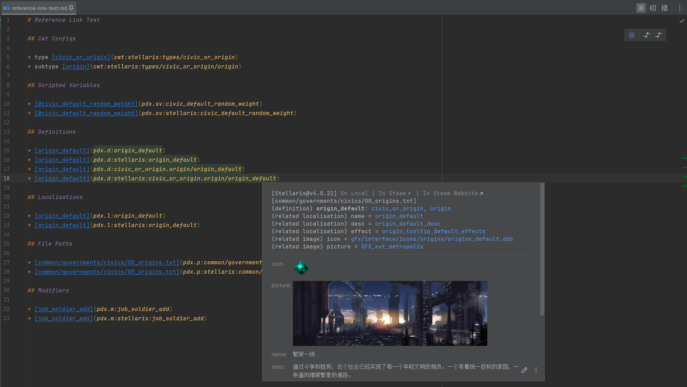

# Extensions

## The Settings Page

To be completed.

## Markdown

> [!NOTE]
> 
> Features in this section require the [Markdown](https://plugins.jetbrains.com/plugin/7793-markdown) plugin to be installed and enabled.

PLS extends integration with Markdown, covering links, inline code, code fences, and more.

### Links

By using specially formatted link texts with specific prefixes, PLS can resolve Markdown links to matched target references (definitions, localizations, etc.),
providing additional language features in the editor such as code navigation and quick documentation.

This also applies to links in other places, such as HTML links, and links in the raw text of quick documentation for navigation to PSI elements.



For different types of reference links, the formats and examples are as follows:

**CWT config** (currently limited support)

* Format
  * `cwt:{gameType}/{parts}`
* Examples
  * `cwt:stellaris:types/civic_or_origin`
  * `cwt:stellaris:types/civic_or_origin/origin`

**Scoped Variable**

* Format
  * `pdx.sv:{name}`
  * `pdx.sv:{gameType}/{name}`
* Examples
  * `pdx.sv:civic_default_random_weight`
  * `pdx.sv:stellaris:civic_default_random_weight`

**Definition**

* Format
  * `pdx.d:{typeExpression}/{name}`
  * `pdx.d:{gameType}/{typeExpression}/{name}`
* Examples
  * `pdx.d:origin_default`
  * `pdx.d:stellaris:origin_default`
  * `pdx.d:civic_or_origin.origin/origin_default`
  * `pdx.d:stellaris:civic_or_origin.origin/origin_default`

**Localization**

* Format
  * `pdx.l:{name}`
  * `pdx.l:{gameType}/{name}`
* Examples
  * `pdx.l:origin_default_desc`
  * `pdx.l:stellaris:origin_default_desc`

**File Path** (relative to game or mod directory)

* Format
  * `pdx.p:{path}`
  * `pdx.p:{gameType}/{path}`
* Examples
  * `pdx.p:common/governments/civics/00_origins.txt`
  * `pdx.p:stellaris:common/governments/civics/00_origins.txt`

**Modifier**

* Format
  * `pdx.m:{name}`
  * `pdx.m:{gameType}:{name}`
* Examples
  * `pdx.m:job_soldier_add`
  * `pdx.m:stellaris:job_soldier_add`

Notes:

* `{gameType}` - Game type ID. Currently supported values: `stellaris`, `ck2`, `ck3`, `eu4`, `hoi4`, `ir`, `vic2`, `vic3` (for shared config groups use `core`).
* `{typeExpression}` - Definition type expression, can be a base type (e.g., `civic_or_origin`) or include base type and subtypes separated by dots (e.g., `civic_or_origin.origin`).

### Inline Code

> [!NOTE]
>
> Features in this section require specific advanced settings to be enabled (`Advanced Settings > Paradox Language Support > Resolve Markdown inline codes`)

PLS can try to resolve Markdown inline codes to matched target references (definitions, localizations, etc.),
providing additional language features in the editor such as code navigation and quick documentation.


For different types of targets, the formats and examples are as follows:

**Scripted Variable**

* Format
  * `@{name}`
* Example
  * `@civic_default_random_weight`

**Definition**

* Format
  * `{name}`
* Example
  * `origin_default`

**Localisation**

* Format
  * `{name}`
* Example
  * `origin_default_desc`

Note:

* If the inline code can be parsed as a definition and a localization at the same time, the definition will be preferred.

### Code Fences

By injecting extra information after the language ID of a Markdown code fence,
you can specify the game type and file path for script or localization file snippets.
PLS will use this information to match CWT configs and provide advanced language features as if you were editing an actual script or localization file.


The format and examples for the injected information are as follows:

* Format
  * `path={gameType}:{path}`
* Example
  * `path=stellaris:common/armies/injected_defence_armies.txt`

A more complete example:

```paradox_script path=stellaris:common/armies/injected_defence_armies.txt
defense_army = {
    # ...
}
```

Notes:

* `{gameType}` - Game type ID. Currently supported values: `stellaris`, `ck2`, `ck3`, `eu4`, `hoi4`, `ir`, `vic2`, `vic3` (for shared config groups use `core`).
* `{path}` - Simulated file path relative to the game or mod directory. Must be a valid script or localization file path.

## Diagrams

> [!NOTE]
>
> Features in this section require the Diagrams plugin to be installed and enabled.

> [!WARNING]
> 
> Features in this section and the Diagrams plugin are only available in IDE professional editions (e.g., IntelliJ IDEA Ultimate).