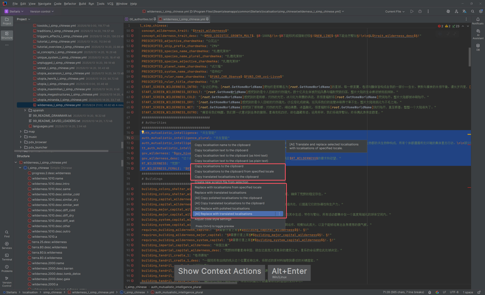
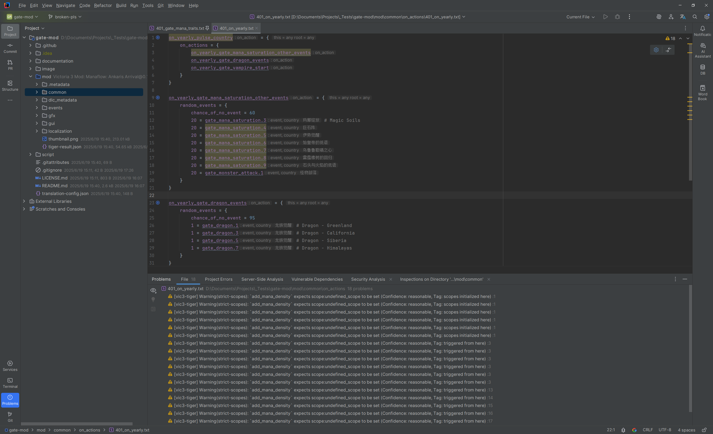

# Integrations

PLS deeply integrates with multiple professional tools to optimize and extend the plugin's performance.

Although the plugin itself is fully functional, enabling these integrations in specific scenarios can solve particular problems and improve development efficiency.

## Settings Page {#settings-page}

In the IDE settings page, go to `Languages & Frameworks > Paradox Language Support > Integrations` to open the integrations settings page.

Here you can configure which tool integrations to enable and specify their options.

## Image Tools

PLS integrates the following image tools to provide better support for DDS and TGA images.

- Based on [Texconv](https://github.com/microsoft/DirectXTex/wiki/Texconv)
  - The official command-line texture converter from DirectXTex, supporting DDS encoding/decoding, format conversion, mipmap generation, etc., suitable for game texture processing.
  - Built-in, only available on Windows.
- Based on [Image Magick](https://www.imagemagick.org)
  - A cross-platform general-purpose image processing suite, supporting batch conversion/cropping/scaling and command-line scripting, suitable for large-scale DDS/TGA workflows.
  - Available on Windows and Linux.
  - Requires specifying the correct path to the executable in the settings page.

By default, PLS uses [TwelveMonkeys ImageIO](https://github.com/haraldk/TwelveMonkeys) to process images.
This is a Java image processing library that adapts additional image types for `ImageIO`. With it, PLS can render DDS and TGA images just like regular PNG images.
You can also specify an image tool for PLS. In this case, if DDS or TGA images need to be rendered, the plugin will first execute the image tool to convert them into temporary PNG images, then read them into `ImageIO`.

This applies to many scenarios, most commonly previewing images directly in the IDE (editing still requires an external editor) and rendering images in quick documentation and inlay hints.
You can also reference DDS images directly in HTML and Markdown documents. Although this is generally not possible, you can preview the rendered document directly in the IDE, where they should display correctly.

In certain scenarios, PLS needs to split images to render quick documentation and inlay hints more accurately. The generated PNG images can be found in `~/.pls/images`.

Additionally, PLS provides actions for converting between different image formats (PNG, DDS, and TGA).
The plugin also allows selecting multiple images in the project view and performing batch conversion of image types.

<!--batch-->

> [!warning]
> Note that [TwelveMonkeys ImageIO](https://github.com/haraldk/TwelveMonkeys) has some limitations in supporting DDS images, such as not supporting DX11 formats.
> 
> If you encounter issues with PLS rendering DDS images properly, we recommend enabling the integration with [Image Magick](https://www.imagemagick.org).
> Download the package from the official website to your local machine, enable the integration in the settings page, correctly configure the path to its executable (named `magick.exe` or `magick`), and save the settings.
> After restarting the IDE, the issue should be resolved.

> [!tip]
> If you need to visually edit DDS and TGA images, we recommend using [Paint.NET](https://www.getpaint.net).
> 
> If you need to batch process DDS and TGA images, such as batch resizing, we recommend using [Image Magick](https://www.imagemagick.org).

> [!tip]
> You can jump directly to external image tools from the IDE in several ways:
> 
> 1. Using Intellij IDEA's [External Tools](https://www.jetbrains.com/help/idea/configuring-third-party-tools.html) feature
>    - In the IDE settings page, go to `Tools > External Tools` and configure the external tools.
>    - Open the target file in the editor (or select it in the project view), then in the right-click menu, go to `External Tools > {toolName}`.
> 2. Jump directly to the external editor for the image
>    - Configure the default application for opening images in your operating system.
>    - Open the target file in the editor (or select it in the project view), then in the right-click menu, click `Jump to External Editor`.
> 
> 
> 
> 

## Translation Tools

PLS integrates the following translation tools for batch translation of localization texts.

- Based on [Translation Plugin](https://github.com/yiiguxing/TranslationPlugin)
  - A commonly used translation tool in the IntelliJ ecosystem, supporting multiple translation engines, terminology/history, word extraction, and panel interaction, suitable for quick bilingual reference and batch processing within the editor.
  - If this plugin is enabled, PLS can provide additional features, such as intentions and actions.
- Based on AI
  - The built-in [AI Integration](ai.md) supports streaming translation and polishing of localization texts. Suitable for batch, context-aware translations with optional additional requirements.

If translation tools are available, PLS will provide additional intentions and actions for manipulating localizations.
They can be used to batch translate localization texts, then copy to the system clipboard or perform streaming replacements.

You can access these features from multiple entry points (tools menu, editor right-click menu, project view right-click menu, etc.) at multiple batch levels (localization at the cursor position, all localizations in the selected range, or all localizations in selected files and directories in the project view).

<!--batch-->

Here is a demonstration of using AI to batch translate localization texts:

<ArtPlayer src="/videos/integrations/translate_and_replace_1.mp4" poster="../images/translate_and_replace_1.png" />

> [!info]
> * For manipulation tasks based on the [Translation Plugin](https://github.com/yiiguxing/TranslationPlugin), they are executed concurrently at the file level and at each localization entry level within the file.
> * For AI-based manipulation tasks, they are executed concurrently at the file level and streamed at each localization entry level within the file.
> * After completing the task, a notification will pop up to indicate the task's execution status and provide options to revert or reapply the manipulations.
> * You can cancel the currently executing task at any time.

## Linting Tools

PLS integrates the following linting tools to provide additional code inspections.

- [Tiger](https://github.com/amtep/tiger)
  - A static analyzer for Paradox scripts (ck3/ir/vic3), capable of performing consistency and semantic checks on events, triggers, modifiers, etc., and outputting structured diagnostic results.
  - Available on Windows and Linux.
  - Only applicable to mod directories.
  - Supported game types: `ck3`, `ir`, `vic3`.
  - Requires specifying the correct path to the executable in the settings page.
  - You can specify the path to the configuration file to use in the settings page.
  - Configuration files in the correct location under the mod directory will be applied automatically.

If these tool integrations are enabled and correctly configured, PLS can provide additional code inspections.
You can view the inspection results directly in the Problems view, or perform a global code inspection and view the overview.

<!--batch-->

> [!tip]
> You can selectively disable linting tools at the project level or mod level in the following ways:
> 
> - Project level: In the IDE settings page, go to `Editor > Inspections`, search for `paradox lint`, and disable the found inspection items as needed.
> - Mod level: In the mod settings dialog, expand `Additional Options`, and disable as needed.