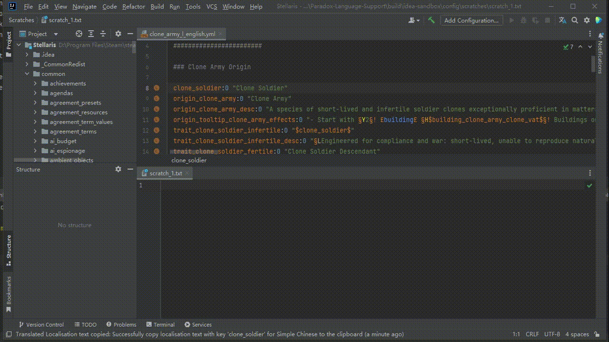

# Plugin Integration

## Integrate **Translation** Plugin

When [Translation](https://github.com/YiiGuxing/TranslationPlugin) plugin is also installed and enabled,
PLS will provide bellow additional features:

### Translate documentation

When the cursor is over a definition name, a localisation name or some other positions,
can translate documentation content by click and select `Translate Documentation` icon button in quick documentation popup window,
or click `Translate Documentation` item in right-click menu.

> [!warning]
>
> There is no guarantee that special markers will be preserved correctly after translation.

### Intention: Copy translated localisation(s) to the clipboard

When the cursor selection scope involves localisation(s), this intention can copy all involved localisation(s) to the system clipboard.
Localisation text will be translated to the selected locale.

> [!warning]
>
> There is no guarantee that special markers will be preserved correctly after translation.
