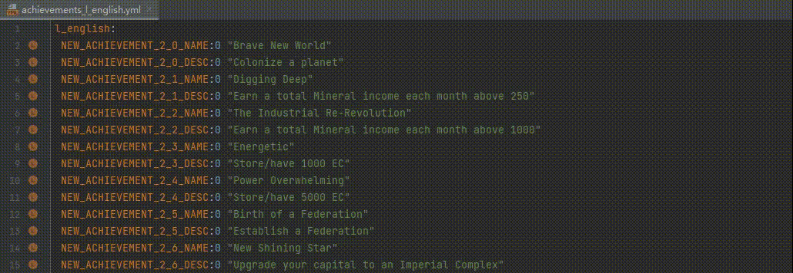

# Plugin Integration

## Integrate **Translation** Plugin

When [Translation](https://github.com/YiiGuxing/TranslationPlugin) plugin is also installed and enabled,
PLS will provide bellow additional features:

### Translate documentation

When the cursor is over a definition name, a localisation name or some other positions,
can translate documentation content by click and select `Translate Documentation` icon button in quick documentation popup window,
or click `Translate Documentation` item in right-click menu.

> **Note**
> 
> There is no guarantee that special markers will be preserved correctly after translation yet.

### Intention: Copy localisation(s) to the clipboard for locale...

When the cursor selection scope involves localization(s),
this intention can copy all involved localization(s) to the clipboard,
and try to translate the localisation text into the specified locale before doing so.

> **Note**
> 
> There is no guarantee that special markers will be preserved correctly after translation yet.