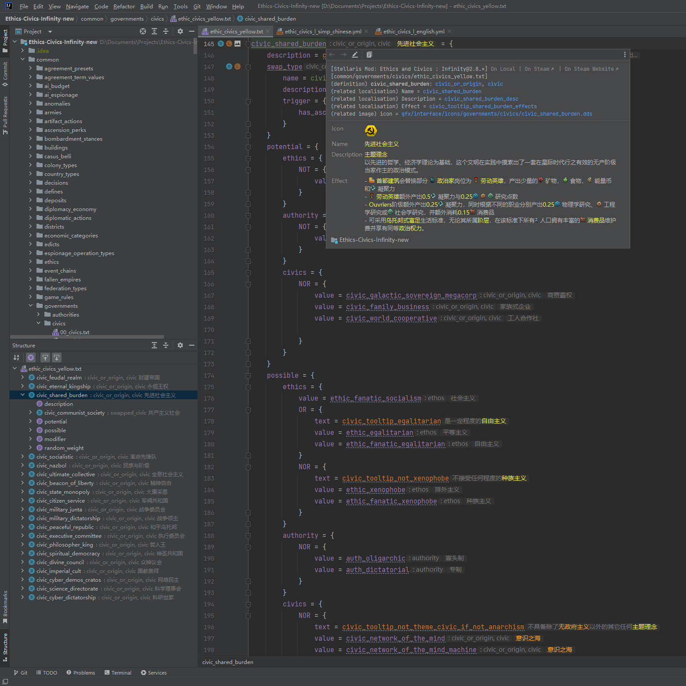
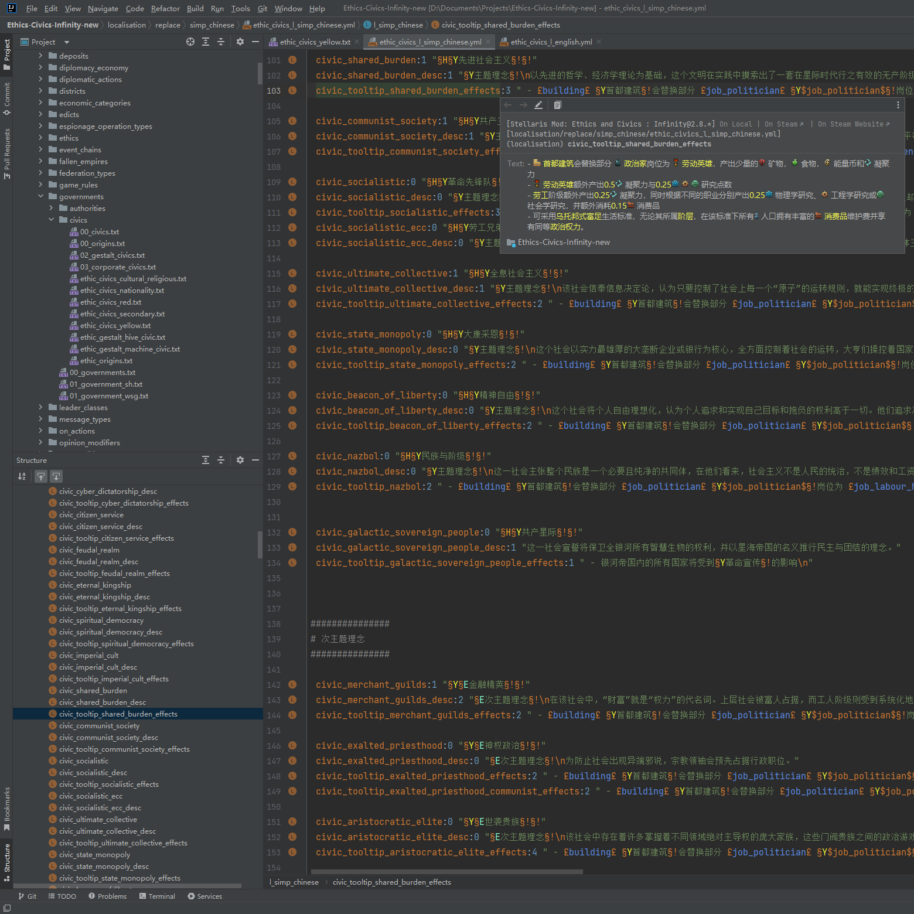

# 简介

## 概述

[GitHub](https://github.com/DragonKnightOfBreeze/Paradox-Language-Support) |
[Plugin Marketplace Page](https://plugins.jetbrains.com/plugin/16825-paradox-language-support) |
QQ群：653824651

IDEA插件：Paradox语言支持。

支持Paradox脚本语言（以`*.txt`文件为主）和本地化语言（`*.yml`文件），
提供语法解析、引用解析、快速文档、代码导航、代码检查、代码补全、内嵌提示、动态模版、本地化文本渲染、DDS图片渲染等功能。

支持CWT语言（`*.cwt`文件），
提供语法解析、引用解析、快速文档、代码导航等功能。

支持直接在IDE中查看DDS图片，提供必要的编辑器功能，如同IDE对普通图片的支持一样。

此插件会自动识别游戏目录（包含启动器配置文件`launcher-settings.json`）和模组目录（包含模组描述符文件`descriptor.mod`）中的脚本文件和本地化文件。

此插件与 [CWTools](https://github.com/cwtools/cwtools-vscode) 共享规则文件（`*.cwt`），这些规则文件目前由插件内置，并经过一定的修改和扩展。

通过由编辑器悬浮工具栏或右键菜单打开的游戏配置/模组配置对话框，可以更改游戏/模组的游戏类型、游戏目录、模组依赖等配置项。

通过插件的配置页面`Settings > Languages & Frameworks > Paradox Language Support`以及某些IDE的通用配置页面，可以更改一些全局配置项。

如果同时安装了 [Translation](https://github.com/YiiGuxing/TranslationPlugin) ，此插件可以提供一些[额外的功能](https://windea.icu/Paradox-Language-Support/#/zh/plugin-integration.md)。

此插件正在开发中，如果在使用过程中遇到问题，欢迎在Github上反馈。

## 使用

* 通过IDE打开你的模组根目录。（需要直接包含模组描述符文件`descriptor.mod`）
* 打开模组描述符文件，点击位于编辑器右上角的悬浮工具栏（或者编辑器右键菜单）中的模组配置按钮，配置模组的游戏类型、游戏目录和额外的模组依赖。
* 点击确定按钮完成配置，然后等待IDE索引完成。（很快就好）
* 开始你的模组编程之旅吧！

提示：

* 如果某段脚本无法被识别，通常有以下几种情况：
  * 对应的CWT规则不存在（即这段脚本存在错误）
  * 对应的CWT规则不完善（考虑在Github上反馈）
  * 存在无法解析的引用（考虑配置对应的游戏目录或者模组依赖）
* 如果IDE索引出现问题，或者发生了涉及IDE索引的报错，请尝试重建索引。
  （点击`File -> Invalidate Caches... -> Invalidate and Restart`）

## 参考

参考手册：

* [IntelliJ Platform SDK | IntelliJ Platform Plugin SDK](https://plugins.jetbrains.com/docs/intellij/welcome.html)
* [JFlex - manual](https://www.jflex.de/manual.html)

工具和插件：

* [cwtools/cwtools](https://github.com/cwtools/cwtools)
* [cwtools/cwtools-vscode](https://github.com/cwtools/cwtools-vscode)
* [OldEnt/stellaris-triggers-modifiers-effects-list](https://github.com/OldEnt/stellaris-triggers-modifiers-effects-list)
* [vincentzhang96/DDS4J](https://github.com/vincentzhang96/DDS4J)
* [YiiGuxing/TranslationPlugin](https://github.com/YiiGuxing/TranslationPlugin)

Wiki：

* [Stellaris Wiki](https://stellaris.paradoxwikis.com/Stellaris_Wiki)
* [群星中文维基 | Stellaris 攻略资料指南 - 灰机wiki](https://qunxing.huijiwiki.com/wiki/%E9%A6%96%E9%A1%B5)