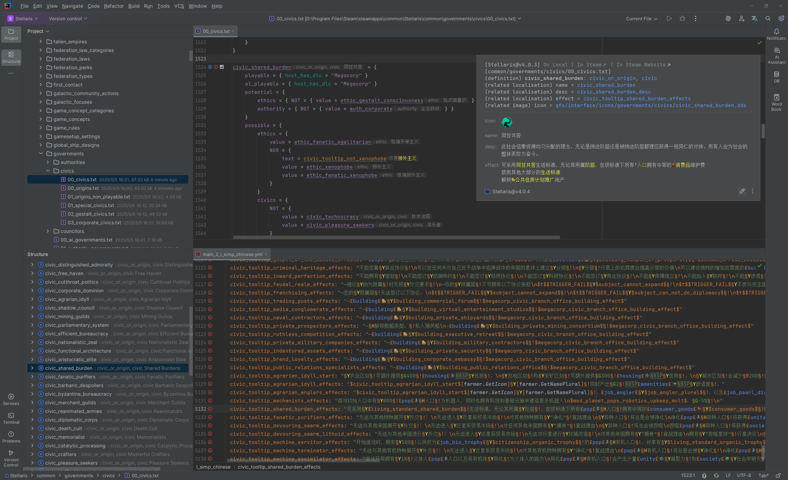

# 介绍

## 概述

[GitHub](https://github.com/DragonKnightOfBreeze/Paradox-Language-Support) |
[Plugin Marketplace Page](https://plugins.jetbrains.com/plugin/16825-paradox-language-support) |
[Discord](https://discord.gg/vBpbET2bXT) |
QQ群：653824651

用于编写群星模组（也支持其他P社游戏）的Intellij IDEA插件，智能、便捷且更具潜力。

特性：

* 支持编写模组所使用的脚本语言、本地化语言与CSV语言，以及编写规则文件所使用的CWT语言。
* 提供诸多较为完备的语言功能，包括代码高亮、代码导航、代码补全、代码检查、代码重构、快速文档、内嵌提示、动态模版、代码层级、图表、差异比较等。
* 支持预览与渲染DDS和TGA图片，提供不同图片格式（PNG、DDS、TGA）之间的相互转换的操作。
* 支持通过快速文档与内嵌提示等方式，渲染各种有用的信息（例如本地化文本、图片、作用域信息和参数信息）。
* 支持脚本语言与本地化语言的多数高级特性（例如参数、作用域、内联脚本和各种复杂表达式）。
* 支持自定义扩展的规则文件，从而允许插件提供更加完善的语言功能（例如代码导航、代码补全、快速文档和内嵌提示）。
* 集成图片工具（如[Image Magick](https://www.imagemagick.org)）、翻译工具（如[Translation Plugin](https://github.com/yiiguxing/TranslationPlugin)）与检查工具（如[Tiger](https://github.com/amtep/tiger)）。
* 初步集成AI技术，可用于翻译和润色本地化文本。
* 自动识别游戏目录和模组目录。

此插件基于由规则文件组成的[规则分组](config.md#config-group)，实现了诸多语言功能。
插件已经内置了最新版本的规则文件，以便开箱即用。
除此之外，插件也支持[自定义](config.md#writing-cwt-config-files)与[导入](config.md#importing-cwt-config-files)规则文件。

## 参考

参考手册：

* [Kotlin Docs | Kotlin Documentation](https://kotlinlang.org/docs/home.html)
* [Getting started | IntelliJ IDEA Documentation](https://www.jetbrains.com/help/idea/getting-started.html)
* [IntelliJ Platform SDK | IntelliJ Platform Plugin SDK](https://plugins.jetbrains.com/docs/intellij/welcome.html)
* [JFlex - manual](https://www.jflex.de/manual.html)

插件：

* [YiiGuxing/TranslationPlugin](https://github.com/YiiGuxing/TranslationPlugin)

工具：

* [cwtools/cwtools](https://github.com/cwtools/cwtools)
* [cwtools/cwtools-vscode](https://github.com/cwtools/cwtools-vscode)
* [bcssov/IronyModManager](https://github.com/bcssov/IronyModManager)
* [amtep/ck3-tiger](https://github.com/amtep/ck3-tiger)
* [OldEnt/stellaris-triggers-modifiers-effects-list](https://github.com/OldEnt/stellaris-triggers-modifiers-effects-list)

Wikis：

* [Stellaris Wiki](https://stellaris.paradoxwikis.com/Stellaris_Wiki)
* [群星中文维基 | Stellaris 攻略资料指南 - 灰机wiki](https://qunxing.huijiwiki.com/wiki/%E9%A6%96%E9%A1%B5)