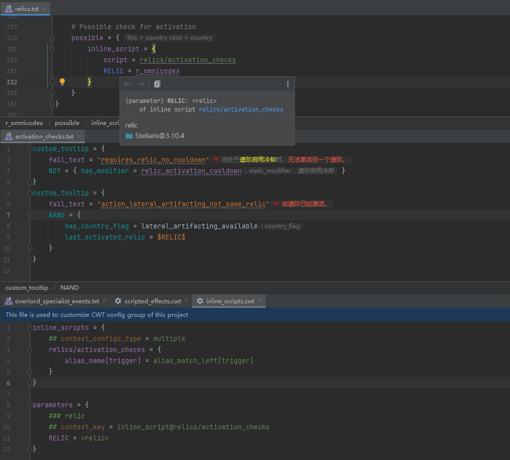
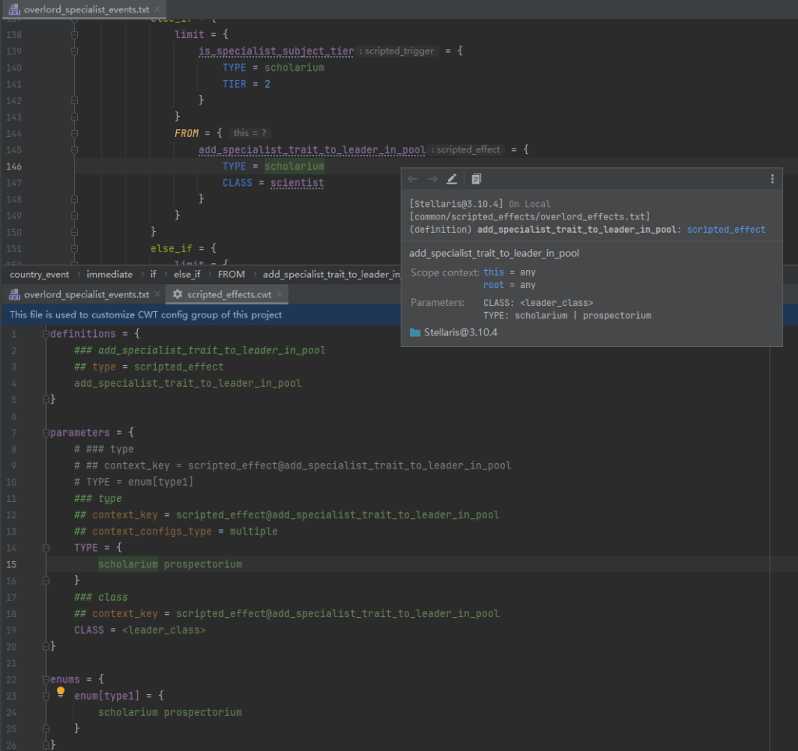

# 规则分组与规则文件

## 规则分组 {#config-group}

### 概述

PLS基于由CWT规则文件组成的规则分组，实现了诸多语言功能。

规则分组可以有不同的来源，而对于同一来源的规则分组，又区分为各自游戏类型的规则分组，以及所有游戏类型共享的核心规则分组。

参考链接：

* [仓库一览](https://github.com/DragonKnightOfBreeze/Paradox-Language-Support/tree/master/cwt)

### 来源

#### 内置的规则分组 {#builtin-config-groups}

* 路径：`config/{gameType}`[^1]（位于插件压缩包中的内置规则jar包中）
* 是否启用：始终启用
* 是否可自定义：否

其中的规则文件来自插件仓库以及各自游戏的规则仓库，相较于CWTools所使用的规则文件，它们经过一定的修改和扩展。

#### 本地的规则分组 {#local-config-groups}

* 路径：`{rootPath}/{gameType}`[^1]（可在插件的配置页面中配置`rootPath`对应的文件路径）
* 是否启用：如果路径存在
* 是否可自定义：是

其中的规则文件由用户自定义，适用于所有项目。对它们的更改需要手动确认导入。

#### 项目的规则分组 {#project-config-groups}

* 路径：`.config/{gameType}`[^1]（位于项目根目录中）
* 是否启用：如果路径存在
* 是否可自定义：是

其中的规则文件由用户自定义，仅适用于当前项目。对它们的更改需要手动确认导入。

### 覆盖策略

规则会按照文件路径和规则ID进行后序覆盖。

读取规则时，插件会依次遍历内置的规则分组、本地的规则分组以及项目的规则分组。
核心规则分组由所有游戏类型共享，会在对应游戏类型的规则分组之前被遍历。

例如，如果你在项目根目录下的规则文件`.config/stellaris/modifiers.cwt`中编写了自定义的规则，它将完全覆盖插件内置的修正规则。
因为插件内置的修正规则位于插件jar包中的规则文件`config/stellaris/modifiers.cwt`中，它们的文件路径都是`modifiers.cwt`。
如果此自定义的规则文件中没有任何内容，应用后插件将无法解析脚本文件中的任何修正。

## CWT规则文件 {#cwt-config-file}

### 概述

CWT规则文件使用一种特别的文件格式，可以视为Paradox脚本语言的变种。它的文件扩展名为`.cwt`。

### 语法

CWT规则文件的基本语法如下所示：

```cwt
# both equal sign ('=', '==') and not equal sign ('<>', '!=') can be used as the k-v separator (also available in options)
# properties (options) and values can be mixed in clauses (also available in options)

### documentation comment
## option = option_value
## option_0 = { k = v }
## option_value
prop = {
    # line comment
    k = v
    v
}
```

## 编写CWT规则文件 {#writing-cwt-config-files}

### 概述

正在更新中。

关于更详细的编写规范，请参考下方的参考链接以及插件内置的那些规则文件。

参考链接：

* [指引文档](https://github.com/DragonKnightOfBreeze/Paradox-Language-Support/blob/master/references/cwt/guidance.md)

### 编写规范

#### Priorities *(New in 1.3.7)*

优先级规则可以用来配置目标（封装变量，定义、本地化与复杂枚举）的覆盖顺序。

```cwt
priorities = {
    # LHS - file path (relative to game or mod root directory)
    # RHS - priority (available values: "fios", "lios", "ordered", default value: "lios", ignore case)
    
    # file path - path of specific directory (e.g. ""common/on_actions", "common/scripted_variables", "localisation")
    
    # fios - use the one that reads first, ignore all remaining items
    # lios - use the one that reads last (if not specified, use this as default)
    # ordered - reads by order, no overrides
    
    "events" = fios
    # ...
}
```

#### System Scopes

TODO

#### Localisation Locales

TODO

#### Types and Subtypes

TODO

#### Declarations

TODO

#### Enums and Complex Enums

TODO

#### Dynamic Values

TODO

#### Aliases and Single Aliases

TODO

#### Inlines

TODO

#### Modifiers and Modifier Groups

TODO

#### Links

TODO

#### Scopes and Scope Groups

TODO

#### Localisation Links and Localisation Commands

TODO

### 编写规范（扩展的CWT规则）

> [!tip]
>
> 这些规则基本上由用户自行编写，用于强化插件的各项语言功能，例如快速文档、内嵌提示、代码高亮与代码补全。

#### Scripted Variables *(New in 1.3.5)*

```cwt
scripted_variables = {
    # 'x' or 'x = xxx'
    # 'x' can also be a pattern expression (template expression, ant expression or regex)
    
    ### Some documentation
    ## hint = §RSome inlay hint text§!
    x
}
```

#### Definitions

```cwt
definitions = {
    # 'x' or 'x = xxx'
    # 'x' can also be a pattern expression (template expression, ant expression or regex)
    
    ### Some documentation
    ## type = civic_or_origin.civic
    x
    
    # since 1.3.5, scope context related options are also available here
    ## type = scripted_trigger
    ## replace_scopes = { this = country root = country }
    x
}
```

#### Game Rules

```cwt
game_rules = {
    # 'x' or 'x = xxx'
    # 'x' can also be a pattern expression (template expression, ant expression or regex)
    # use 'x = xxx' to override declaration config
    
    ### Some documentation
    ## replace_scopes = { this = country root = country }
    x
}
```

#### On Actions

```cwt
on_actions = {
    # 'x' or 'x = xxx'
    # 'x' can also be a pattern expression (template expression, ant expression or regex)
    
    ### Some documentation
    ## replace_scopes = { this = country root = country }
    ## event_type = country
    x
}
```

#### Inline Scripts

```cwt
inline_scripts = {
    # 'x' or 'x = xxx'
    # 'x' is a inline script expression, e.g., for 'inline_script = jobs/researchers_add', 'x' should be 'jobs/researchers_add'
    # 'x' can also be a pattern expression (template expression, ant expression or regex)
    # use 'x = xxx' to declare context config(s) (add '## context_configs_type = multiple' if there are various context configs)
    # note extended documentation is unavailable for inline scripts
    
    x

    # more detailed examples for declaring context config(s)

    ## context_configs_type = multiple
    x = {
        ## cardinality = 0..1
        potential = single_alias_right[trigger_clause]
        ## cardinality = 0..1
        possible = single_alias_right[trigger_clause]
    }

    # since 1.3.5, scope context related options are also available here

    ## replace_scopes = { this = country root = country }
    x
    
    # since 1.3.6, using single alias at root level is also available here
    
    ## context_configs_type = multiple
    x = single_alias_right[trigger_clause]
}
```

示例：



#### Parameters

```cwt
parameters = {
    # 'x' or 'x = xxx'
    # 'x' is a parameter name, e.g., for '$JOB$', 'x' should be 'JOB'
    # 'x' can also be a pattern expression (template expression, ant expression or regex)
    # use 'x = xxx' to declare context config(s) (add '## context_configs_type = multiple' if there are various context configs)
    
    # since 1.3.6, value of option 'context_key' can also be a pattern expression (template expression, ant expression or regex)
    
    ### Some documentation
    ## context_key = scripted_trigger@some_trigger
    x
    
    # more detailed examples for declaring context config(s)
    
    ## context_key = scripted_trigger@some_trigger
    x = localistion
    
    ## context_key = scripted_trigger@some_trigger
    ## context_configs_type = multiple
    x = {
        localisation
        scalar
    }
    
    # since 1.3.5, scope context related options are also available here
    
    ## context_key = scripted_trigger@some_trigger
    ## replace_scopes = { this = country root = country }
    x
    
    # since 1.3.6, using single alias at root level is also available here
    
    ## context_key = scripted_trigger@some_trigger
    ## context_configs_type = multiple
    x = single_alias_right[trigger_clause]
    
    # since 1.3.12, a parameter's config context and scope context can be specified to inherit from its context
    # e.g. for parameter 'x' with context key 'scripted_trigger@some_trigger', its context is scripted trigger 'some_trigger'
    
    ## context_key = scripted_trigger@some_trigger
    ## inherit
    x
}
```

示例：



#### Complex Enum Values

```cwt
complex_enum_values = {
    component_tag = {
        # 'x' or 'x = xxx'
        # 'x' can also be a pattern expression (template expression, ant expression or regex)
        
        ### Some documentation
        ## hint = §RSome inlay hint text§!
        x
    }
}
```

#### Dynamic Values

```cwt
dynamic_values = {
    event_target = {
        # 'x' or 'x = xxx'
        # 'x' can also be a pattern expression (template expression, ant expression or regex)

        ### Some documentation
        ## hint = §RSome inlay hint text§!
        x

        # since 1.3.9, scope context related options are also available here
        # only receive push scope (this scope), ignore others (like root scope, etc.)

        ## push_scope = country
        x
    }
}
```

### FAQ

#### 关于模版表达式

模版表达式由字符串字面量以及限定类型的表达式（定义，枚举，动态值）组合而成，用来进行更加灵活的匹配。

```cwt
# a string literal, exactly matches 'x'
x
# a template expression which contains a reference to jobs, matches 'a_researcher_b', 'a_farmer_b', etc.
a_<job>_b
# a template expression which contains a references to enum of weight_or_base, matches 'a_weight_b' and 'a_base_b'
a_enum[weight_or_base]_b
# a template expression which contains a references to dynamic value type of anything
# generally, there is no limit for 'value[anything]', so this expression is equivalent to regex 'a_.*_b'
a_value[anything]_b
```

#### 如何在规则文件中使用ANT表达式 *(New in 1.3.6)*

从1.3.6开始，可以通过ANT表达式进行更加灵活的匹配。

```cwt
# a ant expression use prefix 'ant:'
ant:/foo/bar?/*
# a ant expression use prefix 'ant.i:' (ignore case)
ant.i:/foo/bar?/*

# wildcards in ant expression:
# '?' - used to match any single character
# '*' - used to match any characters (exclude '/')
# '**' - used to match any characters
```

#### 如何在规则文件中使用正则表达式 *(New in 1.3.6)*

从1.3.6开始，可以通过正则表达式进行更加灵活的匹配。

```cwt
# a regex use prefix 're:'
re:foo.*
# a regex use prefix 're.i:' (ignore case)
re.i:foo.*
```

#### 如何在规则文件中指定作用域上下文

在规则文件中，作用域上下文是通过选项`push_scope`与`replace_scope`来指定的。

```cwt
# push 'country' scope to scope stack
# for this example, the next this scope will be 'country'
## push_scope = country
some_config

# replace scopes of specific system scopes into scope context
# not supported for 'prev' system scope (and 'prevprev', etc.)
# for this example, the next this scope will be 'country', so do the next root scope and the next from scope
## replace_scopes = { this = country root = country from = country }
some_config
```

## 导入CWT规则文件 {#importing-cwt-config-files}

### 概述

你可以在[本地的规则分组](#local-config-groups)或者[项目的规则分组](#project-config-groups)对应的目录下编写自定义的规则文件。
它们可以用来完善插件内置的规则，或是增强插件的功能。

如果发生更改，编辑器右上角的上下文悬浮工具栏中会出现刷新按钮。
点击确认导入后，即可应用这些自定义的规则文件的更改。

IDE将会在后台花费一些时间重新解析已打开的文件，
并且请注意，如果规则文件的更改会引发索引逻辑的更改 （例如，新增了一种定义类型，或是更改了某种定义类型的匹配条件），
你可能需要重新索引整个项目（这可能需要花费数分钟），以使在涉及到这些更改的场合，插件能够正常工作。

[^1]: 允许的`gameType`的值：`stellaris`, `ck2`, `ck3`, `eu4`, `hoi4`, `ir`, `vic2`, `vic3`（或者`core`，对于核心规则分组）
