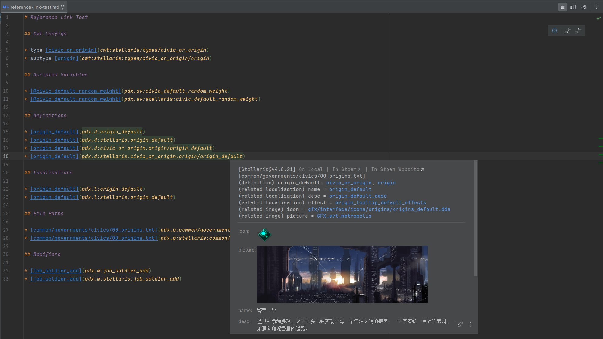
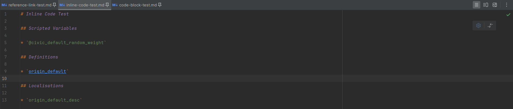
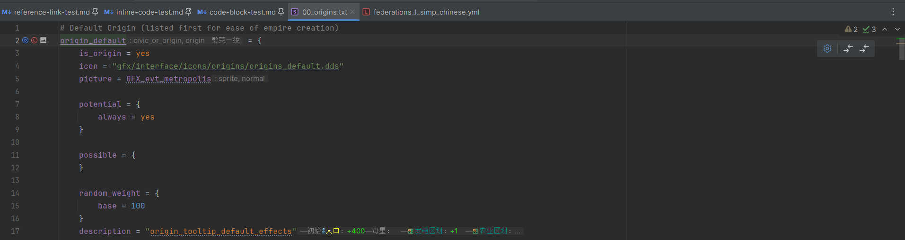
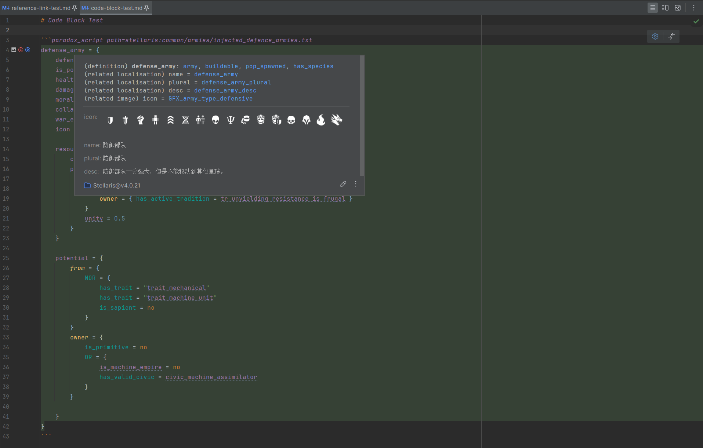
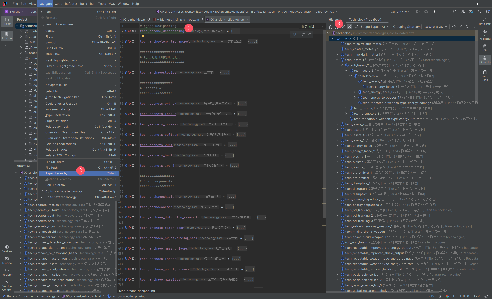
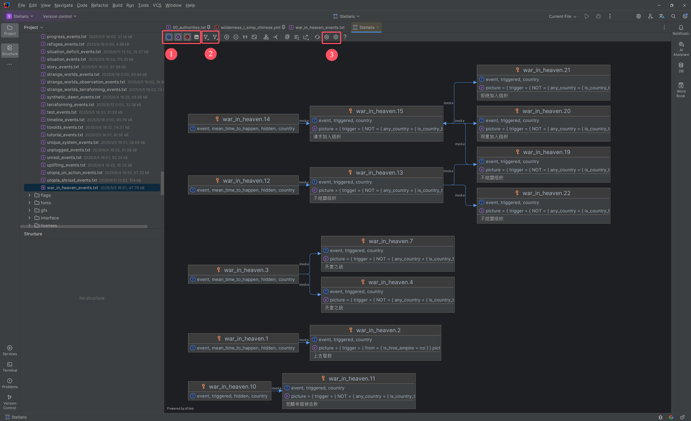
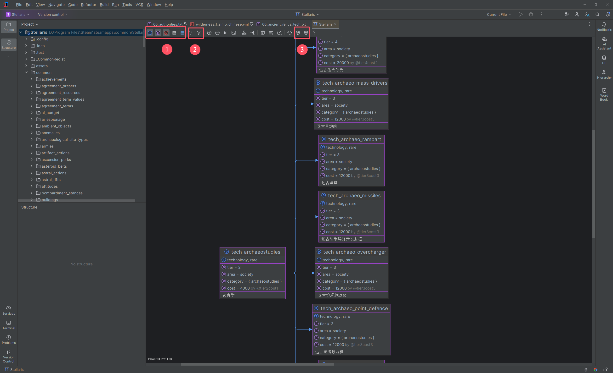
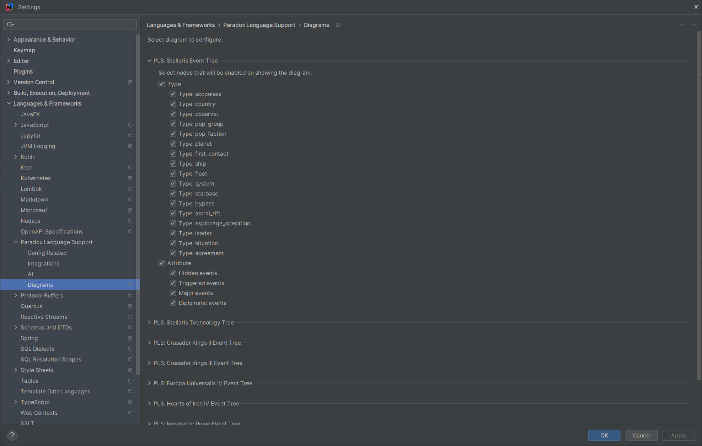

# 扩展

## Markdown {#md}

> [!NOTE]
> 
> 此章节的功能要求同时安装与启用 [Markdown](https://plugins.jetbrains.com/plugin/7793-markdown) 插件

PLS 扩展了与 Markdown 的集成，涉及链接、内联代码、代码块等。

### 链接

通过使用带有特定前缀的特定格式的链接文本，PLS 可以将 Markdown 链接解析为匹配的目标引用（定义、本地化等），
从而在编辑器视图中额外提供代码导航、快速文档等语言功能。

这也适用于其他地方的链接，例如 HTML 链接，以及快速文档的原始文本中的用于导航到 PSI 元素的链接。



对于不同类型的引用链接，其格式与示例如下：

**CWT 规则**（目前仅提供有限的支持）

* 格式
  * `cwt:{gameType}/{parts}`
* 示例
  * `cwt:stellaris:types/civic_or_origin`
  * `cwt:stellaris:types/civic_or_origin/origin`

**封装变量**

* 格式
  * `pdx.sv:{name}`
  * `pdx.sv:{gameType}/{name}`
* 示例
  * `pdx.sv:civic_default_random_weight`
  * `pdx.sv:stellaris:civic_default_random_weight`

**定义**

* 格式
  * `pdx.d:{typeExpression}/{name}`
  * `pdx.d:{gameType}/{typeExpression}/{name}`
* 示例
  * `pdx.d:origin_default`
  * `pdx.d:stellaris:origin_default`
  * `pdx.d:civic_or_origin.origin/origin_default`
  * `pdx.d:stellaris:civic_or_origin.origin/origin_default`

**本地化**

* 格式
  * `pdx.l:{name}`
  * `pdx.l:{gameType}/{name}`
* 示例
  * `pdx.l:origin_default_desc`
  * `pdx.l:stellaris:origin_default_desc`

**文件路径**（相对于游戏或模组目录）

* 格式
  * `pdx.p:{path}`
  * `pdx.p:{gameType}/{path}`
* 示例
  * `pdx.p:common/governments/civics/00_origins.txt`
  * `pdx.p:stellaris:common/governments/civics/00_origins.txt`

**修正**

* 格式
  * `pdx.m:{name}`
  * `pdx.m:{gameType}:{name}`
* 示例
  * `pdx.m:job_soldier_add`
  * `pdx.m:stellaris:job_soldier_add`

备注：

* `{gameType}` - 游戏类型ID，目前有以下可选值：`stellaris`, `ck2`, `ck3`, `eu4`, `hoi4`, `ir`, `vic2`, `vic3`（对于共享的规则分组则为`core`）。
* `{typeExpression}` - 定义类型表达式，可以仅包含基础类型（如`civic_or_origin`），也可以包含基础类型以及多个匹配的子类型，用点号分割（如`civic_or_origin.origin`）。

### 内联代码

> [!NOTE]
>
> 此章节的功能需要启用特定的高级设置项（`高级设置 > Paradox Language Support > 解析 Markdown 内联代码`）

PLS 可以尝试将 Markdown 内联代码解析为匹配的目标引用（定义、本地化等），
从而在编辑器视图中额外提供代码导航、快速文档等语言功能。





对于不同类型的目标，其格式与示例如下：

**封装变量**

* 格式
  * `@{name}`
* 示例
  * `@civic_default_random_weight`

**定义**

* 格式
  * `{name}`
* 示例
  * `origin_default`

**本地化**

* 格式
  * `{name}`
* 示例
  * `origin_default_desc`

备注：

* 如果可以同时解析为定义和本地化，则会优先解析为定义。

### 代码块

通过在 Markdown 代码块的语言ID后面注入额外的信息，可以为其中的脚本或本地化文件的片段指定游戏类型和文件路径。
PLS 会根据这些信息来匹配CWT规则，从而提供各种高级语言功能，如同编写实际的脚本或本地化文件一样。



注入信息的格式与示例如下：

* 格式
  * `path={gameType}:{path}`
* 示例
  * `path=stellaris:common/armies/injected_defence_armies.txt`

更加完整的示例：

```paradox_script path=stellaris:common/armies/injected_defence_armies.txt
defense_army = {
    # ...
}
```

备注：

* `{gameType}` - 游戏类型ID，目前有以下可选值：`stellaris`, `ck2`, `ck3`, `eu4`, `hoi4`, `ir`, `vic2`, `vic3`（对于共享的规则分组则为`core`）。
* `{path}` - 模拟的相对于游戏或模组目录的文件路径。必须是合法的脚本或本地化文件的路经。

## 图表 {#diagrams}

> [!NOTE]
>
> 此章节的功能要求同时安装与启用 Diagrams 插件

> [!WARNING]
> 
> 此章节的功能以及 Diagrams 插件仅在专业版IDE中可用（例如：IntelliJ IDEA Ultimate）

PLS提供了数种图表（Diagrams），可用于展示特定类型的定义的信息，以及相互之间的关系。

目前仅提供事件树与科技树的图表。

> [!TIP]
> 
> 你也可以考虑使用定义的类型层级视图来查看事件树与科技树。
> 
> * 光标位于定义或其引用上时，在主菜单中点击 `Navigate > Type Hierarchy`，打开类型层级窗口。
> * 在弹出的层级的工具窗口中，通过可折叠的树状视图，可以查看同一类型的所有定义的信息。
> * 如果定义类型为事件或科技，也可以对应地以事件树或科技树的形式展示层级视图。
> 
> 

### 事件树

可以通过以下几种方式打开事件树的图表：

* 在项目视图中，选中事件的脚本文件或者其父目录（包括游戏或模组目录），然后打开右键菜单，选择 `Diagrams > Show Diagram...`，接着选择任意属于事件树的图表类型。
* 在编辑器中，打开事件的脚本文件，然后打开右键菜单，选择 `Diagrams > Show Diagram...`，接着选择任意属于事件树的图表类型。
* 如果可用，也可以直接通过快捷键或者随处搜索功能（按`Shift + Shift`）直接打开。

事件树的图表展示了事件的关键信息，以及事件之间的调用关系。可以通过上方的工具栏配置要显示的节点元素，以及过滤要展示的节点。



1. 用于设置要显示的节点元素。从左到右依次是类型、属性、本地化标题、图片。
2. 用于按查询作用域过滤要显示的节点。例如，仅显示已打开的文件中的事件对应的节点。
3. 用于打开图表的设置页面。

> [!WARNING]
>
> IDE 需要花费一定时间来完成数据加载与图形渲染。如果需要渲染的节点与节点元素过多，这个耗时可能相当长。

### 科技树

如果当前游戏类型为 *Stellaris*，可以通过以下几种方式打开科技树的图表：

* 在项目视图中，选中科技的脚本文件或者其父目录（包括游戏或模组目录），然后打开右键菜单，选择 `Diagrams > Show Diagram...`，接着选择任意属于科技树的图表类型。
* 在编辑器中，打开科技的脚本文件，然后打开右键菜单，选择 `Diagrams > Show Diagram...`，接着选择任意属于科技树的图表类型。
* 如果可用，也可以直接通过快捷键或者随处搜索功能（按`Shift + Shift`）直接打开。

科技树的图表展示了科技的关键信息，以及科技之间的先后关系。可以通过上方的工具栏配置要显示的节点元素，以及过滤要展示的节点。



1. 用于设置要显示的节点元素。从左到右依次是类型、属性、本地化名字、图标、图像（以科技卡的形式显示）。
2. 用于按查询作用域过滤要显示的节点。例如，仅显示已打开的文件中的科技对应的节点。
3. 用于打开图表的设置页面。

> [!WARNING]
>
> IDE 需要花费一定时间来完成数据加载与图形渲染。如果需要渲染的节点与节点元素过多，这个耗时可能相当长。

### 设置页面

在 IDE 的设置页面中，点击 `Languages & Frameworks > Paradox Language Support > Diagrams`，可以打开图表的设置页面。

可以在这里根据各种条件，配置各种图表的要显示的节点。

