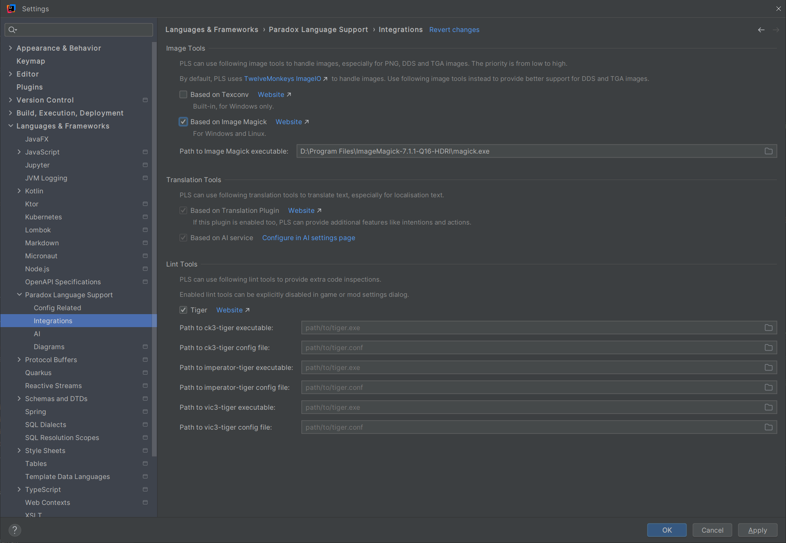
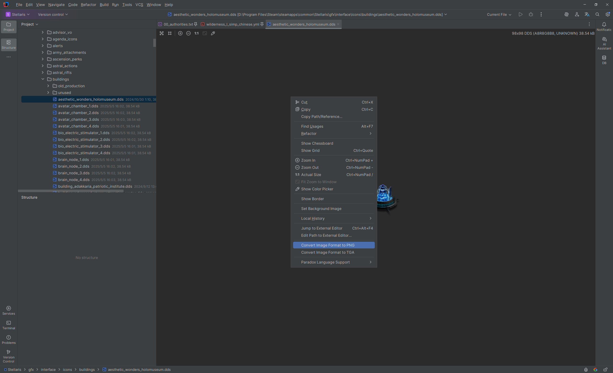
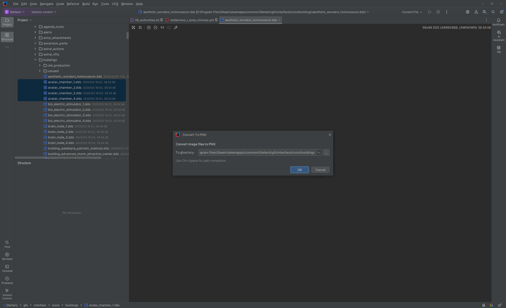
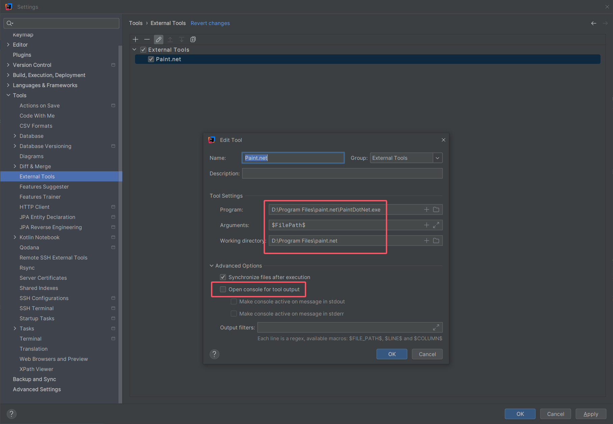
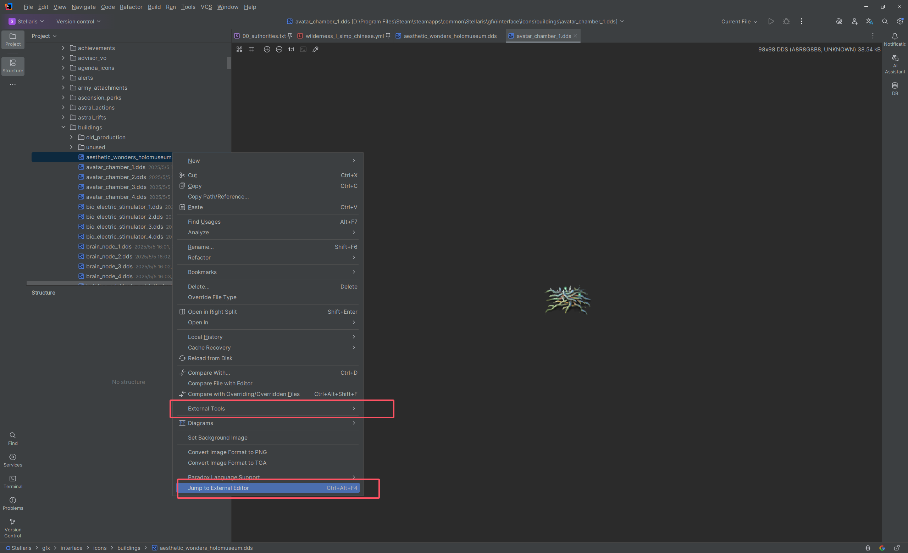
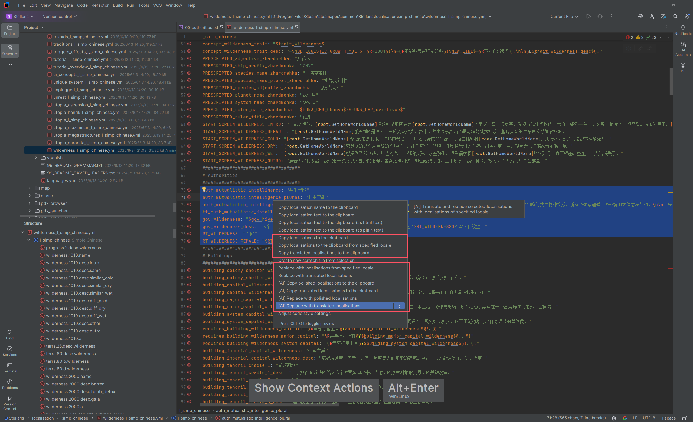
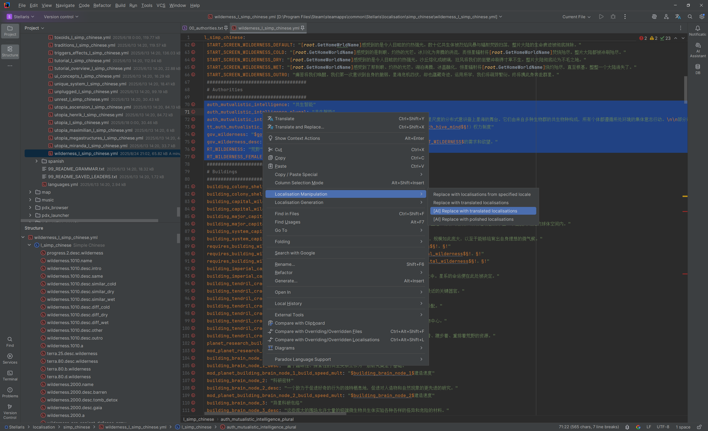
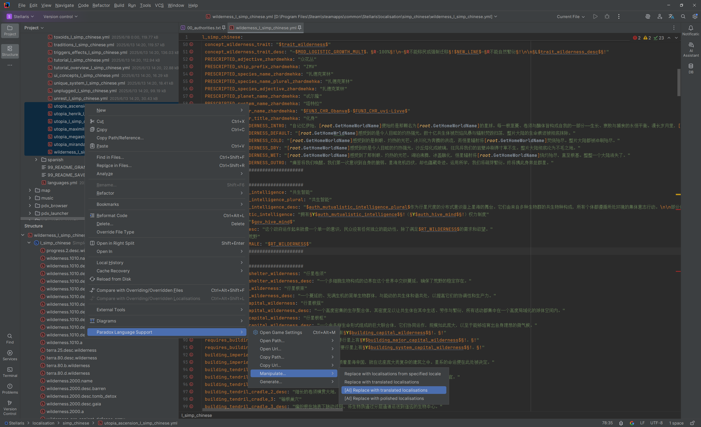
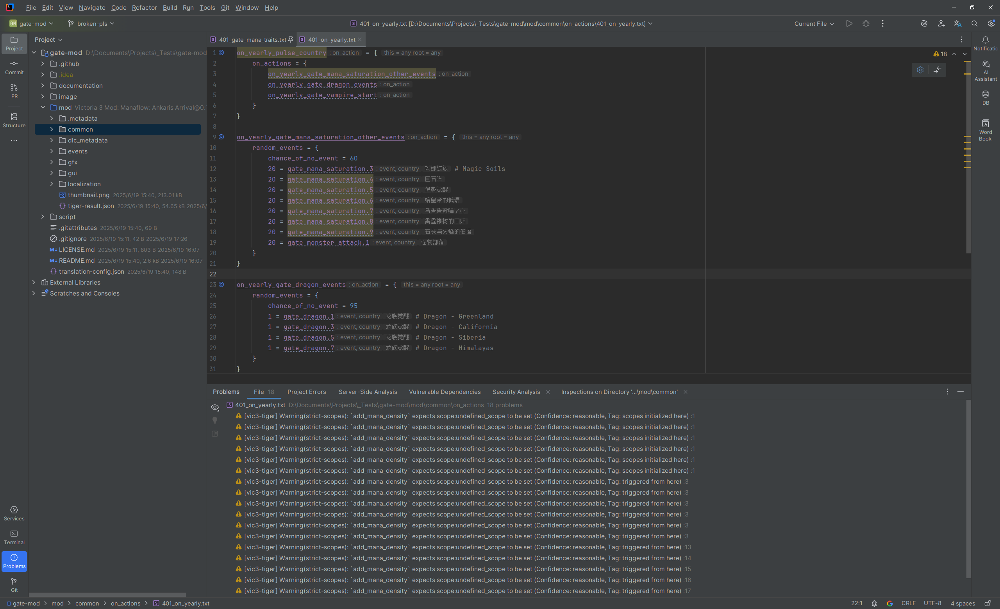
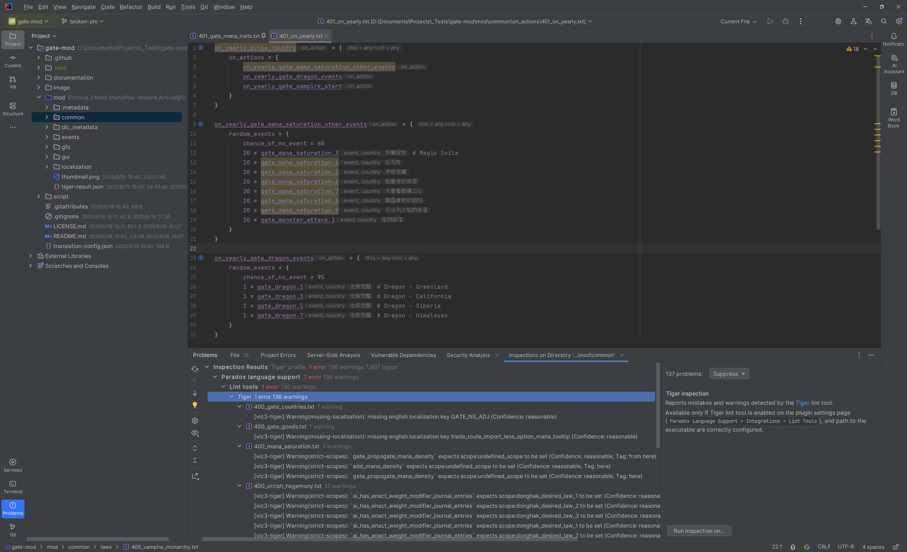

# 集成

PLS 集成了多种实用工具，用于优化和扩展插件的功能。

尽管插件本身已具备完整功能，但在特定场景下启用这些集成可以解决特殊问题、提升开发效率。

## 设置页面 {#settings-page}

在 IDE 的设置页面中，点击 `Languages & Frameworks > Paradox Language Support > 集成`，可以打开集成的设置页面。

可以在这里配置要启用的工具集成，以及具体的工具集成选项。

## 图片工具 {#image-tools}

PLS 集成了以下图片工具，可用于提供更好的对 DDS 和 TGA 图片的支持。

- 基于 [Texconv](https://github.com/microsoft/DirectXTex/wiki/Texconv)
  - DirectXTex 提供的官方命令行纹理转换器，支持 DDS 编解码、格式转换、mipmap 生成等，适合游戏贴图处理。
  - 内置，仅适用于 Windows。
- 基于 [Image Magick](https://www.imagemagick.org)
  - 跨平台的通用图像处理套件，支持批量转换/裁剪/缩放与命令行脚本化，适合大批量 DDS/TGA 工作流。
  - 适用于 Windows 和 Linux。
  - 需要在设置页面中指定正确的可执行文件的路径。

默认的，PLS 使用 [TwelveMonkeys ImageIO](https://github.com/haraldk/TwelveMonkeys) 处理图片。
这是一个 Java 图片处理库，它为 `ImageIO` 适配了多种额外的图片类型。借助它，PLS 可以如同渲染普通的 PNG 图片一样渲染 DDS 和 TGA 图片。
你也可以为 PLS 指定图片工具，此时，如果需要渲染 DDS 和 TGA 图片，插件会先执行图片工具，将其转换为临时 PNG 图片，然后再读取到 `ImageIO` 中。

这适用于很多场合，最常见的是直接在 IDE 中打开图片以进行预览（编辑图片仍然需要在外部编辑器中进行），以及在快速文档与内嵌提示中渲染图片。
你也可以直接在 HTML 文档与 Markdown 文档中引用 DDS 图片，尽管一般来说不能这么做，但是你可以直接在 IDE 中预览渲染后的文档，此时它们应当能够正常显示。 

某些场景下，PLS 需要切分图片以更准确地渲染快速文档与内嵌提示，生成的 PNG 图片可以在 `~/.pls/images` 中找到。

此外，PLS 也提供不同图片格式（PNG、DDS 和 TGA）之间的相互转换的动作。
插件也允许直接在项目视图中选择多个图片，然后执行图片类型的批量转换。

<!--batch-->

> [!warning]
> 请注意， [TwelveMonkeys ImageIO](https://github.com/haraldk/TwelveMonkeys) 对 DDS 图片的支持存在一些限制，例如，它不支持 DX11 格式。
> 
> 如果你遇到 PLS 无法正常渲染 DDS 图片的问题，我们推荐启用插件与 [Image Magick](https://www.imagemagick.org) 的集成。
> 从官网下载程序包到本地，在设置页面中启用集成，正确配置其可执行文件（名为 `magick.exe` 或者 `magick`）的路径，然后保存设置。
> 重启 IDE 后，问题应当能够得到解决。

> [!tip]
> 如果你需要可视化地编辑 DDS 和 TGA 图片，我们推荐使用 [Paint.NET](https://www.getpaint.net)。
> 
> 如果你需要批处理 DDS 和 TGA 图片，如批量调整图片尺寸，我们推荐使用 [Image Magick](https://www.imagemagick.org)。

> [!tip]
> 你可以通过以下几种方式，直接从 IDE 转到外部的图片工具。
> 
> 1. 通过 Intellij IDEA 的 [外部工具](https://www.jetbrains.com/help/idea/configuring-third-party-tools.html) 功能
>    - 在 IDE 的设置页面中，点击 `Tools > External Tools`，然后配置好外部工具。
>    - 在编辑器中打开目标文件（或者在项目视图中选中目标文件），然后在右键菜单中，点击 `External Tools > {toolName}`。
> 2. 直接转到图片的外部编辑器
>    - 在操作系统上，配置好图片的打开方式。
>    - 在编辑器中打开目标文件（或者在项目视图中选中目标文件），然后在右键菜单中，点击 `Jump to External Editor`。
> 
> 
> 
> 

## 翻译工具 {#translation-tools}

PLS 集成了以下翻译工具，可用于批量翻译本地化文本。

- 基于 [Translation 插件](https://github.com/yiiguxing/TranslationPlugin)
  - IntelliJ 生态中常用的翻译工具，支持多翻译引擎、术语/历史、取词与面板交互，适合在编辑器内快速双语对照与批量处理。
  - 如果启用了此插件，PLS 可以提供额外的功能，例如意图和操作。
- 基于 AI
  - 插件内置的 [AI 集成](ai.md) 支持流式翻译与润色本地化文本。适合批量、上下文感知且可能带有额外要求的翻译场景。

如果翻译工具可用，PLS 将会提供额外的用于操作本地化的意图和操作。
它们可以用来批量地翻译本地化文本，然后复制到系统剪贴板，或是进行流式替换。

你可以从多个入口（工具菜单，编辑器右键菜单，项目视图的右键菜单，等等）， 在多个批处理级别（光标位置对应的本地化，光标选取范围涉及到的所有本地化，或是项目视图中选中的文件和目录中的所有本地化） 访问这些功能。

<!--batch-->

以下是一个使用 AI 批量翻译本地化文本的演示：

<ArtPlayer src="/videos/integrations/translate_and_replace_1.mp4" poster="../images/translate_and_replace_1.png" />

> [!info]
> * 对于基于 [Translation 插件](https://github.com/yiiguxing/TranslationPlugin) 的操作任务，会在文件级别以及文件中的每个本地化条目级别并发执行。
> * 对于基于 AI 的操作任务，会在文件级别并发执行，在文件中的每个本地化条目级别流式执行。
> * 完成任务后，会弹出通知，提示任务的执行状态，并提供回退与重新应用操作的入口。
> * 随时可以取消当前正在执行的任务。

## 检查工具 {#linting-tools}

PLS 集成了以下检查工具，可用于提供额外的代码检查。

- [Tiger](https://github.com/amtep/tiger)
  - 面向 P 社脚本的静态分析器（ck3/ir/vic3），可对事件、触发器、修正等进行一致性与语义检查，输出结构化诊断结果。
  - 适用于 Windows 和 Linux。
  - 仅适用于模组目录。
  - 支持的游戏类型：`ck3`, `ir`, `vic3`。
  - 需要在设置页面中指定正确的可执行文件的路径。
  - 可以在设置页面中指定使用的配置文件的路径。
  - 模组目录下的正确位置的配置文件会被自动应用。

如果启用并正确配置了与这些工具的集成，PLS 可以提供额外的代码检查。
你可以直接在问题视图中查看检查结果，或是执行全局代码检查并查看总览。

<!--batch-->

> [!tip]
> 你可以通过以下几种方式，在项目级别或者模组级别选择性禁用检查工具。
> 
> - 项目级别：在 IDE 的设置页面中，点击 `Editor > Inspections`，搜索`paradox lint`，然后按需禁用搜索到的检查项。
> - 模组级别：在模组设置对话框中，展开 `额外选项`，然后按需禁用。