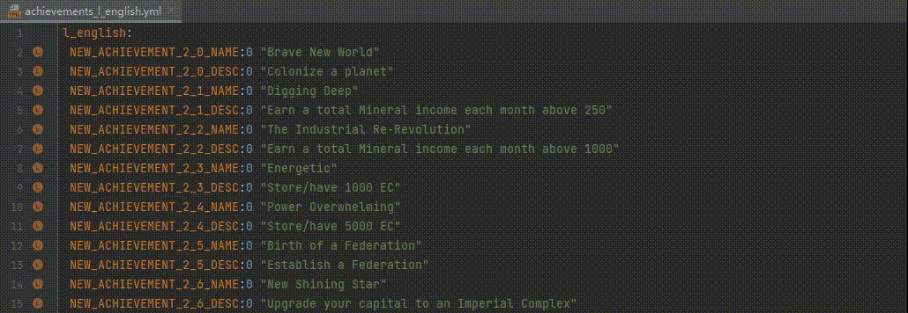

# 插件集成

## 集成**Translation**插件

当同时安装且启用了[Translation](https://github.com/YiiGuxing/TranslationPlugin)插件时，PLS将会额外提供以下功能：

### 翻译文档内容

当光标位于定义的名字、本地化的名字等位置时，
可以通过点击并选择快速文档弹出窗口中的`Translate Documentation`图标按钮，或者点击右键菜单中的`Translate Documentation`选项翻译文档内容。

**注意：**暂不保证翻译后能够正确地识别并保留各种特殊标记。

### 意向：复制本地化到剪贴板并将本地化文本翻译为指定语言区域

当光标选取范围涉及到本地化时，此意向可以将所有涉及到的本地化复制到剪切板，并且在这之前尝试将本地化文本翻译到指定的语言区域。

**注意：**暂不保证翻译后能够正确地识别并保留各种特殊标记。