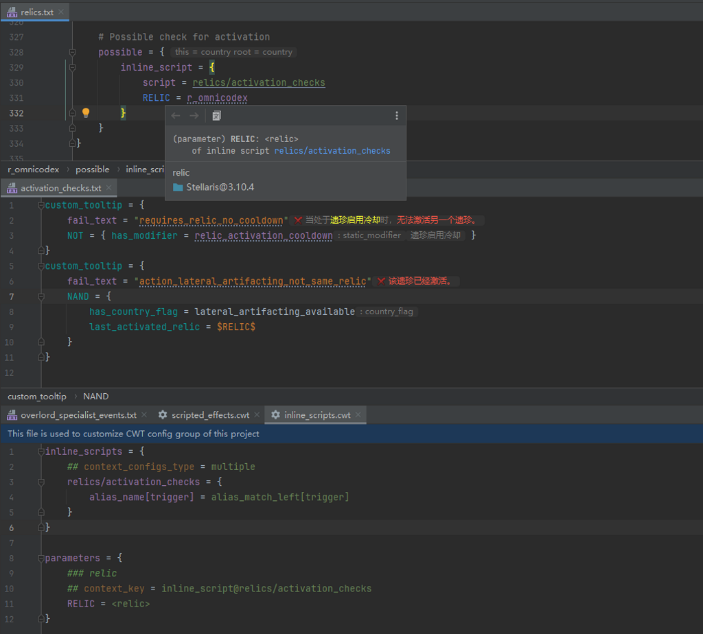
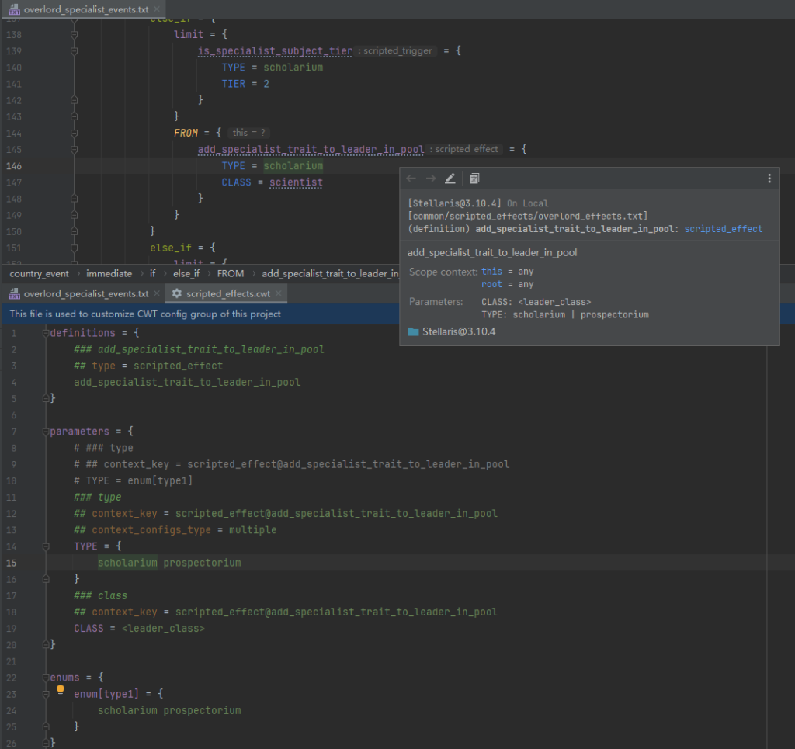

# 附录：规则格式参考

<!--
@doc-meta
本文档是 CWT 规则格式的参考手册，描述插件所支持的各种规则的用途、格式、字段与注意事项。
文档内容基于 Paradox Language Support 插件的实现编写，与 CWTools 的规则格式在多数情况下兼容，但在细节和扩展点上存在差异。

@see docs/zh/config.md
@see icu.windea.pls.config.config.*
@see icu.windea.pls.config.configExpression.*
-->

## 总览 {#overview}

本文档是 CWT 规则格式的参考手册，面向希望理解、编写或扩展 CWT 规则文件的所有读者——包括模组作者、规则文件的协助维护者、插件维护者以及 AI 编程助手。

本文档旨在：

- **统一术语与边界**：对齐插件与 CWTools 的语义，明确插件的扩展点与差异。
- **建立从文档到实现的映射**：在必要时标注对应的接口与解析器，便于回溯源码与验证行为。
- **指导实践**：概述各类规则的用途、格式与注意事项，为正确编写和维护规则文件打好基础。

插件通过读取 `.cwt` 规则文件，构建"规则分组（config group）"，并将其中的规则解析为结构化的"规则对象（config object）"。这些规则对象在代码高亮、补全、导航、检查、快速文档等语言功能中被广泛使用。规则系统由两大要素构成：

- **规则（config）**：每条规则定义了键、值或块的允许形态与上下文约束，如类型、枚举、别名、链接等。详见[规则](#configs)章节。
- **规则表达式（config expression）**：嵌入在规则的字符串字段中，用于描述取值形态或匹配模式的结构化语法，如 `<type>`、`enum[...]`、`value[...]`，以及基数表达式、模板表达式、位置表达式等。详见[规则表达式](#config-expressions)章节。

此外，规则表达式解析后会得到具体的**数据类型（data type）**，数据类型决定了表达式能够匹配脚本文件中的哪些键或值。详见[数据类型](#data-types)章节。

关于规则系统的整体介绍（如规则分组、规则覆盖、自定义规则等），请参阅 [config.md](config.md)。

## 规则 {#configs}

<!-- @see icu.windea.pls.config.config.CwtConfig -->

> 本章节介绍各种规则的用途、格式要点与注意事项，帮助读者正确理解与编写这些规则。

### 概述 {#configs-summary}

#### 规则字段的表示约定

每条规则由若干**字段**（field）组成。字段在规则文件中有多种来源，本文档采用以下格式统一描述：

- **属性字段**：以 `key = value` 形式出现在规则体中的普通属性。文档中直接使用字段名，如 `path`、`name_field`。
- **选项字段**：以选项注释 `## key = value` 形式出现的字段。文档中以 `## ` 为前缀，如 `## cardinality`、`## push_scope`。
- **布尔选项**：以选项注释 `## key` 形式出现的无值标记。文档中同样以 `## ` 为前缀，如 `## primary`、`## inherit`。注意这与 `## key = yes` 不同——布尔选项仅需标记名即可生效。
- **文档注释**：以 `### text` 形式出现的文档注释，通常用于提供快速文档文本。
- **值字段**：直接以值形式出现在规则体中（而非作为属性的值侧），如枚举的值列表。

字段名在规则文件中使用 `snake_case` 形式。

#### 处理流程

规则的整体处理流程可以简化为三个阶段：

1. 读取规则分组中的各个规则文件，构建其语法树（PSI）。
2. 按规则类别，使用对应的解析器（Resolver）将语法树节点转化为结构化的规则对象。
3. 在各语言功能中，根据当前上下文（作用域、类型名、声明上下文等）查询并应用这些规则对象。

规则的来源与覆盖机制详见 [config.md](config.md) 中"规则分组"与"覆盖方式"相关章节。

本文档中的"规则"按层级分为以下几类：

- **基础规则**：如 `CwtPropertyConfig`，是语法树级别的通用节点，用于承载规则文件中的属性和值。本文档不逐一介绍基础规则。
- **[普通规则](#configs-normal)**：驱动各种语言功能的核心规则，包括类型、别名、枚举、链接、作用域等。
- **[扩展规则](#configs-extended)**：用于增强插件功能的附加规则，如为特定定义或内联脚本提供额外的上下文与提示。
- **[内部规则](#configs-internal)**：由插件内部使用的规则，目前不支持（或尚不支持）自定义。

### 普通规则 {#configs-normal}

> 这些规则驱动了各种各样的语言功能，包括但不限于代码补全、代码检查、快速文档、内嵌提示等。

#### 优先级规则 {#config-priority}

<!-- @see icu.windea.pls.lang.overrides.ParadoxOverrideStrategy -->
<!-- @see icu.windea.pls.lang.overrides.ParadoxOverrideService -->
<!-- @see cwt/core/priorities.core.cwt -->

优先级规则用于配置"目标"（文件、全局封装变量、定义、本地化等）的覆盖方式。它影响目标的生效顺序与查询结果排序（流式查询除外）。未命中任何目录映射时，默认使用 `LIOS`（后读覆盖）。

**覆盖方式**：

- **`FIOS`**（First In, Only Served）：先加载者生效，后加载者被忽略。
- **`LIOS`**（Last In, Only Served）：后加载者覆盖先加载者。
- **`DUPL`**（Duplicates）：整文件覆盖，必须用同路径文件进行整体替换。
- **`ORDERED`**（Ordered）：顺序读取，后加载者按序新增或合并，不覆盖既有条目。

查询（非流式）结果的排序由优先级驱动；同一路径下按加载顺序（游戏 / 依赖链）决定先后。同一文件内，后出现的项覆盖前面出现的项。

**格式说明**：

```cwt
priorities = {
    # LHS - file path of containing directory, relative to entry directory
    # RHS - used override strategy
    # entry directory - normally game or mod directory, or `game` subdirectory of game directory
    # override strategy - available values: `fios`, `lios`, `dupl`, `ordered`; default: `lios`; ignore case

    "events" = fios
    # ...
}
```

**示例**：

```cwt
priorities = {
    "common/event_chains" = fios
    "common/on_actions" = ordered
    "common/scripted_variables" = fios
    "events" = fios
}
```

- 两个 MOD 都在 `events/` 中定义同名事件：由于 `events = fios`，先被读取（加载更早）的 MOD 生效，后者被忽略。
- 两个 MOD 都在 `common/on_actions/` 添加条目：由于 `ordered`，会顺序合并执行，不发生覆盖。

#### 声明规则 {#config-declaration}

<!-- @see icu.windea.pls.config.config.delegated.CwtDeclarationConfig -->
<!-- @see icu.windea.pls.ep.resolve.config.CwtDeclarationConfigContextProvider -->
<!-- @see icu.windea.pls.ep.config.config.CwtInjectedConfigProvider -->
<!-- @see icu.windea.pls.config.util.manipulators.CwtConfigManipulator.deepCopyConfigsInDeclaration -->

声明规则描述了"定义条目"的结构，是补全、检查与快速文档等功能的基础。

**路径定位**：`{name}`，其中 `{name}` 为规则名称（即"定义类型"名）。规则文件中的顶级属性，如果键为合法标识符且未被其他规则匹配到，会回退尝试解析为声明规则。

声明规则的处理流程大致如下：首先，只有键为合法标识符的顶级属性才会被视为声明规则。如果声明的根级值为 `single_alias_right[...]`，会先进行内联展开。随后，插件会按子类型裁剪和扁平化规则树——匹配当前上下文子类型的 `subtype[...]` 块会被展开为平级子规则，不匹配的则跳过。最终生成的规则树用于驱动补全、检查等功能。

声明规则可以与其他规则协作：在声明内可引用[别名与单别名](#config-alias)（`alias_name[...]` / `alias_match_left[...]`、`single_alias_right[...]`）。切换类型（swapped type）的声明可直接嵌套在对应基础类型的声明中。游戏规则（game rule）和动作触发（on action）还可以通过[扩展规则](#configs-extended)改写声明上下文。

**示例**：

```cwt
# from `common/buildings.cwt` of stellaris config group

## push_scope = planet
building = {
    ## cardinality = 0..inf
    ## replace_scopes = { this = planet root = planet }
    desc = single_alias_right[triggered_desc_clause]

    ## cardinality = 0..1
    owner_type = corporate

    ## cardinality = 0..1
    ruined_icon = icon[gfx/interface/icons/buildings]

    ## cardinality = 0..1
    ruined_icon = <sprite>

    ## cardinality = 0..1
    building_sets = {
        ## cardinality = 0..inf
        enum[building_set]
    }

    # ...
}
```

**注意事项**：

- `subtype[...]` 仅在与上下文子类型匹配时生效；不匹配将被忽略（不会报错）。
- 根级 `single_alias_right[...]` 会先被展开，再参与后续解析与检查。
- 为保证后续功能能够"向上溯源"，生成的规则节点均会保持父链（parent config）引用。

#### 系统作用域规则 {#config-system-scope}

<!-- @see icu.windea.pls.config.config.delegated.CwtSystemScopeConfig -->
<!-- @see cwt/core/system_scopes.core.cwt -->

系统作用域规则为内置的"系统级作用域"（如 This、Root、Prev、From 等）提供元信息，用于快速文档与作用域栈推导。

**路径定位**：`system_scopes/{id}`，其中 `{id}` 为系统作用域 ID。

**字段含义**：

- `id`：系统作用域 ID。
- `base_id`：基底作用域 ID，未指定时默认为 `id`。用于将同族系统作用域（如 `Prev` / `PrevPrev`、`From` / `FromFrom`）归类。
- `: string`（值）：可读名称，未指定时默认为 `id`。

系统作用域规则与[作用域规则与作用域分组规则](#config-scope)一起决定作用域检查与提示。在部分[扩展规则](#configs-extended)中，可使用选项 `## replace_scopes` 指定系统作用域在当前上下文下对应的具体作用域类型（如将 `this` / `root` / `from` 映射为 `country`）。需要注意的是，`## replace_scopes` 不支持替换 `prev` 系列系统作用域。

**示例**：

```cwt
# from `system_scopes.core.cwt` of core config group

system_scopes = {
    This = {}
    Root = {}
    Prev = { base_id = Prev }
    PrevPrev = { base_id = Prev }
    PrevPrevPrev = { base_id = Prev }
    PrevPrevPrevPrev = { base_id = Prev }
    From = { base_id = From }
    FromFrom = { base_id = From }
    FromFromFrom = { base_id = From }
    FromFromFromFrom = { base_id = From }
}
```

#### 指令规则 {#config-directive}

<!-- @see icu.windea.pls.config.config.delegated.CwtDirectiveConfig -->
<!-- @see cwt/cwtools-stellaris-config/config/common/inline_scripts.cwt -->
<!-- @see cwt/cwtools-vic3-config/config/definition_injections.cwt -->
<!-- @see cwt/cwtools-eu5-config/config/definition_injections.cwt -->

指令规则用于描述脚本文件中区别于一般结构的特殊表达式和结构，并提供额外的提示和验证元数据。这些表达式和结构会改变游戏运行时脚本解析器的行为，从而改变、扩展或复用已有的脚本片段。不同的指令可以拥有不同的规则结构。

目前涉及的指令包括：

- **内联脚本（inline_script）**：（Stellaris）在解析阶段被替换为目标文件的内容，且可以指定参数。
- **定义注入（definition_injection）**：（VIC3 / EU5）在解析阶段对目标定义的声明进行注入或替换，且可以指定模式以决定具体行为。

**路径定位**：`directive[{name}]`，`{name}` 为规则名称。

**示例**：

```cwt
directive[inline_script] = {
    # ...
}
```

#### 类型规则与子类型规则 {#config-type}

<!-- @see icu.windea.pls.config.config.delegated.CwtTypeConfig -->
<!-- @see icu.windea.pls.config.config.delegated.CwtSubtypeConfig -->
<!-- @see icu.windea.pls.lang.match.ParadoxConfigMatchService.matchesType -->
<!-- @see icu.windea.pls.lang.match.ParadoxConfigMatchService.matchesTypeFast -->
<!-- @see icu.windea.pls.lang.match.ParadoxConfigMatchService.matchesSubtype -->
<!-- @see icu.windea.pls.lang.match.ParadoxConfigMatchService.matchesSubtypeFast -->

类型规则按"文件路径 / 键名"等条件定位并命名"定义（definition）"，并可声明子类型、展示信息与图片。

**路径定位**：

- 类型：`types/type[{type}]`，`{type}` 为定义类型名。
- 子类型：`types/type[{type}]/subtype[{subtype}]`。

**类型字段**：

- `path`：参与扫描的文件目录路径（解析时会自动移除 `game/` 前缀）。可声明多个。
- `path_file`：限定文件名（不含扩展名）。若指定，则 `path_extension` 不再单独生效。
- `path_extension`：限定文件扩展名（解析时会自动规范化，如补齐 `.`）。仅在未指定 `path_file` 时单独生效。
- `path_pattern`：使用 ANT 路径模式匹配文件路径。可声明多个，与 `path` 独立——任一 `path_pattern` 匹配即可通过路径检查。
- `path_strict`：设为 `yes` 时强制精确匹配目录，不匹配子目录。
- `type_per_file`：设为 `yes` 时表示"一文件一类型实例"（此时定义对应整个脚本文件而非其中的某个属性）。
- `name_field`：从定义体中指定的属性键读取展示名称。存在时，类型键仅接受 `## type_key_filter` 中显式列出的值或无限制。
- `name_from_file`：设为 `yes` 时从文件名推导定义名。
- `unique`：设为 `yes` 时启用重名冲突检查。
- `severity`：重名冲突的报告级别（如 `warning`、`error`）。
- `skip_root_key`：允许跳过若干顶级键后继续匹配类型键。值为花括号集合，支持多组（忽略大小写，支持通配符 `any`/`*`/`?`）。若 `skip_root_key` 非空但文件中无根键则不匹配；若为空但文件中有根键同样不匹配。
- `type_key_prefix`：类型键的必需前缀（忽略大小写）。
- `## type_key_filter`：类型键的过滤条件（选项注释，忽略大小写）。支持包含集合 `{ a b }` 和排除集合 `<> { x y }`。
- `## type_key_regex`：类型键的正则过滤（选项注释，忽略大小写）。
- `## starts_with`：类型键的前缀过滤（选项注释，忽略大小写）。
- `## graph_related_types`：声明图相关类型（选项注释），用于定义间依赖关系图。
- `localisation`：本地化展示小节，详见[类型展示规则](#config-type-presentation)。
- `images`：图片展示小节，详见[类型展示规则](#config-type-presentation)。
- `modifiers`：修正小节，派生出与类型绑定的[修正规则](#config-modifier)。

**类型匹配流程**：

对于一个脚本文件中的属性（或整个文件），类型匹配按以下步骤依次进行：

1. **元素类型检查**：`type_per_file` 为 `yes` 时，定义必须对应整个脚本文件；否则必须对应一个属性。
2. **路径匹配**：先检查 `path_pattern`（ANT 模式），若有任一匹配即通过；否则检查 `path_file` 或 `path_extension`，再检查 `path`（含 `path_strict`）。`path` 和 `path_extension`/`path_file` 均不为空时必须同时满足。
3. **类型键检查**（顺序进行）：`## starts_with` → `## type_key_regex` → `## type_key_filter` → `name_field` 约束（若 `name_field` 存在，则类型键仅可为 `## type_key_filter` 显式列出的值之一，或无限制）。
4. **根键检查**：根据 `skip_root_key` 判断是否需要跳过根键。
5. **类型键前缀检查**：根据 `type_key_prefix` 判断是否匹配（忽略大小写）。
6. **声明结构检查**：检查定义的属性值是否与[声明规则](#config-declaration)的预期结构一致（如声明规则期望块则属性值必须为块）。

**子类型字段**：

子类型通过内容匹配确定。子类型按声明顺序逐个检查，通常与[声明规则](#config-declaration)中的 `subtype[...] = {...}` 一起使用，以细化结构与校验。

- `## type_key_filter`：按类型键过滤（选项注释，忽略大小写）。
- `## type_key_regex`：按类型键正则过滤（选项注释，忽略大小写）。
- `## starts_with`：按类型键前缀过滤（选项注释，不忽略大小写）。
- `## push_scope`：匹配时推入的作用域类型（选项注释）。
- `## display_name`：子类型的展示名称（选项注释）。
- `only_if_not`：与指定子类型互斥——仅在指定的子类型均未匹配时才继续检查。
- `## group`：子类型分组名（选项注释）。同一分组内的子类型互斥（最多匹配一个）。

**子类型匹配流程**：

1. **互斥检查**：若 `only_if_not` 中指定的任一子类型已匹配，则跳过。
2. **类型键检查**：依次检查 `## starts_with`（不忽略大小写）→ `## type_key_regex` → `## type_key_filter`（忽略大小写）。
3. **内容匹配**：若子类型声明体（`subtype[...] = { ... }`）中包含属性或值规则，则递归检查定义体中是否存在匹配的属性和值。匹配方式包括布尔值精确匹配、字符串/数据表达式匹配、以及嵌套块的递归匹配。若声明体为空（`{}`），则仅需类型键检查通过即可匹配。

类型规则与[声明规则](#config-declaration)协作，为具体定义的声明提供上下文与结构约束。

**示例**：

```cwt
# from `events/events.cwt` of stellaris config group

types = {
    ## graph_related_types = { special_project anomaly_category }
    type[event] = {
        name_field = id
        path = "game/events"
        path_extension = .txt

        subtype[inherited] = {
            base = <event>
        }

        ## group = event_attribute
        subtype[triggered] = {
            is_triggered_only = yes
        }

        ## group = event_type
        ## type_key_filter = country_event
        ## push_scope = country
        ## display_name = Country Event
        subtype[country] = {}

        ## group = event_type
        ## type_key_filter = planet_event
        ## push_scope = planet
        ## display_name = Planet Event
        subtype[planet] = {}

        # ... more event type subtypes (ship, fleet, system, etc.)
    }
}
```

```cwt
# from `common/buildings.cwt` of stellaris config group
# which represents `localisation` and `images` sections

types = {
    type[building] = {
        path = "game/common/buildings"
        path_extension = .txt
        subtype[capital] = {
            capital = yes
        }
        localisation = {
            name = "$"
            desc = "$_desc"
        }
        images = {
            icon = icon
            icon = "gfx/interface/icons/buildings/$.dds"
        }
    }
}
```

**注意事项**：

- `path` 为必需字段；缺失将导致类型被跳过。
- `skip_root_key` 为多组设置：若存在任意一组与文件顶级键序列匹配，则允许跳过后继续匹配类型键。
- 子类型匹配"顺序敏感"，请将更具体的规则放在更前面。
- 同一 `## group` 内的子类型互斥（如 `event_type` 分组中的 `country`、`planet`、`ship` 等）。

#### 别名规则与单别名规则 {#config-alias}

<!-- @see icu.windea.pls.config.config.delegated.CwtAliasConfig -->
<!-- @see icu.windea.pls.config.config.delegated.CwtSingleAliasConfig -->
<!-- @see icu.windea.pls.config.util.manipulators.CwtConfigManipulator.inlineAlias -->
<!-- @see icu.windea.pls.config.util.manipulators.CwtConfigManipulator.inlineSingleAlias -->

别名规则将可复用的规则片段抽象成"具名别名"，在多处引用并展开。单别名用于"值侧"的一对一复用。

**路径定位**：

- 别名：`alias[{name}:{subName}]`（`{subName}` 为受限的数据表达式）。
- 单别名：`single_alias[{name}]`。

**声明与引用语法**：

- 声明别名：`alias[effect:some_effect] = { ... }`
- 使用别名：`alias_name[effect] = alias_match_left[effect]`
- 声明单别名：`single_alias[trigger_clause] = { alias_name[trigger] = alias_match_left[trigger] }`
- 使用单别名：`potential = single_alias_right[trigger_clause]`

别名支持通过选项指定作用域约束：`## scope` / `## scopes` 声明允许的输入作用域集合，`## push_scope` 声明输出作用域。别名的 `subName` 支持受限的数据表达式，用于匹配与提示。

在使用处，别名体会被复制为普通属性规则（键名 = 子名，值和子规则深拷贝，保留选项）。如果展开结果的值侧仍为 `single_alias_right[...]`，会继续触发级联展开。别名常与[声明规则](#config-declaration)结合使用，在定义声明中复用 trigger / effect 等片段。

**示例**：

```cwt
# Alias: define an effect fragment
alias[effect:apply_bonus] = {
    add_modifier = {
        modifier = enum[modifier_rule]
        days = int
    }
}

# Use alias in scripts
scripted_effect = {
    alias_name[effect] = alias_match_left[effect]
}

# Single alias: define a trigger-block fragment
single_alias[trigger_clause] = {
    alias_name[trigger] = alias_match_left[trigger]
}

# Use single-alias on value side in a declaration
some_definition = {
    ## cardinality = 0..1
    potential = single_alias_right[trigger_clause]
}
```

**注意事项**：

- 别名唯一键由 `name:subName` 组成；重复定义将按覆盖方式 / 优先级处理。
- 展开后才会进行基数与选项校验；请在展开位置而非声明处考虑最终语义。
- `subName` 为数据表达式（受限），可使用模板 / 枚举等提高复用度，但请避免过宽导致误匹配。

#### 枚举规则与复杂枚举规则 {#config-enum}

<!-- @see icu.windea.pls.config.config.delegated.CwtEnumConfig -->
<!-- @see icu.windea.pls.config.config.delegated.CwtComplexEnumConfig -->
<!-- @see icu.windea.pls.lang.match.ParadoxConfigMatchService.matchesComplexEnum -->

枚举规则为数据表达式 `enum[...]` 提供取值集合。根据值的来源不同，分为简单枚举和复杂枚举。

**路径定位**：

- 简单枚举：`enums/enum[{name}]`
- 复杂枚举：`enums/complex_enum[{name}]`

---

**简单枚举（Enum）**

简单枚举的值集合全部在规则文件中声明，匹配时忽略大小写。当前实现仅支持常量值，不支持模板表达式。

```cwt
enums = {
    enum[weight_or_base] = { weight base }
}
```

---

**复杂枚举（Complex Enum）**

复杂枚举从脚本文件中按路径和锚点动态收集枚举值。

`path` / `path_file` / `path_extension` / `path_pattern` / `path_strict` 组合决定参与扫描的文件集合（路径匹配逻辑与[类型规则](#config-type)相同）。`start_from_root` 指定是否从文件顶部（而非顶级属性的下一级）开始查询锚点。`name` 小节描述如何在匹配文件中定位值锚点——实现会收集其中所有名为 `enum_name` 的属性键或属性值或块成员值作为锚点。

**复杂枚举匹配流程**：对于匹配文件中的每个字符串表达式，插件会检查它是否可以作为某个复杂枚举值的锚点。具体步骤为：首先在 `name` 小节中查找包含 `enum_name` 的规则条目；然后根据 `enum_name` 出现的位置（作为属性键、属性值或块成员值），确定当前表达式的角色——若为属性键侧的 `enum_name`，则当前属性键即为枚举值锚点；若为属性值侧的 `enum_name`，则当前属性的值即为枚举值锚点；若为块成员值的 `enum_name`，则该值本身即为枚举值锚点。最后，从锚点向上逐层匹配父级结构，直至到达 `name` 小节的根（`start_from_root` 为 `yes` 时必须到达文件根级，否则到达顶级属性的下一级即可）。

插件扩展选项：布尔选项 `## case_insensitive` 将复杂枚举值标记为忽略大小写；布尔选项 `## per_definition` 将同名同类型复杂枚举值的等效性限制在定义级别（而非文件级别）。

```cwt
enums = {
    complex_enum[component_tag] = {
        path = "game/common/component_tags"
        start_from_root = yes
        name = {
            enum_name
        }
    }
}
```

**注意事项**：

- 简单枚举当前仅支持常量值；若填写模板表达式，不会被按模板解析。
- 复杂枚举若缺少 `name` 小节或未能在匹配文件中找到任何 `enum_name` 锚点，将导致该枚举为空。
- 简单枚举值默认忽略大小写，复杂枚举值默认不忽略大小写。

#### 动态值类型规则 {#config-dynamic-value-type}

<!-- @see icu.windea.pls.config.config.delegated.CwtDynamicValueTypeConfig -->

动态值类型规则为数据表达式 `value[...]` 提供"预定义（硬编码）"的动态值集合，替代固定字面量，便于补全与校验。当前实现仅支持常量值，不支持模板表达式。

**路径定位**：`values/value[{name}]`，`{name}` 为动态值类型名。

若需为动态值声明"作用域上下文"或按上下文动态生成值，请参考[动态值的扩展规则](#config-extended-dynamic-value)。

**示例**：

```cwt
values = {
    value[event_target] = { owner capital }  # case-insensitive
}
```

#### 链接规则 {#config-link}

<!-- @see icu.windea.pls.config.config.delegated.CwtLinkConfig -->

链接规则为复杂表达式中的"字段 / 函数样"节点提供语义与类型约束（作用域 / 值），支撑链式访问与补全检查。

**路径定位**：

- 常规链接：`links/{name}`
- 本地化链接：`localisation_links/{name}`（若未显式声明，会自动复制静态的常规链接）

**静态与动态**：未声明 `data_source` 的链接为静态链接，仅代表一个固定的节点名（如 `owner`）。声明了 `data_source` 与 / 或 `prefix` / `from_*` 的链接为动态链接，可携带动态数据（如 `modifier:x`、`relations(x)`、`var:x`）。

**主要字段**：

- `type`：链接类型（`scope` / `value` / `both`，默认为 `scope`）。
- `from_data`：是否从文本数据中读取动态数据（格式如 `prefix:data`）。
- `from_argument`：是否从传参中读取动态数据（格式如 `func(arg)`）。
- `argument_separator`：多传参时使用的分隔符（`comma` / `pipe`，默认为 `comma`）。
- `prefix`：动态链接的前缀。
- `data_source`（可多值）：每个数据源是一个数据表达式，用于约束动态数据的合法取值。
- `input_scopes`：输入作用域集合，可写单个或集合，同时支持 `input_scope` 与 `input_scopes` 两种写法。
- `output_scope`：输出作用域；为空时表示透传或基于数据源推导。
- `for_definition_type`：仅在指定定义类型中可用。

**示例**：

```cwt
# from `links.cwt` of stellaris config group

links = {
    # Static scope link
    planet = {
        input_scopes = { megastructure planet pop_group leader army starbase deposit archaeological_site }
        output_scope = planet
    }
    
    # Dynamic value link (without prefix)
    variable = {
        type = value
        from_data = yes
        data_source = value[variable]
    }
    
    # Dynamic value link (with prefix)
    script_value = {
        from_data = yes
        type = value
        prefix = value:
        data_source = <script_value>
    }
}
```

```cwt
# from `links.core.cwt` of core config group

links = {
    event_target = {
        from_data = yes
        type = scope
        prefix = event_target:
        data_source = value[event_target]
    }
}
```

**注意事项**：

- `prefix` 不应带引号或括号；`input_scopes` 使用花括号集合语法（如 `{ country }`）。
- 可混合多个 `data_source`。
- 若动态链接参数为单引号字面量，则按字面量处理，通常不提供补全。

#### 作用域规则与作用域分组规则 {#config-scope}

<!-- @see icu.windea.pls.config.config.delegated.CwtScopeConfig -->
<!-- @see icu.windea.pls.config.config.delegated.CwtScopeGroupConfig -->

作用域规则定义"作用域类型"及其别名，作用域分组规则对作用域进行分组，二者用于作用域检查、链路约束与提示。

**路径定位与字段**：

- 作用域：`scopes/{name}`
  - `name`：作用域 ID。
  - `aliases: string[]`：别名集合（忽略大小写）。
- 作用域分组：`scope_groups/{name}`
  - `name`：分组名。
  - `: string[]`（值列表）：分组内作用域 ID 集合（忽略大小写）。

作用域规则与系统作用域共同决定作用域栈与含义；与链接规则共同约束链式访问的输入 / 输出作用域。在扩展规则中可通过 `## replace_scopes` 指定在特定上下文下系统作用域映射到的具体作用域类型。

**示例**：

```cwt
# from `scopes.cwt` of stellaris config group

scopes = {
    Country = { aliases = { country } }
    Leader = { aliases = { leader } }
    System = { aliases = { galacticobject system galactic_object } }
    Planet = { aliases = { planet } }
    "Pop Group" = { aliases = { pop_group } }
    "Pop Job" = { aliases = { job pop_job } }
}

scope_groups = {
    target_species = {
        country pop_group leader planet ship fleet army species first_contact
    }
}
```

#### 修正规则与修正分类规则 {#config-modifier}

<!-- @see icu.windea.pls.config.config.delegated.CwtModifierConfig -->
<!-- @see icu.windea.pls.config.config.delegated.CwtModifierCategoryConfig -->

修正规则声明修正（modifier）与其分类，用于图标渲染、补全与作用域校验。

**路径定位**：

- 修正：
  - `modifiers/{name}`（`{name}` 可为常量或模板表达式）
  - `types/type[{type}]/modifiers/{name}`（其中 `$` 会被替换为 `<{type}>`）
  - `types/type[{type}]/modifiers/subtype[{subtype}]/{name}`（`{type}.{subtype}` 作为类型表达式参与替换）
- 修正分类：`modifier_categories/{name}`

**修正字段**：`name` 为模板化名称（如 `job_<job>_add`），支持匹配动态生成的修正。`categories` 为分类名集合，决定允许的作用域类型。如果已解析出分类映射，则基于类别汇总作用域；否则回退到修正自身的选项 `supported_scopes`。

**修正分类字段**：`name` 为分类名（如 `Pops`），`supported_scopes` 为该分类允许的作用域集合。

修正规则与[类型规则](#config-type)的 `modifiers` 小节联动：在类型规则中声明的修正名称使用 `$` 占位，解析时会被替换为 `<{type}>` 或 `<{type}.{subtype}>`，从而派生出与类型绑定的修正规则。

**示例**：

```cwt
# from `modifiers.cwt` and `modifiers.categories.cwt` of stellaris config group

# Standalone modifier declarations
modifiers = {
    pop_happiness = { Pops }
    job_<job>_add = { Planets }
}

# Modifier categories
modifier_categories = {
    Pops = {
        supported_scopes = { species pop_group planet sector galacticobject country }
    }
}
```

```cwt
# Modifiers declared in type configs (will derive templated names)
types = {
    type[job] = {
        modifiers = {
            job_$_add = { Planets }   # -> job_<job>_add
        }
    }
}
```

**注意事项**：

- 修正条目缺少 `categories` 会被跳过（不生效）。
- 类型规则中的修正名称使用 `$` 占位，请确保与类型 / 子类型表达式对应。
- 类别中的 `supported_scopes` 应使用标准作用域 ID，解析时会自动归一化大小写。

#### 本地化命令规则与本地化提升规则 {#config-localisation}

<!-- @see icu.windea.pls.config.config.delegated.CwtLocalisationCommandConfig -->
<!-- @see icu.windea.pls.config.config.delegated.CwtLocalisationPromotionConfig -->

本地化命令规则声明"本地化命令字段"（如 `GetCountryType`）的可用性与允许作用域。本地化提升规则声明"本地化作用域提升"，使得通过本地化链接切换作用域后仍能使用对应的命令字段。

**路径定位**：

- 本地化命令：`localisation_commands/{name}`（名称忽略大小写）
- 本地化提升：`localisation_promotions/{name}`（名称忽略大小写，对应本地化链接名）

二者均包含 `supported_scopes` 字段，声明允许的作用域类型集合。

**示例**：

```cwt
# from `localisation.cwt` of stellaris config group

localisation_commands = {
    GetCountryType = { country }
}

localisation_promotions = {
    Ruler = { country }
}

# In localisation text:
# [Ruler.GetCountryType] is valid under the promoted scope after Ruler link
```

**注意事项**：

- 名称大小写不敏感；请保持与实际使用一致的拼写风格以便检索。
- 提升规则的名称应与本地化链接名一致；否则无法正确匹配。
- 静态常规链接会自动复制为本地化链接；如需动态行为，请单独声明本地化链接。

#### 类型展示规则 {#config-type-presentation}

<!-- @see icu.windea.pls.config.config.delegated.CwtTypePresentationConfig -->
<!-- @see icu.windea.pls.config.config.delegated.CwtTypeLocalisationConfig -->
<!-- @see icu.windea.pls.config.config.delegated.CwtTypeImagesConfig -->

类型展示规则为定义类型配置"名称 / 描述 / 必需本地化键"和"主要图片 / 切分规则"等展示信息，以便在 UI、导航与提示中展示。

**路径定位**：

- 本地化：`types/type[{type}]/localisation`
- 图片：`types/type[{type}]/images`

二者结构一致：由若干"子类型表达式 + 位置规则"的配对组成。在运行时根据实际"定义的子类型集合"过滤并合并得到最终的规则列表。位置规则的常用选项包括 `required`（是否必需项）和 `primary`（是否主要项，用于主展示图标 / 主名称）。位置表达式的详细语法参见[位置表达式](#config-expression-location)。

**示例**：

```cwt
types = {
    type[ship_design] = {
        localisation = {
            ## primary
            name = some_loc_key
            subtype[corvette] = { name = some_corvette_loc_key }
        }
        images = {
            ## primary ## required
            icon = "icon|icon_frame"  # image location expression
        }
    }
}
```

#### 数据库对象类型规则 {#config-db-type}

<!-- @see icu.windea.pls.config.config.delegated.CwtDatabaseObjectTypeConfig -->

数据库对象类型规则为本地化中的"数据库对象表达式"（如 `['civic:some_civic', ...]`）定义类型与格式，支持在 UI 与提示中将其解析为定义或本地化。

**路径定位**：`database_object_types/{name}`，`{name}` 为前缀（如 `civic`）。

**字段含义**：

- `type`：若存在，将 `prefix:object` 的 `object` 作为该类型的定义引用。
- `swap_type`：若存在，将 `prefix:object:swap` 的 `swap` 作为切换类型的定义引用。
- `localisation`：若存在，将 `prefix:object` 的 `object` 作为本地化键解析。

**示例**：

```cwt
# from `database_object_types.cwt` of stellaris config group

database_object_types = {
    civic = {
        type = civic_or_origin
        swap_type = swapped_civic
    }
    technology = {
        type = technology
        swap_type = swapped_technology
    }
    job = {
        localisation = job_
    }
}
```

#### 位置规则 {#config-location}

<!-- @see icu.windea.pls.config.config.delegated.CwtLocationConfig -->

位置规则声明图片 / 本地化等资源的定位键与位置表达式，用于类型展示规则的 `localisation` 和 `images` 小节中。

**路径定位**：`types/type[{type}]/localisation/{key}` 和 `types/type[{type}]/images/{key}`。

#### 行规则 {#config-row}

<!-- @see icu.windea.pls.config.config.delegated.CwtRowConfig -->
<!-- @see icu.windea.pls.lang.match.ParadoxConfigMatchService.matchesRow -->

行规则为 CSV 行声明列名与取值形态，用于补全与检查。

**路径定位**：`rows/row[{name}]`。

`path` / `path_file` / `path_extension` / `path_pattern` / `path_strict` 组合决定参与扫描的文件集合。`columns` 小节声明列名到列规则的映射，`end_column` 声明终止列名（匹配到后视为可省略的尾列）。

**示例**：

```cwt
rows = {
    row[component_template] = {
        path = "game/common/component_templates"
        path_extension = .csv
        columns = {
            key = <component_template>
            # ... other columns
        }
    }
}
```

#### 语言环境规则 {#config-locale}

<!-- @see icu.windea.pls.config.config.delegated.CwtLocaleConfig -->

语言环境规则声明语言环境（locale）的基本信息，便于识别项目 / 用户偏好的语言环境，改进 UI 展示与本地化校验。

**路径定位**：`locales/{id}`，`{id}` 如 `l_english`。

**字段含义**：

- `id`：语言环境 ID。
- `codes: string[]`：该语言环境包含的语言代码（如 `en`、`zh-CN`）。
- 派生字段：`shortId`（去除前缀 `l_`）、`idWithText`（带展示文本）。

**示例**：

```cwt
locales = {
    l_english = { codes = { "en" } }
    l_simp_chinese = { codes = { "zh-CN" } }
}
```

### 扩展规则 {#configs-extended}

> 这些规则用于增强插件的功能，例如指定规则上下文、提供额外的快速文档与内嵌提示文本等。
>
> 扩展规则中有一些常见的共通特征：
> - 大部分扩展规则支持多种**名称匹配**方式：常量、[模板表达式](#config-expression-template)、[ANT 路径模式](#faq-ant)和[正则表达式](#faq-regex)。
> - 大部分扩展规则支持通过文档注释提供快速文档文本。
> - 大部分扩展规则支持通过选项注释提供内嵌提示文本（`## hint`）。
> - 部分扩展规则支持通过选项注释指定**作用域上下文**（`## replace_scopes` / `## push_scope`）。

#### 封装变量的扩展规则 {#config-extended-scripted-variable}

<!-- @see icu.windea.pls.config.config.extended.CwtExtendedScriptedVariableConfig -->

为脚本中的封装变量（scripted variable）提供额外提示（快速文档、内嵌提示等）。

**路径定位**：`scripted_variables/{name}`。名称支持常量、模板表达式、ANT 路径模式与正则表达式。

**格式说明**：

```cwt
scripted_variables = {
    # 'x' or 'x = xxx'
    # 'x' can also be a pattern expression (template expression, ant expression or regex)

    ### Some documentation
    ## hint = §RSome inlay hint text§!
    x
}
```

**注意事项**：

- 名称可使用模板 / ANT / 正则匹配，但请避免过宽导致误匹配。
- 本条目仅提供"提示增强"，不负责声明或校验封装变量的取值与类型。

#### 定义的扩展规则 {#config-extended-definition}

<!-- @see icu.windea.pls.config.config.extended.CwtExtendedDefinitionConfig -->

为具体"定义（definition）"提供额外上下文与提示信息，包括文档 / 提示（`## hint`）、绑定定义类型（`## type`，必填）、以及按需指定的作用域上下文（`## replace_scopes` / `## push_scope`）。

**路径定位**：`definitions/{name}`。名称支持常量、模板表达式、ANT 路径模式与正则表达式。

**格式说明**：

```cwt
definitions = {
    # 'x' or 'x = xxx'
    # 'x' can also be a pattern expression (template expression, ant expression or regex)

    ### Some documentation
    ## type = civic_or_origin.civic
    x

    # since 1.3.5, scope context related options are also available here
    ## type = scripted_trigger
    ## replace_scopes = { this = country root = country }
    x
}
```

**注意事项**：

- `type` 为必填；缺失将导致该条目被跳过。
- 此扩展用于"提示与上下文增强"，并不直接改变[声明规则](#config-declaration)的结构。

#### 游戏规则的扩展规则 {#config-extended-game-rule}

<!-- @see icu.windea.pls.config.config.extended.CwtExtendedGameRuleConfig -->

为游戏规则（即类型为 `game_rule` 的定义）提供文档 / 提示增强，并支持"重载[声明规则](#config-declaration)"。

**路径定位**：`game_rules/{name}`。名称支持常量、模板表达式、ANT 路径模式与正则表达式。

当条目为属性节点时（如 `x = { ... }` 或 `x = single_alias_right[...]`），其值或子块会作为"声明规则重载"在使用处生效。仅当为属性节点时才会产生重载效果；纯值节点仅提供提示。

**格式说明**：

```cwt
game_rules = {
    ### Some documentation
    ## hint = §RSome hint text§!
    x # provide hint only

    ### Some documentation
    ## replace_scopes = { this = country root = country }
    y = single_alias_right[trigger_clause] # override declaration via single alias
}
```

**示例**：

```cwt
# from `game_rules.cwt` of stellaris config group

game_rules = {
    ### This rule is a condition for declaring war
    ### Root = country, attacker
    ### This = country, target
    ## replace_scopes = { this = country root = country }
    can_declare_war
}
```

**注意事项**：

- 若值为 `single_alias_right[...]`，会先被内联展开，再作为重载规则生效。
- 该扩展仅影响"[声明规则](#config-declaration)的来源 / 结构"与"提示信息"，不改变整体优先级与覆盖方式。

#### 动作触发的扩展规则 {#config-extended-on-action}

<!-- @see icu.windea.pls.config.config.extended.CwtExtendedOnActionConfig -->

为动作触发（即类型为 `on_action` 的定义）提供文档 / 提示增强，并指定"事件类型"以影响声明上下文中与事件有关的引用。

**路径定位**：`on_actions/{name}`。名称支持常量、模板表达式、ANT 路径模式与正则表达式。

`## event_type`（必填）声明事件类型，用于在声明上下文中将与事件相关的数据表达式替换为该事件类型对应的表达式。

**格式说明**：

```cwt
on_actions = {
    ### Some documentation
    ## replace_scopes = { this = country root = country }
    ## event_type = country
    x
}
```

**示例**：

```cwt
# from `on_actions.cwt` of stellaris config group

on_actions = {
    ### Triggers when the game starts
    ## replace_scopes = { this = no_scope root = no_scope }
    ## event_type = scopeless
    on_game_start

    ## replace_scopes = { this = country root = country }
    ## event_type = country
    on_game_start_country
}
```

**注意事项**：

- `## event_type` 为必填；缺失将导致该条目被跳过。
- 如需作用域替换，可结合 `## replace_scopes` 使用。

#### 内联脚本的扩展规则 {#config-extended-inline-script}

<!-- @see icu.windea.pls.config.config.extended.CwtExtendedInlineScriptConfig -->

为具体的内联脚本（inline script）声明"上下文规则"和"作用域上下文"，用于在被调用处提供正确的补全与检查。

**路径定位**：`inline_scripts/{name}`。名称支持常量、模板表达式、ANT 路径模式与正则表达式。其中 `name` 为 `x/y` 时，对应文件为 `common/inline_scripts/x/y.txt`。

`## context_configs_type` 控制上下文规则的聚合形态：`single`（默认）仅取值侧作为上下文规则；`multiple` 取子规则列表作为上下文规则。

**格式说明**：

```cwt
inline_scripts = {
    # 'x' is an inline script expression
    # e.g., for 'inline_script = jobs/researchers_add', 'x' should be 'jobs/researchers_add'
    # 'x' can also be a pattern expression (template expression, ant expression or regex)
    # use 'x = xxx' to declare context config(s)

    x

    ## context_configs_type = multiple
    x = {
        ## cardinality = 0..1
        potential = single_alias_right[trigger_clause]
        ## cardinality = 0..1
        possible = single_alias_right[trigger_clause]
    }

    # scope context options are also available
    ## replace_scopes = { this = country root = country }
    x

    # using single alias at root level is also available
    ## context_configs_type = multiple
    x = single_alias_right[trigger_clause]
}
```



**注意事项**：

- 若仅需单条上下文规则，保持默认 `single` 即可；需要声明多条时使用 `multiple`。
- 根级 `single_alias_right[...]` 会被内联展开后再作为上下文规则使用。

#### 参数的扩展规则 {#config-extended-parameter}

<!-- @see icu.windea.pls.config.config.extended.CwtExtendedParameterConfig -->

为触发器 / 效果 / 内联脚本中的参数（`$PARAM$` 或 `$PARAM|DEFAULT$`）提供文档与上下文增强：绑定上下文键、声明上下文规则与作用域上下文，以及支持从使用处继承上下文。

**路径定位**：`parameters/{name}`。名称支持常量、模板表达式、ANT 路径模式与正则表达式。

**主要字段**：

- `## context_key`（必填）：上下文键（如 `scripted_trigger@some_trigger`），`@` 之前为包含的定义类型（或 `inline_script`），`@` 之后为定义名或内联脚本路径。上下文键自身也支持模式匹配。
- `## context_configs_type`：`single`（默认）或 `multiple`，含义同内联脚本扩展规则。
- `## inherit`：布尔选项，标记后从参数的"使用处"继承上下文（规则与作用域），而非使用静态声明。

**格式说明**：

```cwt
parameters = {
    # 'x' is a parameter name, e.g., for '$JOB$', 'x' should be 'JOB'
    # 'x' can also be a pattern expression (template expression, ant expression or regex)

    ### Some documentation
    ## context_key = scripted_trigger@some_trigger
    x

    ## context_key = scripted_trigger@some_trigger
    x = localisation

    ## context_key = scripted_trigger@some_trigger
    ## context_configs_type = multiple
    x = {
        localisation
        scalar
    }

    # scope context options are also available
    ## context_key = scripted_trigger@some_trigger
    ## replace_scopes = { this = country root = country }
    x

    # inherit context from usage site
    ## context_key = scripted_trigger@some_trigger
    ## inherit
    x
}
```



**注意事项**：

- `## context_key` 为必填；缺失将导致该条目被跳过。
- 标记 `## inherit` 时，上下文取自"使用处"，可能为空或因位置不同而变化。
- 根级 `single_alias_right[...]` 会被内联展开后再作为上下文规则使用。

#### 复杂枚举值的扩展规则 {#config-extended-complex-enum-value}

<!-- @see icu.windea.pls.config.config.extended.CwtExtendedComplexEnumValueConfig -->

为复杂枚举的具体条目提供文档 / 提示增强（快速文档、内嵌提示等）。

**路径定位**：`complex_enum_values/{type}/{name}`，其中 `{type}` 为复杂枚举名，`{name}` 为条目名或匹配模式。名称支持常量、模板表达式、ANT 路径模式与正则表达式。

**格式说明**：

```cwt
complex_enum_values = {
    component_tag = {
        ### Some documentation
        ## hint = §RSome inlay hint text§!
        x
    }
}
```

**注意事项**：

- 本扩展不改变复杂枚举"值来源"的收集逻辑，仅提供提示信息。
- 名称可使用模板 / ANT / 正则匹配，但请避免过宽导致误匹配。

#### 动态值的扩展规则 {#config-extended-dynamic-value}

<!-- @see icu.windea.pls.config.config.extended.CwtExtendedDynamicValueConfig -->

为某种动态值类型下的具体"动态值"条目提供文档 / 提示增强。

**路径定位**：`dynamic_values/{type}/{name}`，其中 `{type}` 为动态值类型，`{name}` 为条目名或匹配模式。名称支持常量、模板表达式、ANT 路径模式与正则表达式。

**格式说明**：

```cwt
dynamic_values = {
    event_target = {
        ### Some documentation
        ## hint = §RSome inlay hint text§!
        x

        # scope context options: only receive push scope (this scope)
        ## push_scope = country
        x
    }
}
```

**注意事项**：

- 本扩展不改变动态值类型与基础"值集合"的定义，仅提供提示信息。
- 名称可使用模板 / ANT / 正则匹配，但请避免过宽导致误匹配。

### 内部规则 {#configs-internal}

> 这些规则由插件内部使用，不支持自定义（或是目前尚不支持）。

#### 模式规则 {#config-internal-schema}

<!-- @see icu.windea.pls.config.config.internal.CwtSchemaConfig -->
<!-- @see icu.windea.pls.config.configExpression.CwtSchemaExpression -->
<!-- @see icu.windea.pls.config.util.CwtConfigSchemaManager -->
<!-- @see cwt/core/internal/schema.cwt -->

模式规则为"规则文件本身"的右侧取值形态提供声明，用于基础级别的补全与（有限的）结构校验。目前以"初步补全"为主，暂不提供严格的 Schema 校验。

模式规则仅来源于内置文件 `internal/schema.cwt`，不可被外部文件覆盖。其结构包含三类条目：

- **普通属性**（`properties`）：键解析为常量、类型或模板形态。
- **枚举**（`enums`）：键解析为枚举表达式（如 `$enum:NAME$`）。
- **约束**（`constraints`）：键解析为约束表达式（如 `$$NAME`）。

#### 折叠设置规则 {#config-internal-folding}

<!-- @see icu.windea.pls.config.config.internal.CwtFoldingSettingsConfig -->
<!-- @see icu.windea.pls.lang.folding.ParadoxExpressionFoldingBuilder -->
<!-- @see cwt/core/internal/folding_settings.cwt -->

折叠设置规则为编辑器提供额外的代码折叠规则（内部使用，目前尚不支持自定义）。

仅来源于内置文件 `internal/folding_settings.cwt`。以组为单位读取每个条目，每个条目包含：

- `id`：折叠项 ID（对应规则文件路径或表达式）。
- `key`：折叠项键。
- `keys`：备选键集合。
- `folding_key`：用于折叠的显示键。
- `placeholder`（选项注释 `## placeholder`）：折叠后的占位文本。

#### 后缀模板设置 {#config-internal-postfix-template}

<!-- @see icu.windea.pls.config.config.internal.CwtPostfixTemplateSettingsConfig -->
<!-- @see icu.windea.pls.lang.codeInsight.postfix.ParadoxPostfixTemplateProvider -->
<!-- @see cwt/core/internal/postfix_template_settings.cwt -->

后缀模板设置规则为编辑器提供后缀补全模板（内部使用，目前尚不支持自定义）。

仅来源于内置文件 `internal/postfix_template_settings.cwt`。每个条目包含：

- `id`：模板 ID。
- `key`：触发后缀的关键字。
- `example`：展示用示例文本。
- `expression`：模板表达式（使用 `$EXPR$` 作为占位符）。
- `context_expression`（选项注释 `## context_expression`）：约束模板可用上下文的表达式。

## 数据类型 {#data-types}

<!-- @see icu.windea.pls.config.CwtDataType -->
<!-- @see icu.windea.pls.config.CwtDataTypes -->
<!-- @see icu.windea.pls.config.CwtDataTypeSets -->
<!-- @see icu.windea.pls.ep.config.configExpression.CwtDataExpressionResolver -->
<!-- @see icu.windea.pls.ep.match.ParadoxScriptExpressionMatcher -->

> 本章节介绍数据类型的概念、分类与用途，帮助读者理解规则文件中的数据表达式如何与脚本文件中的实际内容进行匹配。

### 概述 {#data-types-summary}

数据类型（Data Type）是连接"规则表达式"与"脚本内容"的桥梁。每条数据表达式在解析后都会得到一个具体的数据类型，该数据类型决定了这条表达式能够匹配脚本文件中的哪些键或值。

例如，数据表达式 `<event.country>` 的数据类型为 `Definition`，附带元数据 `event.country`，表示匹配类型为 `event`、子类型包含 `country` 的定义。又如，`enum[weight_or_base]` 的数据类型为 `Enum`，附带元数据 `weight_or_base`，表示匹配该枚举中声明的所有可选值。

数据类型的解析由 `CwtDataExpressionResolver` 扩展点驱动，匹配逻辑由 `ParadoxScriptExpressionMatcher` 扩展点驱动。二者协作，使规则系统能够灵活地支持各种复杂的取值形态。插件会遍历所有已注册的匹配器，直到某个匹配器返回非空的匹配结果。

### 基本数据类型 {#data-types-base}

以下数据类型表示脚本中的基本取值形态：

- **`Block`**：匹配块（`{ ... }`）。仅在值上下文中生效，且要求脚本表达式为块。
- **`Bool`**：匹配布尔值（`yes` / `no`）。要求脚本表达式的类型为布尔类型。
- **`Int`**：匹配整数，可附带范围约束（如 `int[-5..100]`）。接受整数类型，也兼容加引号的整数字符串。容忍存在范围约束但值超出范围的情况（通过代码检查报告此问题）。
- **`Float`**：匹配浮点数，可附带范围约束（如 `float[0.0..1.0]`）。接受浮点数类型，也兼容加引号的浮点数字符串。容忍存在范围约束但值超出范围的情况（通过代码检查报告此问题）。
- **`Scalar`**：匹配任意标量值。接受键、布尔值、整数、浮点数和字符串（含加引号的），是一种宽松的匹配类型。
- **`String`**：匹配任意字符串。通常以加引号的形式出现在脚本中。
- **`ColorField`**：匹配颜色字段（如 `color[rgb]`、`color[hsv]` 等）。要求脚本表达式的类型为颜色类型，且前缀与规则中指定的颜色类型一致。
- **`PercentageField`**：匹配百分比字段（如 `percentage_field`）。
- **`DateField`**：匹配日期字段（如 `date_field`）。

### 引用数据类型 {#data-types-reference}

以下数据类型通过引用其他规则或索引中的内容来进行匹配：

- **`Constant`**：匹配固定的常量字符串（忽略大小写）。作为值时，`yes` / `no` 需为非引号形式才能匹配。也尝试兼容空字符串和含参数的表达式。
- **`Definition`**：匹配特定类型的定义。语法为 `<type>` 或 `<type.subtype>`。接受字符串、整数和浮点数类型（如 `<technology_tier>` 可用数字表示）。通过索引查询是否存在对应名称和类型的定义。
- **`Enum`**：匹配枚举值。语法为 `enum[name]`。对于简单枚举，检查值是否在枚举的值集合中（忽略大小写）；对于复杂枚举，通过索引查询该值是否被收集为枚举值。
- **`DynamicValue`**：匹配动态值。语法为 `value[name]`。要求值为合法标识符（允许 `.` 分隔符），匹配时采用宽松策略（因为动态值可以被脚本自行声明）。
- **`Modifier`**：匹配修正名。语法为 `modifier`。要求值为合法标识符，通过索引查询是否存在对应名称的修正。
- **`Parameter`**：匹配参数引用。语法为 `parameter`。要求值为合法标识符即可。
- **`ShorthandParameter`**：匹配简写参数引用。语法为 `shorthand_parameter`。
- **`LocalisationCommand`**：匹配本地化命令字段。语法为 `localisation_command`。
- **`DatabaseObject`**：匹配数据库对象。语法为 `database_object[type]`。

### 复杂数据类型 {#data-types-complex}

以下数据类型对应更复杂的表达式结构，匹配的脚本表达式通常会被进一步解析为"复杂表达式"：

- **`ScopeField`**：匹配作用域字段表达式（如 `root.owner`）。语法为 `scope_field`。要求值为字符串类型，将其解析为复杂的链式作用域表达式后进行验证。
- **`Scope`**：匹配特定的作用域。语法为 `scope[name]` 或 `scope[group_name]`。
- **`ScopeGroup`**：匹配作用域分组。语法为 `scope_group[name]`。
- **`ValueField`**：匹配值字段表达式。语法为 `value_field`。除了接受字符串类型的复杂表达式外，也直接接受浮点数。
- **`VariableField`**：匹配变量字段表达式。语法为 `variable_field`。除了接受字符串类型的复杂表达式外，也直接接受浮点数。
- **`IntVariableField`**：匹配整数变量字段表达式。语法为 `int_variable_field`。除了接受字符串类型的复杂表达式外，也直接接受整数。

### 特殊数据类型 {#data-types-special}

- **`AnyType`**：匹配任意类型（包括块），用于宽松校验场景。语法为 `any`。总是返回兜底匹配结果。
- **`Other`**：兜底类型，当无法解析为上述任何已知类型时使用。

### 数据类型分组 {#data-type-groups}

插件内部将数据类型按行为特征分组（`CwtDataTypeSets`），用于在特定上下文中快速判断表达式的可用行为。例如：

- 哪些数据类型可以出现在复杂表达式的键侧或值侧。
- 哪些数据类型支持作为"动态值"或"作用域"参与链式访问。
- 哪些数据类型需要参与补全或校验等。

这些分组主要服务于插件内部逻辑，规则文件的编写者通常不需要直接关注。

## 规则表达式 {#config-expressions}

<!-- @see icu.windea.pls.config.configExpression.CwtConfigExpression -->

> 本章节介绍各种规则表达式的用途、格式与默认 / 边界行为，帮助读者正确理解与编写这类特殊的表达式。

### 概述 {#config-expressions-summary}

规则表达式是在规则的"字符串字段"中使用的结构化语法，用于描述值的形态或匹配模式。规则表达式解析后会得到具体的[数据类型](#data-types)，数据类型决定了表达式能够匹配脚本文件中的哪些键或值。

在语义匹配流程中，插件会将脚本文件中的表达式与规则表达式逐一进行匹配。匹配时，首先根据规则表达式的数据类型分发到对应的匹配器（`ParadoxScriptExpressionMatcher`），由匹配器判断脚本表达式是否符合该数据类型的要求。各数据类型的具体匹配行为详见[数据类型](#data-types)章节。

本章节涵盖以下几种规则表达式：

- **[数据表达式](#config-expression-data)**（Data Expression）：描述键或值的取值形态，解析后得到具体的数据类型。
- **[模板表达式](#config-expression-template)**（Template Expression）：由常量与动态片段拼接的模式，用于更灵活的匹配。
- **[基数表达式](#config-expression-cardinality)**（Cardinality Expression）：约束定义成员的出现次数。
- **[位置表达式](#config-expression-location)**（Location Expression）：定位图片、本地化等资源的来源。
- **[模式表达式](#config-expression-schema)**（Schema Expression）：为规则文件本身的取值形态提供声明。

### 数据表达式 {#config-expression-data}

<!-- @see icu.windea.pls.config.configExpression.CwtDataExpression -->

数据表达式用于描述脚本文件中键或值的取值形态，可为常量、基本数据类型、引用或动态内容等。解析后会得到具体的[数据类型](#data-types)（如 `Int`、`Float`、`Scalar`、`Enum`、`Scope`、`Definition` 等），并可附带扩展元数据（如数值范围 `int[-5..100]`、大小写策略等）。

解析时会区分键上下文（isKey=true）与值上下文（isKey=false），部分数据类型仅在特定上下文中有效。

**默认与边界行为**：

- 块（`{ ... }`）对应的数据类型是 `Block`。
- 空字符串（`""`）对应的数据类型是 `Constant`，并把自身作为常量值。
- 无法匹配任何已知数据类型时，回退为 `Constant`，并把原始字符串作为常量值。
- 定义引用应使用尖括号形式（如 `<event>`），而非带前缀的方括号形式（如 `definiton[event]`，这是错误的写法）。

**示例**：

```cwt
int                         # 整数
float[0.0..1.0]             # 带范围约束的浮点数
enum[shipsize_class]        # 枚举引用
scope[country]              # 作用域引用
<ship_size>                 # 定义引用
value[event_target]         # 动态值引用
pre_<opinion_modifier>_suf  # 模板表达式（含定义引用片段）
```

### 模板表达式 {#config-expression-template}

<!-- @see icu.windea.pls.config.configExpression.CwtTemplateExpression -->

模板表达式由多个片段拼接而成——常量片段与动态片段交替组合——用于描述比单一数据表达式更复杂的取值形态。每个动态片段本身是一个受限的数据表达式（如定义引用、枚举引用、动态值引用等）。

**解析约束**：

- 包含空白字符的文本视为无效模板。
- 仅存在一个片段（纯常量或纯一个动态）时不视为模板，而是作为普通的数据表达式处理。
- 多个片段之间采用"最左最早匹配"的拆分策略。
- 每个片段最终委托数据表达式解析；未匹配到已知类型时降级为常量片段。

**示例**：

以下示例展示了模板表达式的典型用法，`#` 后的注释标注了各片段的拆分方式：

```cwt
job_<job>_add             # "job_" + <job> + "_add"
xxx_value[anything]_xxx   # "xxx_" + value[anything] + "_xxx"
a_enum[weight_or_base]_b  # "a_" + enum[weight_or_base] + "_b"
```

例如，`job_<job>_add` 能匹配 `job_researcher_add`、`job_farmer_add` 等——其中 `<job>` 部分匹配类型为 `job` 的任意定义名。

**注意事项**：

- 常量片段与动态规则名紧邻时，解析器会优先保证动态规则的正确识别。
- 模板表达式不支持空白字符；若需要空白匹配，请改用 [ANT 路径模式](#faq-ant)或[正则表达式](#faq-regex)。

### 基数表达式 {#config-expression-cardinality}

<!-- @see icu.windea.pls.config.configExpression.CwtCardinalityExpression -->

基数表达式用于约束定义成员的出现次数，驱动代码检查与代码补全等功能。通过选项注释 `## cardinality` 声明。

格式为 `min..max`，其中 `min` 和 `max` 为非负整数或 `inf`（不区分大小写，表示无限）。在 `min` 或 `max` 前添加 `~` 前缀表示宽松校验（未满足时，仅产生警告而非错误）。

**默认与边界行为**：

- 最小值为负数时会被限制为 0。
- 缺少 `..` 分隔符时视为无效，不产生约束。
- `min > max` 时视为无效，不产生约束。

**示例**：

```cwt
## cardinality = 0..1     # 可选，最多出现 1 次
## cardinality = 0..inf   # 可选，出现次数不限
## cardinality = 1..5     # 必须出现 1 到 5 次
## cardinality = ~1..10   # 宽松校验：期望出现 1 到 10 次，但未出现时仅产生警告
```

### 位置表达式 {#config-expression-location}

<!-- @see icu.windea.pls.config.configExpression.CwtLocationExpression -->

位置表达式用于定位目标资源（图片、本地化等）的来源。表达式中的 `$` 为占位符，运行时会被"定义名"或"属性值"等动态内容替换。

位置表达式使用 `|` 分隔参数，格式为 `<location>|<args...>`。不同类型的位置表达式对参数的解读方式有所不同，详见下文。

#### 图片位置表达式 {#config-expression-location-image}

<!-- @see icu.windea.pls.config.configExpression.CwtImageLocationExpression -->

用于定位定义的相关图片。位置部分可以是文件路径（如 `gfx/.../mod_$.dds`）、sprite 名（如 `GFX_$`）或属性键名（如 `icon`）。若为属性键名，则会继续解析该属性值所指向的图片。

参数约定：

- 以 `$` 开头的参数表示"名称文本来源路径"（支持逗号分隔多路径），用于替换位置中的 `$` 占位符。
- 其他参数表示"帧数来源路径"（支持逗号分隔多路径），用于图片切分。
- 同类参数重复出现时，以后者为准。

**示例**：

```cwt
gfx/interface/icons/modifiers/mod_$.dds
gfx/interface/icons/modifiers/mod_$.dds|$name
GFX_$
icon
icon|p1,p2
```

#### 本地化位置表达式 {#config-expression-location-localisation}

<!-- @see icu.windea.pls.config.configExpression.CwtLocalisationLocationExpression -->

用于定位定义的相关本地化。位置部分可以是包含 `$` 占位符的本地化键模式（如 `$_desc`），也可以是属性键名（如 `title`）。

参数约定：

- 以 `$` 开头的参数表示"名称文本来源路径"（支持逗号分隔多路径），用于替换位置中的 `$` 占位符。
- 参数 `u` 表示将最终名称强制转为大写（仅限使用占位符时有效）。
- `$` 参数重复出现时，以后者为准。

**示例**：

```cwt
$_desc
$_desc|$name
$_desc|$name|u
$_desc|$name,$alt_name
title
```

### 模式表达式 {#config-expression-schema}

<!-- @see icu.windea.pls.config.configExpression.CwtSchemaExpression -->

模式表达式用于描述规则文件中键与值的取值形态，从而为规则文件本身提供代码补全等功能。目前仅用于提供基础的代码补全，且仅在内置文件 `internal/schema.cwt` 中使用。与[内部规则 → 模式规则](#config-internal-schema)协同工作。

模式表达式支持以下四种形态：

- **常量（Constant）**：不包含 `$` 的原样字符串，如 `types`、`enums`。
- **模板（Template）**：包含一个或多个 `$...$` 参数的模式，如 `$type$`、`type[$type$]`。
- **类型（Type）**：以单个 `$` 起始（不闭合），如 `$any`、`$int`。
- **约束（Constraint）**：以 `$$` 起始，如 `$$declaration`。

## FAQ {#faq}

#### 关于模板表达式 {#faq-template}

模板表达式由多个[数据表达式](#config-expression-data)片段（如定义引用、枚举引用、动态值引用等）与常量片段组合而成，用来进行更加灵活的匹配。详见[模板表达式](#config-expression-template)章节。

以下示例展示了从简单字面量到复杂模板的演进：

- `x`：字符串字面量，精确匹配 `x`。
- `a_<job>_b`：包含定义引用 `<job>` 的模板，可匹配 `a_researcher_b`、`a_farmer_b` 等。
- `a_enum[weight_or_base]_b`：包含枚举引用 `enum[weight_or_base]` 的模板，可匹配 `a_weight_b` 和 `a_base_b`。
- `a_value[anything]_b`：包含动态值引用 `value[anything]` 的模板。由于 `value[anything]` 通常没有取值限制，效果近似于正则表达式 `a_.*_b`。

**示例**：

```cwt
x
a_<job>_b
a_enum[weight_or_base]_b
a_value[anything]_b
```

#### 如何在规则文件中使用 ANT 路径模式 {#faq-ant}

从插件版本 1.3.6 开始，可以在规则表达式中使用 ANT 路径模式进行更灵活的匹配。ANT 表达式通过前缀标识：`ant:` 表示区分大小写，`ant.i:` 表示忽略大小写。

ANT 路径模式支持以下通配符：

- `?`：匹配任意单个字符。
- `*`：匹配任意字符（不含 `/`）。
- `**`：匹配任意字符（含 `/`）。

**示例**：

```cwt
ant:/foo/bar?/*
ant.i:/foo/bar?/*
```

#### 如何在规则文件中使用正则表达式 {#faq-regex}

从插件版本 1.3.6 开始，可以在规则表达式中使用正则表达式进行更灵活的匹配。正则表达式通过前缀标识：`re:` 表示区分大小写，`re.i:` 表示忽略大小写。前缀之后的部分即为标准的正则表达式。

**示例**：

```cwt
re:foo.*
re.i:foo.*
```

#### 如何在规则文件中指定作用域上下文 {#faq-scope-context}

在规则文件中，作用域上下文是通过选项 `## push_scope` 与 `## replace_scopes`（或 `## replace_scope`）来指定的。

`## push_scope = x` 用于将指定的作用域类型压入当前的作用域堆栈。

`## replace_scopes = { this = x root = y}` 用于将指定的系统作用域到作用域类型的映射替换到当前的作用域上下文。
仅支持 `this`、`root` 和基于 `from` 的系统作用域，不支持基于 `prev` 的系统作用域。

**示例**：

```cwt
# for this example, the next this scope will be `country`
## push_scope = country
some_config = single_alias_right[trigger_clause]

# for this example, the next this scope will be `country`
# so do the next root scope, the next from scope, and the next fromfrom scope
## replace_scopes = { this = country root = country from = country fromfrom = country }
some_config = single_alias_right[trigger_clause]
```

#### 如何在规则文件中指定支持的作用域 {#faq-supported-scopes}

在规则文件中，触发器（trigger）与效果（effect）的支持的作用域是通过选项 `## scopes`（或 `## scope`）来指定的。

**示例**：

```cwt
# for this example, the supported scope type of trigger `has_country_flag` is `country`
## scopes = { country }
alias[trigger:has_country_flag] = value[country_flag]
```

#### 如何在规则文件中进行规则注入 {#faq-config-injection}

从插件版本 2.1.0 开始，可以通过使用选项 `## inject` 在规则的解析阶段进行规则注入。

如果已存在规则片段

```cwt
# some/file.cwt
some = {
    property = v1
    property = v2
}
```

那么规则片段

```cwt
# some/other/file.cwt
## inject = some/file.cwt@some/property
k1 = v
## inject = some/file.cwt@some/property
k2 = {}
## inject = some/file.cwt@some/property
k3 = {
    p = v
}
```

在处理后等价于

```cwt
# some/other/file.cwt
k1 = v
k2 = {
    property = v1
    property = v2
}
k3 = {
    p = v
    property = v1
    property = v2
}
```

备注：
- `@` 之前的是规则文件相对于规则分组目录（例如，插件的 jar 包中的 `config/stellaris` 目录）的路径，并且必须完全匹配（不支持通配符，不忽略大小写）。
- `@` 之后的是规则路径，子路径 `-` 匹配所有单独的值，其余情况会作为通配符（忽略大小写，使用 `any` 或 `*` 匹配任意字符，使用 `?` 匹配单个字符）匹配对应键的所有属性。
- 仅适用于值为子句的规则（即 `k = {...}` 或 `{...}`），匹配的规则会被注入到子句中的最后，作为目标规则的子规则。
- 规则注入仅在规则文件的解析阶段处理一次，因此可以在任意规则文件中的任意位置进行注入。
- 如果注入失败（匹配的规则不存在、存在递归等情况），则直接忽略，并打印警告日志。