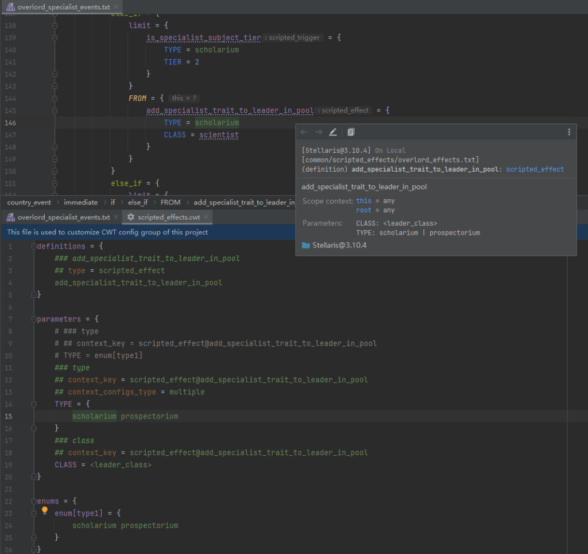

# 附录：规则格式参考

<!-- TODO 人工改进与润色 -->

## 定位与愿景 {#vision}

本参考面向希望“理解/编写/扩展” CWT 规则（CWT config file）的作者与维护者，旨在：

- **统一术语与边界**：对齐 PLS 与 CWTools 的语义，明确 PLS 的扩展点与差异。
- **建立从文档到实现的映射**：每个规则条目均标注对应接口/解析器，便于回溯源码与验证行为。
- **指导实践**：概述用途、格式与注意事项，为后续细化示例与校验规则打基础。

参考关系：
- 概念与示例以 CWTools 指南为基线：`references/cwt/guidance.md`。
- PLS 的整体规则工作流与分组见：`docs/zh/config.md`。
- 规则接口与解析逻辑主要位于：`icu.windea.pls.config.config`（含 `delegated/` 与 `delegated/impl/`）。

## 总览 {#overview}

PLS 通过读取 `.cwt` 文件，构建“规则分组”，并将规则解析为结构化的“规则对象”，供代码高亮/补全/导航/检查/文档等功能使用。

- **规则来源与覆盖**：见 `docs/zh/config.md` 的“规则分组/覆盖策略”。常见来源包括内置、远程、本地与项目本地，按“路径 + 规则ID”执行后序覆盖。
- **两大要素**：
  - 规则（config）：定义“键/值/块”的允许形态与上下文（如类型、枚举、别名、链接……）。
  - 规则表达式（config expression）：在规则的字符串字段中描述取值/匹配的语法（如 `<type>`、`enum[...]`、`value[...]`、基数/模板/位置表达式等）。
- **解析流程（简化）**：
  1. 读取规则分组，构建规则文件 PSI。
  2. 按接口类别用解析器（Resolver）构造“委托型/内部”规则对象。
  3. 在语言特性中按上下文（作用域、类型名、声明上下文等）查询并应用这些规则。

术语约定：
- “规则（config）”包含“基础规则”、“普通规则”、“扩展规则”和“内部规则”。
- “基础规则”（如 `CwtPropertyConfig`）是语法树级别的通用节点，不在本文档中逐一描述。

<!-- @see icu.windea.pls.config.configGroup.CwtConfigGroup -->
<!-- @see icu.windea.pls.config.config.CwtPropertyConfig -->
<!-- @see icu.windea.pls.config.config.delegated.* -->
<!-- @see icu.windea.pls.config.config.delegated.impl.* -->

## 规则 {#configs}

<!-- @see icu.windea.pls.config.config -->

> 本章节介绍各种规则的用途、格式要点与解析要点，帮助读者正确理解与编写这类特殊结构。

### 普通规则 {#configs-normal}

> 与 CWTools 语义一致或兼容，PLS 可能在选项与上下文方面有少量扩展。

#### 优先级 {#config-priority}

<!-- @see icu.windea.pls.ep.priority.ParadoxPriority -->
<!-- @see icu.windea.pls.ep.priority.ParadoxPriorityProvider -->
<!-- @see cwt/core/priorities.core.cwt -->

优先级规则可以用来配置目标（文件、封装变量，定义、本地化与复杂枚举）的覆盖方式。

- **用途**：为“目标”的覆盖与合并提供统一策略，影响生效顺序与查询结果排序（流式查询除外）。
- **适用目标**：文件、封装变量、定义、本地化、复杂枚举等。
- **默认值**：未命中任何目录映射时，使用 `LIOS`（后读覆盖）。

**声明与匹配**：

```cwt
priorities = {
    # LHS - 相对游戏或模组根目录的“目录路径”
    # RHS - 覆盖方式：fios | lios | ordered（忽略大小写）
    "events" = fios
    "common/on_actions" = ordered
}
```

**覆盖方式与行为**：
- `LIOS`（Last In, Only Served）：后加载者覆盖先加载者（多数内容的默认规则）。
- `FIOS`（First In, Only Served）：先加载者生效，后面的被忽略（少数“特别敏感”的目录，如 `events/`、`scripted_variables/`）。
- `DUPL`（重复定义报错/失效）：目前不支持，仅作为参考术语收录。
- `ORDERED`（按序合并）：按加载顺序合并但不覆盖（典型：`common/on_actions`）。

**排序与加载要点**：
- 查询（非流式）结果的排序由优先级驱动；同一路径下按加载顺序（游戏/依赖链）决定先后。
- 同一文件内，后出现的项会覆盖前面出现的项。
- 参见 `ParadoxPriorityProvider.getComparator()` 的排序实现与默认值。

**格式说明**：
```cwt
priorities = {
    # LHS - file path (relative to game or mod root directory)
    # RHS - priority (available values: "fios", "lios", "ordered", default value: "lios", ignore case)

    # file path - path of specific directory (e.g. ""common/on_actions", "common/scripted_variables", "localisation")

    # fios - use the one that reads first, ignore all remaining items
    # lios - use the one that reads last (if not specified, use this as default)
    # ordered - reads by order, no overrides

    "events" = fios
    # ...
}
```

**实践示例**：
```cwt
# 内置示例（节选）
priorities = {
    "common/event_chains" = fios
    "common/on_actions" = ordered
    "common/scripted_variables" = fios
    "events" = fios
}
```

- 两个 MOD 都在 `events/` 中定义同名事件：由于 `events = fios`，先被读取（加载更早）的 MOD 生效，后者被忽略。
- 两个 MOD 都在 `common/on_actions/` 添加条目：由于 `ordered`，会顺序合并执行，不发生覆盖。

#### 声明 {#config-declaration}

<!-- @see icu.windea.pls.config.config.delegated.CwtDeclarationConfig -->
<!-- @see icu.windea.pls.config.config.delegated.impl.CwtDeclarationConfigResolverImpl -->
<!-- @see icu.windea.pls.config.util.manipulators.CwtConfigManipulator -->
<!-- @see icu.windea.pls.ep.configContext.CwtDeclarationConfigContextProvider -->
<!-- @see icu.windea.pls.ep.config.CwtInjectedConfigProvider -->

- **用途**：声明“定义条目”的结构，用于补全、检查与快速文档等。
- **路径定位**：`{name}`，其中 `{name}` 为规则名称（即“定义类型”）。顶级属性若键为合法标识符且未被其他规则匹配，回退尝试解析为声明规则。
- **依赖上下文**：由 `CwtDeclarationConfigContextProvider` 构造声明上下文（含定义名、类型、子类型）。Game Rule/On Action 可通过扩展配置改写上下文。

- **解析流程（实现摘要）**：
  1. 解析名称：若键不是合法标识符则忽略（`CwtDeclarationConfigResolverImpl`）。
  2. 根级内联：若 RHS 为 `single_alias_right[...]`，先展开为普通属性规则（`CwtConfigManipulator.inlineSingleAlias`）。
  3. 生成最终规则树：
     - 深拷贝并按子类型裁剪/扁平化（`deepCopyConfigsInDeclarationConfig`）。
     - 若命中 `subtype[...]` 且与上下文子类型匹配：打平其子规则；不匹配则跳过；非 `subtype[...]` 正常递归。
     - 注入派生规则（`CwtInjectedConfigProvider.injectConfigs`），并统一设置 `parentConfig` 以保持父链。
  4. 子类型缓存键：扫描 `subtype[...]` 收集用到的子类型集合（`subtypesUsedInDeclaration`），结合当前上下文生成 cache key，避免无关子类型导致的缓存失效。

- **与其他规则协作**：
  - 可在声明内引用别名与单别名（`alias_name[...]`/`alias_match_left[...]`、`single_alias_right[...]`）。
  - 切换类型（swapped type）的声明可直接嵌套在对应基础类型的声明中。

**示例**：

```cwt
event = {
    id = scalar

    # 按子类型细化声明结构，仅在匹配的子类型下生效
    subtype[triggered] = {
        ## cardinality = 0..1
        weight_multiplier = {
            factor = float
            alias_name[modifier_rule] = alias_match_left[modifier_rule]
        }
    }

    ## cardinality = 0..1
    # 根级单别名将在解析前被内联
    trigger = single_alias_right[trigger_clause]
}
```

**注意事项**：
- `subtype[...]` 仅在与上下文子类型匹配时生效；不匹配将被忽略（不会报错）。
- 根级 `single_alias_right[...]` 会先被展开后再参与后续解析与检查。
- 为保证后续功能的“向上溯源”，新增节点均会注入 `parentConfig`（父指针）。

#### 系统作用域 {#config-system-scope}

<!-- @see icu.windea.pls.config.config.delegated.CwtSystemScopeConfig -->
<!-- @see icu.windea.pls.config.config.delegated.impl.CwtSystemScopeConfigResolverImpl -->
<!-- @see cwt/core/system_scopes.core.cwt -->

- **用途**：为内置的“系统级作用域”（This/Root/Prev/From 等）提供元信息，用于快速文档与作用域栈推导。
- **路径定位**：`system_scopes/{id}`，其中 `{id}` 为系统作用域 ID。
- **字段含义**：
  - `id`：系统作用域 ID。
  - `base_id`：基底作用域 ID；未指定时默认为 `id`。用于将同族系统作用域（如 `Prev*`、`From*`）归类，便于展示与文档说明。
  - `: string`：可读名称；未指定时默认为 `id`。

- **解析流程（实现摘要）**：
  - 读取 `id = key`，`base_id = properties['base_id'] ?: id`，`name = stringValue ?: id`（`CwtSystemScopeConfigResolverImpl`）。
  - 相等性以 `id` 比较（同 `id` 视为同一系统作用域）。

- **与其他规则协作**：
  - 与 `作用域与作用域组` 一起决定作用域检查与提示。
  - 在部分扩展规则中可使用选项 `replace_scopes` 指定当前上下文下系统作用域对应的具体作用域类型（如将 `this/root/from` 映射为 `country` 等）。
  - 注意：`replace_scopes` 不支持替换 `prev` 系列系统作用域（`prev/prevprev/...`），详见 `docs/zh/config.md` 中“如何在规则文件中指定作用域上下文”的说明。

**示例（内置）**：

```cwt
system_scopes = {
    This = {}
    Root = {}
    Prev = { base_id = Prev }
    From = { base_id = From }
    # 省略 PrevPrev/FromFrom 等链式成员
}
```

#### 内联规则 {#config-inline}

<!-- @see icu.windea.pls.config.config.delegated.CwtInlineConfig -->
<!-- @see icu.windea.pls.config.config.delegated.impl.CwtInlineConfigResolverImpl -->
<!-- @see cwt/cwtools-stellaris-config/config/common/inline_scripts.cwt -->

- **用途**：在规则中声明可复用的“内联逻辑”使用处结构，目前用于“内联脚本（inline script）”。
- **路径定位**：`inline[{name}]`，`{name}` 为规则名称。

- **解析流程（实现摘要）**：
  - 解析名称：从键名中提取 `inline[...]` 的名称（`CwtInlineConfigResolverImpl`）。
  - 展开为普通属性：调用 `CwtInlineConfig.inline()` 使用 `deepCopyConfigs` 复制其子规则，生成可被后续流程直接消费的 `CwtPropertyConfig`。

- **与其他规则协作**：
  - 展开后的规则与普通属性规则一致，参与校验与补全。
  - 若需为“内联脚本路径”提供上下文与多态配置，请参考扩展规则：`内联脚本（扩展）`。

**示例**（Stellaris）：

```cwt
### 使用内联脚本
inline[inline_script] = filepath[common/inline_scripts/,.txt]

### 带参数的内联脚本
### 参数接受字符串，可通过引号包裹以替换进一整段语句
inline[inline_script] = {
    ## cardinality = 1..1
    script = filepath[common/inline_scripts/,.txt]
    ## cardinality = 0..inf
    $parameter = $parameter_value
}
```

#### 类型与子类型 {#config-type}

<!-- @see icu.windea.pls.config.config.delegated.CwtTypeConfig -->
<!-- @see icu.windea.pls.config.config.delegated.CwtSubtypeConfig -->
<!-- @see icu.windea.pls.config.config.delegated.impl.CwtTypeConfigResolverImpl -->
<!-- @see icu.windea.pls.config.config.delegated.impl.CwtSubtypeConfigResolverImpl -->

- **用途**：按“文件路径/键名”定位并命名“定义”，并可声明子类型、展示信息与图片。
- **路径定位**：
  - 类型：`types/type[{type}]`，`{type}` 为定义类型名。
  - 子类型：`types/type[{type}]/subtype[{subtype}]`。

- **文件匹配与来源**：
  - `path`/`path_file`/`path_extension`/`path_pattern`/`path_strict` 组合决定参与扫描的文件集合。
  - 路径会移除前缀 `game/` 并规范化分隔符；`path_extension` 不含点（例如 `.txt` → `txt`）。
  - `type_per_file` 表示“一文件一类型实例”。

- **类型键（definition key）约束**：
  - `type_key_prefix` 指定键前缀；并提供对应的原始值规则（`typeKeyPrefixConfig`）用于渲染与提示。
  - `type_key_filter`/`type_key_regex`/`starts_with` 用于约束“类型键”的取值；`skip_root_key` 允许跳过若干顶级键以继续匹配（忽略大小写，支持多组）。
  - `possibleTypeKeys` 基于类型与子类型的 filter 汇总，便于补全与校验。

- **名称与唯一性**：
  - `name_field` 指定展示名称来源字段；`name_from_file` 表示从文件名推导名称；`unique` 用于冲突检查/导航提示；`severity` 用于标注展示严重级别。

- **子类型（Subtype）**：
  - 选项：`type_key_filter`、`type_key_regex`、`starts_with`、`only_if_not`、`group`。
  - 匹配时按声明顺序裁剪；通常与声明规则中的 `subtype[...]` 一起使用以细化结构与校验。

- **展示**：
  - `localisation`/`images` 小节用于类型的本地化展示与图片展示设置。

- **解析流程（实现摘要）**：
  1. 解析 `type[...]` 名称与必要属性；缺失属性将跳过该类型（`CwtTypeConfigResolverImpl`）。
  2. 收集文件来源与键约束、构造子类型映射、解析展示相关配置。
  3. 合并 `modifiers`：若在类型规则内声明 `modifiers`，将派生对应的修正规则并写入 `configGroup.modifiers` 与 `type2ModifiersMap`（按 `type` 或 `type.subtype` 归档）。
  4. 计算 `possibleTypeKeys`，并在需要时为 `type_key_prefix` 绑定标签类型（`CwtTagType.TypeKeyPrefix`）。

- **与其他规则协作**：
  - 与 `声明` 协作，用于为具体定义的声明提供上下文与结构约束。
  - 与 `修正/修正分类` 协作，通过 `modifiers` 派生与类型强相关的修正规则。

**示例**：

```cwt
types = {
    type[civic_or_origin] = {
        # 文件来源
        path = "game/common/governments/civics"   # 将自动去掉前缀 `game/`
        path_extension = .txt

        # 键约束与前缀
        type_key_prefix = civic_
        ## type_key_filter = { +civic_ -origin_ }  # 包含/排除集合
        ## starts_with = civic_
        ## skip_root_key = { potential }

        # 子类型
        subtype[origin] = {
            ## type_key_filter = +origin_
            ## group = lifecycle
        }

        # 展示
        localisation = { name_field = name }
        images = { main = icon }
    }
}
```

**注意事项**：
- 缺少任何必需属性会导致类型被跳过（日志中将有提示）。
- `path` 与 `path_pattern` 可并用；`path_strict` 会强制严格匹配。
- `skip_root_key` 为多组设置：若存在任意一组与文件顶级键序列匹配，则允许跳过继续匹配类型键。
- 子类型匹配“顺序敏感”，请将更具体的规则放在更前面。

#### 别名与单别名 {#config-alias}

<!-- @see icu.windea.pls.config.config.delegated.CwtAliasConfig -->
<!-- @see icu.windea.pls.config.config.delegated.CwtSingleAliasConfig -->
<!-- @see icu.windea.pls.config.config.delegated.impl.CwtAliasConfigResolverImpl -->
<!-- @see icu.windea.pls.config.config.delegated.impl.CwtSingleAliasConfigResolverImpl -->
<!-- @see icu.windea.pls.config.util.manipulators.CwtConfigManipulator.inlineAlias -->
<!-- @see icu.windea.pls.config.util.manipulators.CwtConfigManipulator.inlineSingleAlias -->

- **用途**：将可复用的规则片段抽象成“具名别名”，在多处引用并展开；单别名用于“值侧”一对一复用。
- **路径定位**：
  - 别名：`alias[{name}:{subName}]`（`{subName}` 为受限的数据表达式）。
  - 单别名：`single_alias[{name}]`。

- **语法与引用**：
  - 声明别名：`alias[effect:some_effect] = { ... }`
  - 使用别名：在使用处编写 `alias_name[effect] = alias_match_left[effect]`
  - 声明单别名：`single_alias[trigger_clause] = { alias_name[trigger] = alias_match_left[trigger] }`
  - 使用单别名：`potential = single_alias_right[trigger_clause]`

- **选项语义（别名）**：
  - `scope/scopes`：允许的输入作用域集合（`supportedScopes`）。
  - `push_scope`：输出作用域（`outputScope`）。
  - `subName` 支持受限的数据表达式，并被解析为 `subNameExpression`，同时作为 `configExpression` 用于匹配与提示。

- **解析与展开流程（实现摘要）**：
  - 解析键名获得 `name`/`subName`（`CwtAliasConfigResolverImpl`）。
  - 在使用处展开：`CwtConfigManipulator.inlineAlias` 将别名体复制为普通属性规则：
    - 展开后键名=子名（`key = subName`），值/子规则深拷贝，保留选项。
    - 若展开结果的 RHS 是 `single_alias_right[...]`，会继续触发单别名的内联展开（级联展开）。
    - 展开后参与注入（`CwtInjectedConfigProvider.injectConfigs`）与父指针回填，随后进入常规校验/补全流程。
  - 单别名在值侧展开：`CwtConfigManipulator.inlineSingleAlias` 将对应声明整体替换到使用处的值与子块内。

- **与其他规则协作**：
  - 常与“声明”规则结合，在定义声明中复用 trigger/effect 等片段。
  - 与“类型与子类型”协作，作为修正规则或上下文约束的一部分。

**示例**：

```cwt
# 别名：定义 effect 片段
alias[effect:apply_bonus] = {
    add_modifier = {
        modifier = enum[modifier_rule]
        days = int
    }
}

# 在脚本处使用别名
scripted_effect = {
    alias_name[effect] = alias_match_left[effect]
}

# 单别名：定义触发块片段
single_alias[trigger_clause] = {
    alias_name[trigger] = alias_match_left[trigger]
}

# 在声明中值侧使用单别名
some_definition = {
    ## cardinality = 0..1
    potential = single_alias_right[trigger_clause]
}
```

**注意事项**：
- 别名唯一键由 `name:subName` 组成；重复定义将按“覆盖策略/优先级”处理。
- 展开后才会进行基数与选项校验；请在展开位置而非声明处考虑最终语义。
- `subName` 为数据表达式（受限），可使用模板/枚举等提高复用度，但请避免过宽导致误匹配。

#### 枚举与复杂枚举 {#config-enum}

<!-- @see icu.windea.pls.config.config.delegated.CwtEnumConfig -->
<!-- @see icu.windea.pls.config.config.delegated.CwtComplexEnumConfig -->
<!-- @see icu.windea.pls.config.config.delegated.impl.CwtEnumConfigResolverImpl -->
<!-- @see icu.windea.pls.config.config.delegated.impl.CwtComplexEnumConfigResolverImpl -->

- **用途**：为数据表达式 `enum[...]` 提供取值集合。
  - 简单枚举：固定值集合，全部在规则文件中声明。
  - 复杂枚举：从脚本文件按路径/锚点动态收集枚举值。

- **路径定位**：
  - 简单枚举：`enums/enum[{name}]`
  - 复杂枚举：`enums/complex_enum[{name}]`

---

**简单枚举（Enum）**：

字段与实现：
- `name`：枚举名。
- `values`：可选项集合（忽略大小写）。
- `valueConfigMap`：可选项到其值规则的映射，用于渲染与提示。
- 当前实现仅支持“常量值”，不支持模板表达式。

声明：

```cwt
enums = {
    enum[weight_or_base] = { weight base }
}
```

---

**复杂枚举（Complex Enum）**：

字段与实现（`CwtComplexEnumConfigResolverImpl`）：
- 文件来源：`path`/`path_file`/`path_extension`/`path_pattern`/`path_strict`（路径会移除前缀 `game/`，扩展名不含点）。
- `start_from_root`：是否从文件顶部（而非顶级属性）开始查询锚点。
- `search_scope_type`（PLS 扩展）：查询作用域类型（目前仅支持 `definition`）。
- `name` 小节：描述如何在匹配文件中定位值锚点；实现会收集其中所有名为 `enum_name` 的属性或值作为锚点（`enumNameConfigs`）。

**解析流程（简要）**：
1. 简单枚举：解析 `enum[...]` 与其值列表，构建忽略大小写的值集合与映射（`CwtEnumConfigResolverImpl`）。
2. 复杂枚举：解析文件来源、`name` 小节与锚点；索引阶段在匹配文件中收集锚点对应的实际值（`enum_name`）。
3. 两者均服务于数据表达式 `enum[...]` 的补全与校验。

声明（示例）：

```cwt
enums = {
    complex_enum[component_tag] = {
        path = "game/common/component_tags"
        name = {
            enum_name
        }
        start_from_root = yes
    }
}
```

**注意事项**：
- 简单枚举当前仅支持常量值；若填写模板表达式，将不会被按模板解析。
- 复杂枚举若缺少 `name` 小节或未能在匹配文件中找到任何 `enum_name` 锚点，将导致该枚举为空。
- 路径字段支持组合使用；`path_strict` 会启用严格匹配；`path_extension` 请勿包含前导点（应写作 `txt`）。

#### 动态值类型 {#config-dynamic-value}

<!-- @see icu.windea.pls.config.config.delegated.CwtDynamicValueTypeConfig -->
<!-- @see icu.windea.pls.config.config.delegated.impl.CwtDynamicValueTypeConfigResolverImpl -->

- **用途**：为数据表达式 `value[...]` 提供“预定义（硬编码）”的动态值集合，替代固定字面量，便于补全与校验。
- **路径定位**：`values/value[{name}]`，`{name}` 为动态值类型名。

- **字段与限制**：
  - `name`：动态值类型名。
  - `values`：值集合（忽略大小写）。
  - `valueConfigMap`：值到对应值规则的映射。
  - 当前实现仅支持“常量值”，不支持模板表达式。

- **解析流程（实现摘要）**：
  - 解析 `value[...]` 名称与值列表，构建忽略大小写的值集合与映射（`CwtDynamicValueTypeConfigResolverImpl`）。
  - 供数据表达式 `value[...]` 在补全与校验阶段使用。

- **与扩展规则的关系**：
  - 若需为动态值声明“作用域上下文”（如仅接收 push scope）或按上下文动态生成值，请参考“扩展规则”中的“动态值（扩展）”。

**示例**：

```cwt
values = {
    value[event_target] = { owner capital }  # 忽略大小写
}
```

#### 链接 {#config-link}

<!-- @see icu.windea.pls.config.config.delegated.CwtLinkConfig -->
<!-- @see icu.windea.pls.config.config.delegated.impl.CwtLinkConfigResolverImpl -->

- **用途**：为复杂表达式中的“字段/函数样”节点提供语义与类型（作用域/值）约束，支撑链式访问与补全检查。
- **路径定位**：
  - 常规链接：`links/{name}`
  - 本地化链接：`localisation_links/{name}`（若未显式声明，会自动复制静态的常规链接）

- **静态 vs 动态**：
  - 静态链接：未声明 `data_source`，仅代表一个固定的节点名（如 `owner`）。
  - 动态链接：声明了 `data_source` 与/或 `prefix`/`from_*`，可携带动态数据（如 `modifier:x`、`relations(x)`、`var:x`）。

- **字段与语义（实现）**：
  - `type`：`scope`/`value`/`both`（默认 `scope`）。
  - `from_data`：是否从“文本数据”读取动态数据（格式如 `prefix:data`）。
  - `from_argument`：是否从“函数参数”读取动态数据（格式如 `func(arg)`）。
  - `prefix`：动态链接的前缀；当 `from_argument = yes` 时，解析会移除尾随冒号（避免 `prefix:` 重复）。
  - `data_source`（可多值）：每个数据源是一个“数据表达式”，用于约束动态数据的合法取值，支持多传参场景。
  - `input_scopes`：输入作用域集合；可写单个或集合，解析器同时支持 `input_scope` 与 `input_scopes` 两种写法。
  - `output_scope`：输出作用域；为空时表示“透传/基于数据源推导”。
  - `for_definition_type`：仅在指定定义类型中可用。

- **解析流程（实现摘要）**：
  - 读取字段并标准化：作用域 ID 通过 `ParadoxScopeManager.getScopeId()` 归一化；
  - 校验：当 `from_data` 或 `from_argument` 为 `yes` 时必须存在至少一个 `data_source`；
  - 生成数据表达式：为每个 `data_source` 解析出 `CwtDataExpression`，支持多参数（可用委托 `delegatedWith(index)` 指定当前参数）。
  - 本地化链接：可从常规链接复制（静态），也可单独解析。

**示例**：

```cwt
links = {
    # 静态 scope 链接
    owner = {
        input_scopes = { any }
        output_scope = any
    }

    # 动态 value 链接（带前缀）
    modifier = {
        type = value
        from_data = yes
        prefix = modifier
        data_source = dynamic_value[test_flag]
        input_scopes = { any }
    }

    # 动态 scope 链接（函数形）
    relations = {
        from_argument = yes
        data_source = <country>           # 可混用多个数据源
        data_source = dynamic_value[test_flag]
        input_scopes = { country }
        # output_scope 为空 -> 基于数据源与实现推导
    }
}
```

**注意事项**：
- `prefix` 不应带引号或括号；`input_scopes` 使用花括号集合语法（如 `{ country }`）。
- 可混合多个 `data_source`；对多参链接可使用 `delegatedWith(index)` 切换当前参数的表达式。
- 若动态链接参数为单引号字面量，则按字面量处理，通常不提供补全。
- 建议在 `data_source` 中使用 `<type>` 简写（如 `<country>`），而非 `definition[country]`。

#### 作用域与作用域组 {#config-scope}

<!-- @see icu.windea.pls.config.config.delegated.CwtScopeConfig -->
<!-- @see icu.windea.pls.config.config.delegated.CwtScopeGroupConfig -->
<!-- @see icu.windea.pls.config.config.delegated.impl.CwtScopeConfigResolverImpl -->
<!-- @see icu.windea.pls.config.config.delegated.impl.CwtScopeGroupConfigResolverImpl -->

- **用途**：定义“作用域类型”及其别名（`scopes`），并对作用域进行分组（`scope_groups`），用于作用域检查、链路约束与提示。

- **路径定位与字段**：
  - 作用域：`scopes/{name}`
    - `name`：作用域 ID。
    - `aliases: string[]`：别名集合（忽略大小写）。
  - 作用域组：`scope_groups/{name}`
    - `name`：分组名。
    - `: string[]`：分组内作用域 ID 集合（忽略大小写）。

**示例**：

```cwt
scopes = {
    Country = { aliases = { country } }
}

scope_groups = {
    target_species = {
        country pop_group leader planet ship fleet army species first_contact
    }
}
```

**与其他规则协作**：
- 与“系统作用域”共同决定作用域栈与含义；与“链接”共同约束链式访问的输入/输出作用域。
- 在扩展规则中可通过 `replace_scopes` 指定在特定上下文下系统作用域映射到的具体作用域类型。

#### 修正与修正分类 {#config-modifier}

<!-- @see icu.windea.pls.config.config.delegated.CwtModifierConfig -->
<!-- @see icu.windea.pls.config.config.delegated.CwtModifierCategoryConfig -->
<!-- @see icu.windea.pls.config.config.delegated.impl.CwtModifierConfigResolverImpl -->
<!-- @see icu.windea.pls.config.config.delegated.impl.CwtModifierCategoryConfigResolverImpl -->

- **用途**：声明修正（modifier）与其分类，用于图标渲染、补全与作用域校验。

- **路径定位**：
  - 修正：
    - `modifiers/{name}`（`{name}` 可为常量或模板表达式）
    - `types/type[{type}]/modifiers/{name}`（其中 `$` 会被替换为 `<{type}>`）
    - `types/type[{type}]/modifiers/subtype[{subtype}]/{name}`（`{type}.{subtype}` 作为类型表达式参与替换）
  - 修正分类：`modifier_categories/{name}`

- **字段与语义（修正）**：
  - `name`：模板化名称（如 `job_<job>_add`），支持匹配动态生成的修正。
  - `categories: string | string[]`：分类名集合；决定允许的作用域类型。
  - `supportedScopes`：允许的作用域集合。
    - 若已解析出 `categoryConfigMap`，则基于类别汇总作用域（`ParadoxScopeManager.getSupportedScopes(...)`）。
    - 否则回退到修正自身的选项 `supported_scopes`（若存在）。

- **字段与语义（修正分类）**：
  - `name`：分类名（如 `Pops`）。
  - `supported_scopes: string | string[]`：该分类允许的作用域集合。

- **解析流程（实现摘要）**：
  - 修正（`CwtModifierConfigResolverImpl`）：
    1. 从值或值列表解析 `categories`；缺失则跳过该条目。
    2. 若来自类型规则的 `modifiers`，将 `name` 中的 `$` 替换为 `<{typeExpression}>`，其中 `typeExpression` 为 `type` 或 `type.subtype`。
    3. 解析模板表达式并计算 `supportedScopes`（基于类别或本地选项）。
  - 修正分类（`CwtModifierCategoryConfigResolverImpl`）：
    1. 解析 `name` 与 `supported_scopes`。

- **与其他规则协作**：
  - 与“类型与子类型”的 `modifiers` 小节联动，派生出与类型绑定的修正规则。
  - 与“作用域/链接/系统作用域”联动进行作用域检查与提示。

**示例**：

```cwt
# 独立声明修正
modifiers = {
    pop_happiness = { Pops }
    job_<job>_add = { Planets }
}

# 在类型规则中声明修正（会派生为模板名称）
types = {
    type[job] = {
        modifiers = {
            job_$_add = { Planets }   # -> job_<job>_add
        }
    }
}

# 修正分类
modifier_categories = {
    Pops = { supported_scopes = { species pop_group planet } }
}
```

**注意事项**：
- 修正条目缺少 `categories` 会被跳过（不生效）。
- 类型规则中的修正名称使用 `$` 占位，请确保与类型/子类型表达式对应。
- 类别中的 `supported_scopes` 应使用标准作用域 ID，解析时会自动归一化大小写。

#### 本地化命令与提升 {#config-localisation}

<!-- @see icu.windea.pls.config.config.delegated.CwtLocalisationCommandConfig -->
<!-- @see icu.windea.pls.config.config.delegated.CwtLocalisationPromotionConfig -->
<!-- @see icu.windea.pls.config.config.delegated.impl.CwtLocalisationCommandConfigResolverImpl -->
<!-- @see icu.windea.pls.config.config.delegated.impl.CwtLocalisationPromotionConfigResolverImpl -->

- **用途**：声明“本地化命令字段”（Get...）的可用性与允许作用域，并声明“本地化作用域提升”规则，支持在本地化链接切换作用域后仍能使用命令字段。

- **路径定位**：
  - 本地化命令：`localisation_commands/{name}`（`{name}` 忽略大小写）
  - 本地化提升：`localisation_promotions/{name}`（`{name}` 忽略大小写，对应本地化链接名）

- **字段与语义**：
  - 命令：`supported_scopes: string | string[]`（允许的作用域类型集合）
  - 提升：`supported_scopes: string | string[]`（提升后的允许作用域集合）

- **解析流程（实现摘要）**：
  - 命令（`CwtLocalisationCommandConfigResolverImpl`）：解析名称（忽略大小写）与 `supported_scopes`。
  - 提升（`CwtLocalisationPromotionConfigResolverImpl`）：解析名称（忽略大小写，匹配本地化链接名）与 `supported_scopes`。
  - 在本地化文本中，若通过本地化链接切换了作用域，则按“提升规则”确认可以使用的命令字段集合。

**示例**：

```cwt
localisation_commands = {
    GetCountryType = { country }
}

localisation_promotions = {
    Ruler = { country }
}

localisation_links = {
    ruler = { ... }
}

# 本地化文本中：
# [Ruler.GetCountryType] 在 Ruler 链接后的作用域提升下有效
```

**注意事项**：
- 名称大小写不敏感；请保持与实际使用的命令字段一致的拼写风格以便检索。
- 提升规则的名称应与本地化链接名一致；否则无法正确匹配。
- 与“链接（本地化链接）”协作时，静态常规链接会自动复制为本地化链接；如需动态行为，请单独声明本地化链接。

#### 类型展示（本地化/图片）{#config-type-presentation}

<!-- @see icu.windea.pls.config.config.delegated.CwtTypeLocalisationConfig -->
<!-- @see icu.windea.pls.config.config.delegated.CwtTypeImagesConfig -->
<!-- @see icu.windea.pls.config.config.delegated.impl.CwtTypeLocalisationConfigResolverImpl -->
<!-- @see icu.windea.pls.config.config.delegated.impl.CwtTypeImagesConfigResolverImpl -->

- **用途**：为某定义类型配置“名称/描述/必需本地化键”“主要图片/切分规则”等，以便在 UI、导航与提示中展示。
- **路径定位**：
  - 本地化：`types/type[{type}]/localisation`
  - 图片：`types/type[{type}]/images`

- **字段与语义**：
  - 二者结构一致：由若干“子类型表达式 + 位置规则”的配对组成（`locationConfigs`）。
  - 在运行时根据实际“定义的子类型集合”过滤并合并得到最终的规则列表（`getConfigs(subtypes)`）。
  - 位置规则参见“位置与行匹配”的 `CwtLocationConfig`，常用选项：
    - `required`：是否必需项（缺失时报错/提示）。
    - `primary`：是否主要项（例如用于主展示图标/主名称）。
  - 位置表达式参见“规则表达式 → 位置表达式”。

**示例**：

```cwt
types = {
    type[ship_design] = {
        localisation = {
            ## primary
            name = some_loc_key
            subtype[corvette] = { name = some_corvette_loc_key }
        }
        images = {
            ## primary ## required
            icon = "icon|icon_frame"  # 图片位置表达式，支持帧数与名称路径参数
        }
    }
}
```

#### 数据库对象类型 {#config-db-type}

<!-- @see icu.windea.pls.config.config.delegated.CwtDatabaseObjectTypeConfig -->
<!-- @see icu.windea.pls.config.config.delegated.impl.CwtDatabaseObjectTypeConfigResolverImpl -->

- **用途**：为本地化中的“数据库对象表达式”（如 `['civic:some_civic', ...]`）定义类型与格式，支持在 UI 与提示中解析为定义或本地化。
- **路径定位**：`database_object_types/{name}`，`{name}` 为前缀（如 `civic`）。

- **字段与语义**：
  - `type`：若存在，将 `prefix:object` 的 `object` 作为该类型的“定义引用”。
  - `swap_type`：若存在，将 `prefix:object:swap` 的 `swap` 作为该“切换类型”的定义引用。
  - `localisation`：若存在，将 `prefix:object` 的 `object` 作为“本地化键”解析。

**示例**：

```cwt
database_object_types = {
    civic = {
        type = civic_or_origin
        swap_type = swapped_civic
    }
}
```

#### 位置与行匹配 {#config-location-row}

<!-- @see icu.windea.pls.config.config.delegated.CwtLocationConfig -->
<!-- @see icu.windea.pls.config.config.delegated.CwtRowConfig -->
<!-- @see icu.windea.pls.config.config.delegated.impl.CwtLocationConfigResolverImpl -->
<!-- @see icu.windea.pls.config.config.delegated.impl.CwtRowConfigResolverImpl -->

- **用途**：
  - `位置规则（Location）`：声明图片/本地化等资源的定位键与位置表达式。
  - `行规则（Row）`：为 CSV 行声明列名与取值形态，用于补全/检查。

- **位置规则（CwtLocationConfig）**：
  - 适用位置：`types/type[{type}]/localisation/{key}` 与 `types/type[{type}]/images/{key}`。
  - 字段：`key`（资源名）、`value`（位置表达式字符串）、`required`、`primary`。
  - 位置表达式详见“规则表达式 → 位置表达式”。

- **行规则（CwtRowConfig）**：
  - 路径定位：`rows/row[{name}]`。
  - 继承文件匹配能力（与类型类似）：`path`/`path_file`/`path_extension`/`path_pattern`/`path_strict`。
  - 字段：`columns`（列名→列规则），`end_column`（终止列名，匹配到后视为可省略的尾列）。

**示例**：

```cwt
rows = {
    row[component_template] = {
        path = "game/common/component_templates"
        file_extension = .csv
        columns = {
            key = <component_template>
            # ... 其他列
        }
    }
}
```

#### 语言环境 {#config-locale}

<!-- @see icu.windea.pls.config.config.delegated.CwtLocaleConfig -->
<!-- @see icu.windea.pls.config.config.delegated.impl.CwtLocaleConfigResolverImpl -->

- **用途**：声明语言环境（locale）的基本信息，便于识别项目/用户偏好的语言环境，改进 UI 展示与本地化校验。
- **路径定位**：`locales/{id}`，`{id}` 如 `l_english`。

- **字段与语义**：
  - `id`：语言环境 ID。
  - `codes: string[]`：该语言环境包含的语言代码（如 `en`, `en-US`）。
  - 派生字段：`shortId`（去除前缀 `l_`）、`idWithText`（带展示文本）。
  - 解析器额外能力：可按 IDE/OS 自动解析或提供 fallback（内部使用）。

**示例**：

```cwt
locales = {
    l_english = { codes = { "en" } }
    l_simp_chinese = { codes = { "zh-CN" } }
}
```

### 扩展规则 {#configs-extended}

> PLS 扩展的规则家族，用于增强 IDE 功能（快速文档、内嵌提示、补全等）。

#### 封装变量（扩展） {#config-extended-scripted-variable}

<!-- @see icu.windea.pls.config.config.delegated.CwtExtendedScriptedVariableConfig -->
<!-- @see icu.windea.pls.config.config.delegated.impl.CwtExtendedScriptedVariableConfigResolverImpl -->

- **用途**：为脚本中的“封装变量（scripted variable）”提供额外提示（快速文档、内嵌提示等）。
- **路径定位**：`scripted_variables/{name}`。
- **名称匹配**：支持常量、模板表达式、ANT 语法与正则（模式感知，见 `CwtDataTypeGroups.PatternAware`）。

- **字段与语义**：
  - `name`：变量名或其匹配模式。
  - `hint: string?`：可选的额外提示文本（用于内嵌提示或文档）。

- **解析流程（实现摘要）**：
  - 名称来源：若为属性则取键名，否则取值（`CwtExtendedScriptedVariableConfigResolverImpl`）。
  - 选项提取：从 `hint` 选项读取提示文本（若存在）。
  - 应用场景：与实际脚本中的封装变量引用按名称/模式匹配，向 UI 注入文档与提示。

**格式说明**：

```cwt
scripted_variables = {
    # 'x' or 'x = xxx'
    # 'x' can also be a pattern expression (template expression, ant expression or regex)

    ### Some documentation
    ## hint = §RSome inlay hint text§!
    x
}
```

**示例**：

```cwt
scripted_variables = {
    ### Some documentation
    ## hint = §RSome hint text§!
    x # 或写作 `x = 1`
}
```

**注意事项**：
- 名称可使用模板/ANT/正则匹配，避免过宽导致误匹配。
- 本条目仅提供“提示增强”，不负责声明或校验封装变量的取值与类型。

#### 定义（扩展） {#config-extended-definition}

<!-- @see icu.windea.pls.config.config.delegated.CwtExtendedDefinitionConfig -->
<!-- @see icu.windea.pls.config.config.delegated.impl.CwtExtendedDefinitionConfigResolverImpl -->

- **用途**：为具体“定义”提供额外上下文与提示信息。
  - 用途包括：文档/提示（`hint`）、绑定定义类型（`type` 必填）、按需要指定作用域上下文（通过选项 `replace_scopes`/`push_scope`）。
- **路径定位**：`definitions/{name}`。
- **名称匹配**：支持常量、模板表达式、ANT 语法与正则（模式感知，见 `CwtDataTypeGroups.PatternAware`）。

- **字段与语义**：
  - `name`：定义名或其匹配模式。
  - `type: string`（必填）：该扩展项对应的“定义类型”。缺失则忽略本条目。
  - `hint: string?`：可选提示文本（用于快速文档/内嵌提示）。
  - 作用域上下文（选项）：
    - `replace_scopes`：重写系统作用域映射，如 `{ this = country root = country }`。
    - `push_scope`：声明输出作用域，供链路/检查参考。

- **解析流程（实现摘要）**：
  - 名称来源：若为属性则取键名，否则取值（`CwtExtendedDefinitionConfigResolverImpl`）。
  - 必填项校验：`type` 缺失会跳过该条目并记录警告日志。
  - 选项提取：从 `hint` 读取提示文本；`replace_scopes`/`push_scope` 由通用选项解析器提供，供后续上下文使用。

**格式说明**：

```cwt
definitions = {
    # 'x' or 'x = xxx'
    # 'x' can also be a pattern expression (template expression, ant expression or regex)
    
    ### Some documentation
    ## type = civic_or_origin.civic
    x
    
    # since 1.3.5, scope context related options are also available here
    ## type = scripted_trigger
    ## replace_scopes = { this = country root = country }
    x
}
```

**示例**：

```cwt
definitions = {
    ### Some documentation
    ## hint = §RSome hint text§!
    ## replace_scopes = { this = country root = country }
    ## type = scripted_trigger
    x # 或写作 `x = ...`
}
```

**注意事项**：
- `type` 为必填；缺失将被跳过（不会生效）。
- 名称可使用模板/ANT/正则匹配，避免过宽导致误匹配。
- 此扩展用于“提示与上下文增强”，并不直接改变“声明”的结构；与声明的协作发生在使用侧的上下文构建与检查/文档阶段。

#### 游戏规则（扩展） {#config-extended-game-rule}

<!-- @see icu.windea.pls.config.config.delegated.CwtExtendedGameRuleConfig -->
<!-- @see icu.windea.pls.config.config.delegated.impl.CwtExtendedGameRuleConfigResolverImpl -->

- **用途**：为“游戏规则（game rule）”（类型为 `game_rule` 的定义）提供文档/提示增强，并可“重载声明规则”。
- **路径定位**：`game_rules/{name}`。
- **名称匹配**：支持常量、模板表达式、ANT 语法与正则（模式感知，见 `CwtDataTypeGroups.PatternAware`）。

- **字段与语义**：
  - `name`：游戏规则名或其匹配模式。
  - `hint: string?`：可选提示文本（用于快速文档/内嵌提示）。
  - `configForDeclaration: CwtPropertyConfig?`：若当前条目是“属性节点”，其值/子块将作为“声明规则重载”在使用处生效；值内若为 `single_alias_right[...]` 将被内联展开。

- **解析流程（实现摘要）**：
  - 名称来源：若为属性则取键名，否则取值（`CwtExtendedGameRuleConfigResolverImpl`）。
  - `configForDeclaration`：当且仅当为属性节点时有效；对其值调用 `inlineSingleAlias(...)`，否则使用原值。
  - 使用侧协作：`GameRuleCwtDeclarationConfigContextProvider` 在构建声明上下文时，若命中该扩展并且其 `config` 含子规则，则以 `configForDeclaration` 重载“声明”规则。

**格式说明**：

```cwt
game_rules = {
    # 'x' or 'x = xxx'
    # 'x' can also be a pattern expression (template expression, ant expression or regex)
    # use 'x = xxx' to override declaration config
    
    ### Some documentation
    ## replace_scopes = { this = country root = country }
    x
}
```

**示例**：

```cwt
game_rules = {
    ### Some documentation
    ## hint = §RSome hint text§!
    x # 仅提供提示增强

    y = single_alias_right[trigger_clause] # 通过单别名重载声明规则
}
```

**注意事项**：
- 仅当为“属性节点”时才会产生 `configForDeclaration` 并参与重载；纯值节点不会重载声明。
- 若值为 `single_alias_right[...]`，会先被内联，再作为重载规则生效。
- 该扩展仅影响“声明规则的来源/结构”与“提示信息”，不改变整体优先级与覆盖策略。

#### On Actions（扩展） {#config-extended-on-action}

<!-- @see icu.windea.pls.config.config.delegated.CwtExtendedOnActionConfig -->
<!-- @see icu.windea.pls.config.config.delegated.impl.CwtExtendedOnActionConfigResolverImpl -->

- **用途**：为具体的 `on_action` 定义提供文档/提示增强，并指定“事件类型”以影响声明上下文中与事件有关的引用。
- **路径定位**：`on_actions/{name}`。
- **名称匹配**：支持常量、模板表达式、ANT 语法与正则（模式感知，见 `CwtDataTypeGroups.PatternAware`）。

- **字段与语义**：
  - `name`：on_action 名称或其匹配模式。
  - `event_type: string`（必填）：事件类型。用于在声明上下文中将与事件相关的数据表达式（例如 `<event>`）替换为该事件类型对应的表达式。
  - `hint: string?`：可选提示文本（用于快速文档/内嵌提示）。

- **解析流程（实现摘要）**：
  - 名称来源：若为属性则取键名，否则取值（`CwtExtendedOnActionConfigResolverImpl`）。
  - 必填项校验：缺少 `event_type` 将跳过该条目并记录警告日志。
  - 使用侧协作：`OnActionCwtDeclarationConfigContextProvider` 命中该扩展后，将把声明上下文中的事件占位替换为指定事件类型，以驱动补全/校验与快速文档。

**格式说明**：

```cwt
on_actions = {
    # 'x' or 'x = xxx'
    # 'x' can also be a pattern expression (template expression, ant expression or regex)

    ### Some documentation
    ## replace_scopes = { this = country root = country }
    ## event_type = country
    x
}
```

**示例**：

```cwt
on_actions = {
  ### Some documentation
  ## hint = §RSome hint text§!
  ## event_type = country
  x
}
```

**注意事项**：
- `event_type` 为必填；缺失将被跳过（不会生效）。
- 名称可使用模板/ANT/正则匹配，避免过宽导致误匹配。
- 如需作用域替换，可结合通用选项（例如 `replace_scopes`）使用，但其是否参与具体检查取决于使用侧上下文与特性实现。

#### 内联脚本（扩展） {#config-extended-inline-script}

<!-- @see icu.windea.pls.config.config.delegated.CwtExtendedInlineScriptConfig -->
<!-- @see icu.windea.pls.config.config.delegated.impl.CwtExtendedInlineScriptConfigResolverImpl -->

- **用途**：为具体“内联脚本（inline script）”声明“上下文规则”和“作用域上下文”，用于在被调用处提供正确的补全/校验。
- **路径定位**：`inline_scripts/{name}`。
- **名称匹配**：支持常量、模板表达式、ANT 语法与正则（模式感知，见 `CwtDataTypeGroups.PatternAware`）。
- **文件对应**：`name` 为 `x/y` 时，对应文件为 `common/inline_scripts/x/y.txt`。

- **字段与语义**：
  - `name`：内联脚本名或其匹配模式。
  - `context_configs_type: string = single | multiple`（默认 `single`）：声明上下文规则的聚合形态。
    - `single`：仅取值侧（`value`）作为上下文规则。
    - `multiple`：取子规则列表（`configs`）作为上下文规则。
  - 作用域上下文（选项）：
    - `replace_scopes`：重写系统作用域映射。
    - `push_scope`：声明输出作用域。

- **解析流程（实现摘要）**：
  - 名称来源：若为属性则取键名，否则取值（`CwtExtendedInlineScriptConfigResolverImpl`）。
  - 容器规则：若为属性节点，对其值先做 `inlineSingleAlias(...)`（支持根级单别名），得到“容器规则”（`getContainerConfig()`）。
  - 上下文规则：
    - `context_configs_type = multiple` 时，取容器规则的子规则列表；否则取容器规则的值规则。
    - 将上述内容用 `inlineWithConfigs(...)` 包装为一个可被消费的“上下文规则容器”（`getContextConfigs()` 返回单元素列表）。

**格式说明**：

```cwt
inline_scripts = {
    # 'x' or 'x = xxx'
    # 'x' is an inline script expression, e.g., for 'inline_script = jobs/researchers_add', 'x' should be 'jobs/researchers_add'
    # 'x' can also be a pattern expression (template expression, ant expression or regex)
    # use 'x = xxx' to declare context config(s) (add '## context_configs_type = multiple' if there are various context configs)
    # note extended documentation is unavailable for inline scripts

    x

    # more detailed examples for declaring context config(s)

    ## context_configs_type = multiple
    x = {
        ## cardinality = 0..1
        potential = single_alias_right[trigger_clause]
        ## cardinality = 0..1
        possible = single_alias_right[trigger_clause]
    }

    # since 1.3.5, scope context related options are also available here

    ## replace_scopes = { this = country root = country }
    x

    # since 1.3.6, using single alias at root level is also available here

    ## context_configs_type = multiple
    x = single_alias_right[trigger_clause]
}
```

**示例**：

```cwt
inline_scripts = {
    ## replace_scopes = { this = country root = country }
    triggers/some_trigger_snippet

    ## context_configs_type = multiple
    triggers/some_trigger_snippet = { ... }

    ## context_configs_type = multiple
    triggers/some_trigger_snippet = single_alias_right[trigger_clause]
}
```


**注意事项**：
- 若仅需单条上下文规则，保持默认 `single` 即可；需要声明多条时使用 `multiple`。
- 根级 `single_alias_right[...]` 会被内联展开后再作为上下文规则使用。
- 本扩展仅提供上下文与作用域信息，不直接约束内联脚本的调用位置与次数。

#### 参数（扩展） {#config-extended-parameter}

<!-- @see icu.windea.pls.config.config.delegated.CwtExtendedParameterConfig -->
<!-- @see icu.windea.pls.config.config.delegated.impl.CwtExtendedParameterConfigResolverImpl -->

- **用途**：为触发/效应/内联脚本中的参数（`$PARAM$` 或 `$PARAM|DEFAULT$`）提供文档与上下文增强：
  - 绑定“上下文键”（指向具体触发/效应/内联脚本的上下文）。
  - 声明上下文规则与作用域上下文。
  - 支持从使用处“继承”上下文。
- **路径定位**：`parameters/{name}`。
- **名称匹配**：支持常量、模板表达式、ANT 语法与正则（模式感知，见 `CwtDataTypeGroups.PatternAware`）。

- **字段与语义**：
  - `name`：参数名或其匹配模式。
  - `context_key: string`（必填）：上下文键（如 `scripted_trigger@X`），用于定位参数的上下文规则来源。
  - `context_configs_type: string = single | multiple`（默认 `single`）：声明上下文规则的聚合形态。
    - `single`：仅取值侧（`value`）作为上下文规则。
    - `multiple`：取子规则列表（`configs`）作为上下文规则。
  - `inherit: boolean = no`：是否继承“使用处”的上下文（规则与作用域）。
  - 作用域上下文（选项）：
    - `replace_scopes`：重写系统作用域映射。
    - `push_scope`：声明输出作用域。

- **解析流程（实现摘要）**：
  - 名称来源：若为属性则取键名，否则取值（`CwtExtendedParameterConfigResolverImpl`）。
  - 必填项校验：`context_key` 缺失将跳过该条目并记录警告日志。
  - 容器规则：若为属性节点，对其值先做 `inlineSingleAlias(...)`，得到“容器规则”（`getContainerConfig(...)`）。
  - 上下文规则：
    - 若 `inherit = yes`：从参数的“使用处”上溯到包含的脚本成员，取其解析得到的上下文规则列表（动态上下文）。
    - 否则：按 `context_configs_type` 从容器规则提取 `value` 或 `configs`，并用 `inlineWithConfigs(...)` 包装成可消费的“上下文规则容器”（`getContextConfigs(...)` 返回单元素列表）。

**格式说明**：

```cwt
parameters = {
    # 'x' or 'x = xxx'
    # 'x' is a parameter name, e.g., for '$JOB$', 'x' should be 'JOB'
    # 'x' can also be a pattern expression (template expression, ant expression or regex)
    # use 'x = xxx' to declare context config(s) (add '## context_configs_type = multiple' if there are various context configs)

    # for value of option 'context_key',
    # before '@' is the containing definition type (e.g., 'scripted_trigger'), or 'inline_script' for inline script parameters
    # after '@' is the containing definition name, or the containing inline script path
    # since 1.3.6, value of option 'context_key' can also be a pattern expression (template expression, ant expression or regex)

    ### Some documentation
    ## context_key = scripted_trigger@some_trigger
    x

    # more detailed examples for declaring context config(s)

    ## context_key = scripted_trigger@some_trigger
    x = localistion

    ## context_key = scripted_trigger@some_trigger
    ## context_configs_type = multiple
    x = {
        localisation
        scalar
    }

    # since 1.3.5, scope context related options are also available here

    ## context_key = scripted_trigger@some_trigger
    ## replace_scopes = { this = country root = country }
    x

    # since 1.3.6, using single alias at root level is also available here

    ## context_key = scripted_trigger@some_trigger
    ## context_configs_type = multiple
    x = single_alias_right[trigger_clause]

    # since 1.3.12, a parameter's config context and scope context can be specified to inherit from its context
    # e.g. for parameter 'x' with context key 'scripted_trigger@some_trigger', its context is scripted trigger 'some_trigger'

    ## context_key = scripted_trigger@some_trigger
    ## inherit
    x
}
```

**示例**：

```cwt
parameters = {
    ## replace_scopes = { this = country root = country }
    ## context_key = some_trigger
    PARAM

    ## context_configs_type = multiple
    ## context_key = some_trigger
    PARAM = { ... }

    ## context_configs_type = multiple
    ## context_key = some_trigger
    PARAM = single_alias_right[trigger_clause]
}
```



**注意事项**：
- `context_key` 为必填；缺失将被跳过（不会生效）。
- `inherit = yes` 时，上下文取自“使用处”，需注意其可为空或因位置不同而变化；PLS 会在该路径下开启“动态上下文”模式。
- 根级 `single_alias_right[...]` 会被内联展开后再作为上下文规则使用。

#### 复杂枚举值（扩展） {#config-extended-complex-enum-value}

<!-- @see icu.windea.pls.config.config.delegated.CwtExtendedComplexEnumValueConfig -->
<!-- @see icu.windea.pls.config.config.delegated.impl.CwtExtendedComplexEnumValueConfigResolverImpl -->

- **用途**：为“复杂枚举（complex enum）”的具体条目提供文档/提示增强（快速文档、内嵌提示等）。
- **路径定位**：`complex_enum_values/{type}/{name}`，其中 `{type}` 为复杂枚举名，`{name}` 为条目名或匹配模式。
- **名称匹配**：支持常量、模板表达式、ANT 语法与正则（模式感知，见 `CwtDataTypeGroups.PatternAware`）。

- **字段与语义**：
  - `type: string`：复杂枚举名（由路径段 `{type}` 提供）。
  - `name`：条目名或其匹配模式（来自键或值）。
  - `hint: string?`：可选提示文本。

- **解析流程（实现摘要）**：
  - 名称来源：若为属性则取键名，否则取值（`CwtExtendedComplexEnumValueConfigResolverImpl`）。
  - 类型来源：由上层遍历时提供（`resolve(config, type)`），对应路径中的 `{type}` 段。
  - 选项提取：从 `hint` 读取提示文本。

**格式说明**：

```cwt
complex_enum_values = {
    component_tag = {
        # 'x' or 'x = xxx'
        # 'x' can also be a pattern expression (template expression, ant expression or regex)

        ### Some documentation
        ## hint = §RSome inlay hint text§!
        x
    }
}
```

**示例**：

```cwt
complex_enum_values = {
    component_tag = {
        ### Some documentation
        ## hint = §GUseful note§!
        x # 或写作 `x = ...`
    }
}
```

**注意事项**：
- 本扩展不改变复杂枚举“值来源”的收集逻辑，仅提供提示信息。
- 名称可使用模板/ANT/正则匹配，但请避免过宽导致误匹配。

#### 动态值（扩展） {#config-extended-dynamic-value}

<!-- @see icu.windea.pls.config.config.delegated.CwtExtendedDynamicValueConfig -->
<!-- @see icu.windea.pls.config.config.delegated.impl.CwtExtendedDynamicValueConfigResolverImpl -->

- **用途**：为某种动态值类型下的具体“动态值”条目提供文档/提示增强。
- **路径定位**：`dynamic_values/{type}/{name}`，其中 `{type}` 为动态值类型，`{name}` 为条目名或匹配模式。
- **名称匹配**：支持常量、模板表达式、ANT 语法与正则（模式感知，见 `CwtDataTypeGroups.PatternAware`）。

- **字段与语义**：
  - `type: string`：动态值类型（由路径段 `{type}` 提供）。
  - `name`：条目名或其匹配模式（来自键或值）。
  - `hint: string?`：可选提示文本。

- **解析流程（实现摘要）**：
  - 名称来源：若为属性则取键名，否则取值（`CwtExtendedDynamicValueConfigResolverImpl`）。
  - 类型来源：由上层遍历时提供（`resolve(config, type)`），对应路径中的 `{type}` 段。
  - 选项提取：从 `hint` 读取提示文本。

**格式说明**：

```cwt
dynamic_values = {
    event_target = {
        # 'x' or 'x = xxx'
        # 'x' can also be a pattern expression (template expression, ant expression or regex)

        ### Some documentation
        ## hint = §RSome inlay hint text§!
        x

        # since 1.3.9, scope context related options are also available here
        # only receive push scope (this scope), ignore others (like root scope, etc.)

        ## push_scope = country
        x
    }
}
```

**示例**：

```cwt
dynamic_values = {
    event_target = {
        ### Some documentation
        ## hint = §RSome hint text§!
        owner # 或写作 `owner = ...`
    }
}
```

**注意事项**：
- 本扩展不改变动态值类型与基础“值集合”的定义，仅提供提示信息。
- 名称可使用模板/ANT/正则匹配，但请避免过宽导致误匹配。

### 内部规则 {#configs-internal}

> 由 PLS 内部使用，控制解析上下文或维护全局语义，不支持自定义。

#### 架构（Schema） {#config-internal-schema}

<!-- @see icu.windea.pls.config.config.internal.CwtSchemaConfig -->
<!-- @see icu.windea.pls.config.config.internal.impl.CwtSchemaConfigResolverImpl -->
<!-- @see icu.windea.pls.config.configExpression.CwtSchemaExpression -->
<!-- @see icu.windea.pls.config.util.CwtConfigSchemaManager -->
<!-- @see icu.windea.pls.lang.codeInsight.completion.CwtConfigCompletionManager -->
<!-- @see cwt/core/internal/schema.cwt -->

- **用途**：为“规则文件（.cwt）本身”的右侧取值形态提供声明，用于基础级别的补全与（有限的）结构校验。
  - 目前以“初步补全”为主，暂不提供严格的 Schema 校验。

- **来源与加载**：
  - 仅来源于内置文件：`internal/schema.cwt`（不可被外部文件覆盖）。
  - 由 `FileBasedCwtConfigGroupDataProvider.processInternalFile()` 调用 `CwtSchemaConfig.resolveInFile(...)` 收集并注入到 `configGroup.schemas`。

- **结构（`CwtSchemaConfig`）**：
  - `file: CwtFileConfig`：对应的规则文件。
  - `properties: CwtPropertyConfig[]`：普通键（其键解析为“常量/类型/模板”形态）。
  - `enums: Map<String, CwtPropertyConfig>`：键解析为“枚举表达式”（`$enum:NAME$`）。
  - `constraints: Map<String, CwtPropertyConfig>`：键解析为“约束表达式”（`$$NAME`）。

**示例（仅示意，位于 `internal/schema.cwt`）**：

```cwt
$enum:my_enum$ = { ... }     # 进入 enums
$$is_valid_key = { ... }     # 进入 constraints
some_key = $any              # 进入 properties
```

**注意事项**：
- 与“规则表达式 → 架构（schema）表达式”协同工作，主要用于编辑器侧的提示与轻量级把关。

#### 折叠设置（Folding Settings） {#config-internal-folding}

<!-- @see icu.windea.pls.config.config.internal.CwtFoldingSettingsConfig -->
<!-- @see icu.windea.pls.config.config.internal.impl.CwtFoldingSettingsConfigResolverImpl -->
<!-- @see icu.windea.pls.lang.folding.ParadoxExpressionFoldingBuilder -->
<!-- @see cwt/core/internal/folding_settings.cwt -->

- **用途**：为编辑器提供额外的代码折叠规则（内部使用，目前尚不支持自定义）。

- **来源与加载**：
  - 仅来源于内置文件：`internal/folding_settings.cwt`。
  - 由 `FileBasedCwtConfigGroupDataProvider.processInternalFile()` 调用 `CwtFoldingSettingsConfig.resolveInFile(...)` 收集并注入 `configGroup.foldingSettings[group]`。

- **结构（`CwtFoldingSettingsConfig`）**：
  - `id: string`：折叠项 ID（组内唯一）。
  - `key: string?`：目标键名（可选）。
  - `keys: string[]?`：目标键名集合（可选）。
  - `placeholder: string`：折叠后占位文本（必填）。

- **解析流程（实现摘要）**：
  - 以组为单位读取每个组下的条目（`group -> id -> { key/keys/placeholder }`）。
  - 若缺少 `placeholder` 或无子属性，将跳过并记录警告。
  - 每个组最终形成大小写不敏感的映射：`configGroup.foldingSettings[group][id]`。

**示例（仅示意，位于 `internal/folding_settings.cwt`）**：

```cwt
folds = {
    expression = {
        fold_modifier = {
            key = "modifier"
            placeholder = "<modifier> ..."
        }
        fold_triggers = {
            keys = { "AND" "OR" }
            placeholder = "<triggers> ..."
        }
    }
}
```

**注意事项**：
- `key` 与 `keys` 可任选其一，`keys` 用于多键匹配；两者同时存在时由使用方决定取舍（目前实现会读取二者）。
- 最终行为由折叠构建器实现控制，参考 `ParadoxExpressionFoldingBuilder`。

#### 后缀模板设置（Postfix Template Settings） {#config-internal-postfix}

<!-- @see icu.windea.pls.config.config.internal.CwtPostfixTemplateSettingsConfig -->
<!-- @see icu.windea.pls.config.config.internal.impl.CwtPostfixTemplateSettingsConfigResolverImpl -->
<!-- @see icu.windea.pls.lang.codeInsight.template.postfix.ParadoxExpressionEditablePostfixTemplate -->
<!-- @see icu.windea.pls.lang.codeInsight.template.postfix.ParadoxVariableOperationExpressionPostfixTemplate -->
<!-- @see cwt/core/internal/postfix_template_settings.cwt -->

- **用途**：为编辑器提供额外的“后缀模板”能力（内部使用，目前尚不支持自定义）。

- **来源与加载**：
  - 仅来源于内置文件：`internal/postfix_template_settings.cwt`。
  - 由 `FileBasedCwtConfigGroupDataProvider.processInternalFile()` 调用 `CwtPostfixTemplateSettingsConfig.resolveInFile(...)` 收集并注入 `configGroup.postfixTemplateSettings[group]`。

- **结构（`CwtPostfixTemplateSettingsConfig`）**：
  - `id: string`：模板 ID（组内唯一）。
  - `key: string`：触发键（必填），对应可应用后缀的位置关键字。
  - `example: string?`：示例文本（可选），用于帮助理解模板用法。
  - `variables: Map<string, string>`：变量名 → 默认值（用于可编辑模板变量）。
  - `expression: string`：模板表达式（必填），由后缀模板实现解析与应用。

- **解析流程（实现摘要）**：
  - 以组为单位读取：`group -> id -> { key/example/variables/expression }`。
  - 必填项校验：缺少 `key` 或 `expression` 将跳过并记录警告。
  - `variables` 读取为子属性映射：`name = defaultValue`。
  - 每个组最终形成大小写不敏感的映射：`configGroup.postfixTemplateSettings[group][id]`。

**示例（仅示意，位于 `internal/postfix_template_settings.cwt`）**：

```cwt
postfix = {
    variable_ops = {
        decr = {
            key = "variable"
            example = "$x.decr"
            variables = { amount = 1 }
            expression = "${x} = ${x} - ${amount}"
        }
    }
}
```

**注意事项**：
- `expression` 的具体语义由后缀模板实现解析与执行，常见实现见 `ParadoxExpressionEditablePostfixTemplate` 等。
- `variables` 仅提供默认值；实际提示/编辑行为由模板实现决定。

## 规则表达式 {#config-expressions}

> 本章节介绍各种规则表达式的用途、格式与默认/边界行为，帮助读者正确理解与编写这类特殊的表达式。

<!-- @see icu.windea.pls.config.configExpression.CwtConfigExpression -->

### 基础概念与适用范围

规则表达式是在规则的“字符串字段”中使用的结构化语法，用于描述值的形态或匹配模式。

主要家族：

- 数据表达式（Data Expression）：解析数据类型或动态片段。
- 模板表达式（Template Expression）：由常量与动态片段拼接的模式，用于更灵活的匹配。
- 基数表达式（Cardinality Expression）：用于声明出现次数范围及严谨/宽松校验。
- 位置表达式（Location Expression）：用于定位图片、本地化等资源。
- 架构表达式（Schema Expression）：用于 RHS 的取值形态声明。

### 数据表达式（Data Expression）

<!-- @see icu.windea.pls.config.configExpression.CwtDataExpression -->

用于描述脚本文件中的键或值的取值形态，可为常量、基本数据类型、引用、解析为动态内容的表达式等情况。

要点：

- **键/值上下文**：解析会区分键（isKey=true）与值（isKey=false）。
- **类型**：解析后会得到具体的数据类型（如 `int`、`float`、`scalar`、`enum[...]`、`scope[...]`、`<type_key>` 等）。
- **扩展元数据**：按数据类型可附带数值范围、大小写策略等（例如 `int[-5..100]`、`float[-inf..inf]`、`ignoreCase`）。

默认与边界行为：

- **回退策略**：无法匹配任何规则时，类型回退为 `Constant`，并把原始字符串写入扩展属性 `value`。
- **空串/块**：空串按 `Constant("")` 处理；解析“块”时返回专用类型 `Block`（作为占位）。
- **定义类型尖括号简写**：优先使用 `<country>` 这类尖括号形式，而非 `definition[country]`。
- **多数据源混用**：可在模板/组合中混用不同来源的动态片段，例如 `<country>/<planet>`、`dynamic_value[test_flag]`。
- **带参动态链接的字面量参数**：对于 `relations('...')` 等，若参数为单引号字面量，视为字面量：不提供代码补全，并在补全入口中提前返回。

示例（节选）：

```cwt
int
float
enum[shipsize_class]
scope[country]
<ship_size>
pre_<opinion_modifier>_suf
```

### 模板表达式（Template Expression）

<!-- @see icu.windea.pls.config.configExpression.CwtTemplateExpression -->

用于描述脚本文件中的键或值的更复杂的取值形态，可视为多个数据表达式的组合。
由数个片段拼接而成：常量字段 + 动态片段（受限支持的数据表达式）。

默认与约束：

- **不允许空白**：包含空白字符视为无效模板（直接返回空表达式）。
- **片段判定**：仅存在一个片段（纯常量或纯一个动态）时不视为模板（返回空表达式）。
- **匹配策略**：仅扫描“具有前后缀”的动态规则，采用“最左最早匹配”拆分。
- **片段类型**：每段最终委托数据表达式解析；未匹配到规则时降级为 Constant。
- **引用统计**：仅非 Constant 片段会作为“引用片段”参与后续引用/导航。

示例：

```cwt
job_<job>_add # "job" + <job> + "_add"
xxx_value[anything]_xxx # "xxx_" + value[anything] + "_xxx"
a_enum[weight_or_base]_b # "a_" + enum[weight_or_base] + "_b"
value[gui_element_name]:<sprite> # value[gui_element_name] + ":" + sprite
value[gui_element_name]:localisation # value[gui_element_name] + ":" + localisation
```

**注意事项**：
- 常量片段与“看起来像规则名”的组合紧邻时，优先保证动态规则的正确识别，避免将“符号 + 规则名”整体当作常量。
- 若需要空白，请改用更合适的匹配方式（如 ANT/正则）。

### 基数表达式（Cardinality Expression）

<!-- @see icu.windea.pls.config.configExpression.CwtCardinalityExpression -->

用于约束定义成员的出现次数，驱动代码检查、代码补全等功能。
支持宽松校验与无限上限。

用 `min..max` 表示允许的出现次数范围，`~` 为宽松标记，`inf` 表示无限。

默认与边界行为：

- **最小值负数**：会被钳制为 0。
- **max 为 `inf`（不区分大小写）**：表示无限。
- **无 `..` 分隔**：视为无效，不产生约束。
- **min > max**：视为无效，不产生约束。

示例：

```cwt
## cardinality = 0..1
## cardinality = 0..inf
## cardinality = ~1..10
```

### 位置表达式（Location Expression）

<!-- @see icu.windea.pls.config.configExpression.CwtLocationExpression -->

用于定位目标资源（图片、本地化等）的来源。
如果表达式中包含包含 `$`，视为占位符，需要在后续步骤以“定义名或属性值”等动态内容替换。

#### 图片位置表达式（Image Location Expression）

<!-- @see icu.windea.pls.config.configExpression.CwtImageLocationExpression -->

用于定位定义的相关图片。

语法与约定：

- 使用 `|` 分隔参数：`<location>|<args...>`。
- 以 `$` 开头的参数表示“名称文本来源路径”（支持逗号分隔多路径）：替换占位符，写入 namePaths。
- 其他参数表示“帧数来源路径”（支持逗号分隔多路径）：用于图片切分，写入 framePaths。
- 同类参数重复出现时（均以 `$` 开头，或均为非 `$`），以后者为准。

示例：

```cwt
gfx/interface/icons/modifiers/mod_$.dds
gfx/interface/icons/modifiers/mod_$.dds|$name
gfx/interface/icons/modifiers/mod_$_by_$.dds|$name
GFX_$
icon
icon|p1,p2
```

说明：`icon` 可被解析为文件路径、sprite 名或定义名；若为定义名则继续解析其最相关图片。

#### 本地化位置表达式（Localisation Location Expression）

<!-- @see icu.windea.pls.config.configExpression.CwtLocalisationLocationExpression -->

用于定位定义的相关本地化。

语法与约定：

- 使用 `|` 分隔参数：`<location>|<args...>`。
- 以 `$` 开头的参数表示“名称文本来源路径”（支持逗号分隔多路径），写入 namePaths。
- 参数 `u` 表示将最终名称强制转为大写。仅限使用占位符时有效。
- `$` 参数重复出现时，以后者为准。

示例：

```cwt
$_desc
$_desc|$name
$_desc|$name|u
$_desc|$name,$alt_name # 多名称路径，逗号分隔
$_desc|$name|$alt_name # 重复 `$` 参数时后者生效（last one wins）
title
```

### 架构表达式（Schema Expression）

<!-- @see icu.windea.pls.config.configExpression.CwtSchemaExpression -->

用于描述规则文件中的键与值的取值形态，从而为规则文件本身提供代码补全、代码检查等功能。
目前仅用于提供基础的代码补全，且仅在 `cwt/core/schema.cwt` 中有用到。

支持的形态：

- **常量（Constant）**：不包含 `$` 的原样字符串。
- **模板（Template）**：包含一个或多个参数（`$...$`），如：`$type$`、`type[$type$]`。
- **类型（Type）**：以单个 `$` 起始，如：`$any`、`$int`。
- **约束（Constraint）**：以 `$$` 起始，如：`$$declaration`。

## FAQ {#faq}

#### 关于模板表达式

模板表达式由多个数据表达式（如定义、本地化、字符串字面量对应的数据表达式）组合而成，用来进行更加灵活的匹配。

```cwt
# a string literal, exactly matches 'x'
x
# a template expression which contains a reference to jobs, matches 'a_researcher_b', 'a_farmer_b', etc.
a_<job>_b
# a template expression which contains a references to enum values of 'weight_or_base', matches 'a_weight_b' and 'a_base_b'
a_enum[weight_or_base]_b
# a template expression which contains a references to dynamic values of 'anything'
# generally, there is no limit for 'value[anything]', so this expression is equivalent to regex 'a_.*_b'
a_value[anything]_b
```

#### 如何在规则文件中使用 ANT 路径模式

PLS 对规则表达式进行了扩展，从1.3.6开始，可以通过 ANT 路径模式进行更加灵活的匹配。

```cwt
# a ant expression use prefix 'ant:'
ant:/foo/bar?/*
# a ant expression use prefix 'ant.i:' (ignore case)
ant.i:/foo/bar?/*

# wildcards in ant expression:
# '?' - used to match any single character
# '*' - used to match any characters (exclude '/')
# '**' - used to match any characters
```

#### 如何在规则文件中使用正则表达式

PLS 对规则表达式进行了扩展，从1.3.6开始，可以通过正则表达式进行更加灵活的匹配。

```cwt
# a regex use prefix 're:'
re:foo.*
# a regex use prefix 're.i:' (ignore case)
re.i:foo.*
```

#### 如何在规则文件中指定作用域上下文

在规则文件中，作用域上下文是通过选项 `push_scope` 与 `replace_scopes` 来指定的。

```cwt
# push 'country' scope to scope stack
# for this example, the next this scope will be 'country'
## push_scope = country
some_config

# replace scopes of specific system scopes into scope context
# not supported for 'prev' system scope (and 'prevprev', etc.)
# for this example, the next this scope will be 'country', so do the next root scope and the next from scope
## replace_scopes = { this = country root = country from = country }
some_config
```