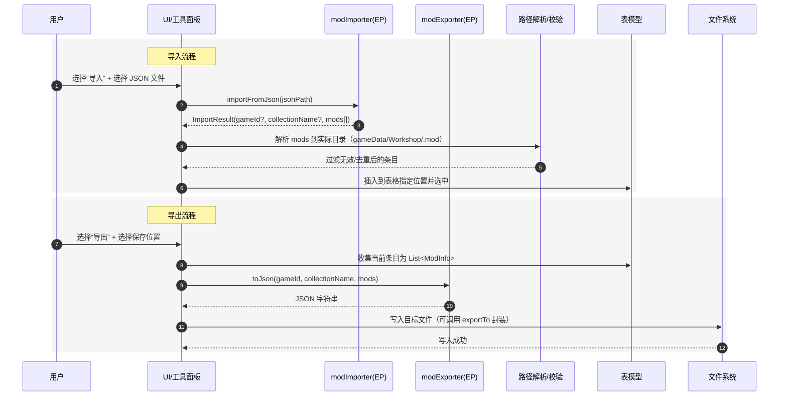
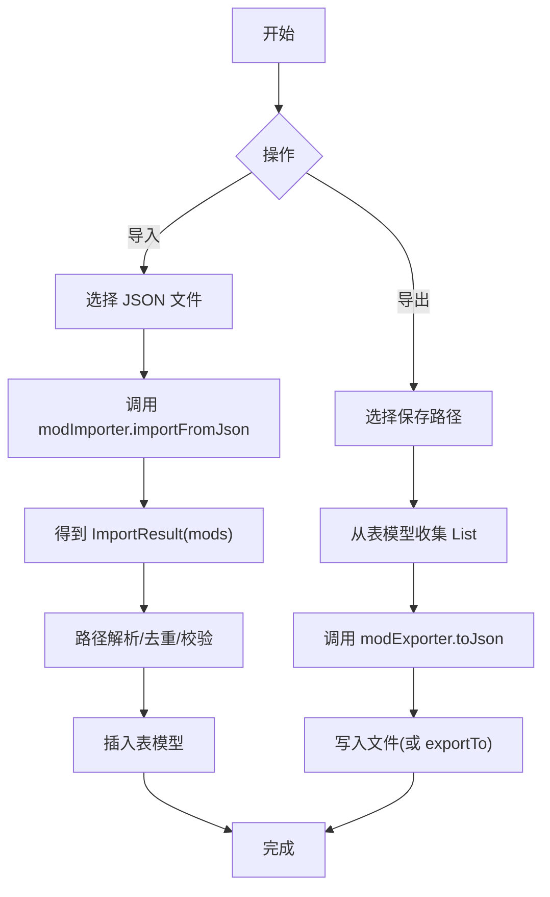

# 笔记：模组导入导出

### 总览

**参考样例文件**

- `references/tools/dlc_load.json`
- `references/tools/playlist.json`

## Paradox Language Support（PLS）

> 项目地址：https://github.com/DragonKnightOfBreeze/Paradox-Language-Support

### 概述

**核心抽象（平台无关）**

- ModImporter：提供 `从 JSON 文件读取 → ImportResult` 的能力。
- ModExporter：提供 `从 (gameId, collectionName, List<ModInfo>) 生成 JSON 字符串` 的能力；可选封装“写入文件”。
- ModInfo：单个模组项的数据结构，包含 name、modDirectory（可空）、remoteId、source（Local/Steam/Paradox）、enabled、version、supportedVersion。
- ImportResult：导入结果的数据结构，包含 gameId（可空）、collectionName（可空）、mods（List<ModInfo>）。

**平台交互**

- 文件选择/保存对话框。
- 基于“游戏数据目录 / Workshop 目录”的路径解析，将 ImportResult 中的条目解析到实际磁盘目录（如根据 steamId 拼接目录，或解析 .mod 描述符）。
- 去重与插入排序（例如保持当前模组在末尾）。
- 成功/失败的用户通知。
- 最终调用两个扩展点（EP）：
- modImporter：接收所选 JSON 文件路径，返回 ImportResult（仅纯数据映射，不做路径解析/去重/磁盘访问）。
- modExporter：接收 (gameId, collectionName, List<ModInfo>)，产出 JSON 字符串（或由 UI 调用其写文件封装）。

**相关代码位置**

- `icu.windea.pls.ep.tools` - EP 与模型类所在的包
- `icu.windea.pls.ep.tools.ParadoxModImporter` - 模组导入器 EP
- `icu.windea.pls.ep.tools.ParadoxModExporter` - 模组导出器 EP
- `icu.windea.pls.lang.ui.tools.ParadoxModDependenciesImportPopup` - 导入模组依赖的弹出窗口 UI 
- `icu.windea.pls.lang.ui.tools.ParadoxModDependenciesExportPopup` - 导出模组依赖的弹出窗口 UI

**时序图**



**流程图**



### 模组导入（平台无关核心逻辑）

<!-- icu.windea.pls.ep.tools.ParadoxModImporter -->
<!-- https://github.com/DragonKnightOfBreeze/Paradox-Language-Support/blob/master/src/main/kotlin/icu/windea/pls/ep/tools/ParadoxModImporter.kt -->

#### GameConfigImporter（dlc_load.json）

<!-- icu.windea.pls.ep.tools.ParadoxDlcLoadImporter -->
<!-- https://github.com/DragonKnightOfBreeze/Paradox-Language-Support/blob/master/src/main/kotlin/icu/windea/pls/ep/tools/ParadoxDlcLoadImporter.kt -->

输入 JSON 示例：

```json
{
  "disabled_dlcs": [],
  "enabled_mods": [
    "mod/ugc_1995601384.mod",
    "mod/ugc_727000451.mod",
    "mod/Utopian-Universe.mod"
  ]
}
```

处理流程：

- 解析 JSON，遍历 `enabled_mods`：
  - 设 `name = 原始条目字符串`，`enabled = true`，`modDirectory = null`。
  - 若条目（文件名或路径）匹配 `ugc_(\d+)\.mod`：标记 `source = Steam`、`remoteId = 捕获的数字`；否则 `source = Local`、`remoteId = null`。
- 输出 ImportResult：`gameId = null`，`collectionName = "Paradox"`，`mods = List<ModInfo>`。

#### LauncherJsonV3Importer（playlist.json）

<!-- icu.windea.pls.ep.tools.ParadoxLauncherJsonV3Importer -->
<!-- https://github.com/DragonKnightOfBreeze/Paradox-Language-Support/blob/master/src/main/kotlin/icu/windea/pls/ep/tools/ParadoxLauncherJsonV3Importer.kt -->

输入 JSON 示例：

```json
{
  "game": "stellaris",
  "name": "Real universe",
  "mods": [
    { "displayName": "More Events Mod", "enabled": true,  "position": 1,  "steamId": "727000451" },
    { "displayName": "Some Paradox Mod", "enabled": true,  "position": 2,  "pdxId":   "123456"    },
    { "displayName": "Local Only",       "enabled": false, "position": 10 }
  ]
}
```

处理流程：

- 解析 JSON，按 `position` 升序遍历 `mods`，逐条映射：
  - 设 `name = displayName`，`enabled = enabled`，`modDirectory = null`。
  - 若含 `steamId`：`source = Steam`、`remoteId = steamId`；否则若含 `pdxId`：`source = Paradox`、`remoteId = pdxId`；否则 `source = Local`、`remoteId = null`。
- 输出 ImportResult：`gameId = game`，`collectionName = name`，`mods = List<ModInfo>`。

共同特性：

- ModImporter 不执行路径解析、不做去重、不访问磁盘目录结构；仅负责 JSON → ImportResult 的纯数据映射。

### 模组导出（平台无关核心逻辑）

<!-- icu.windea.pls.ep.tools.ParadoxModExporter -->
<!-- https://github.com/DragonKnightOfBreeze/Paradox-Language-Support/blob/master/src/main/kotlin/icu/windea/pls/ep/tools/ParadoxModExporter.kt -->

#### LauncherJsonV2Exporter（< 2021.10）

<!-- icu.windea.pls.ep.tools.ParadoxLauncherJsonV2Exporter -->
<!-- https://github.com/DragonKnightOfBreeze/Paradox-Language-Support/blob/master/src/main/kotlin/icu/windea/pls/ep/tools/ParadoxLauncherJsonV2Exporter.kt -->

- 输入：`gameId`、`collectionName`、`mods: List<ModInfo>`。
- 过滤：仅导出 `source != Local` 的条目。
- 映射：
  - `displayName = ModInfo.name.orEmpty()`；`enabled = ModInfo.enabled`；
  - `steamId` 当 `source == Steam` 时取 `remoteId`；`pdxId` 当 `source == Paradox` 时取 `remoteId`；
  - `position = (index + 1 + 4096)` 转十六进制字符串，宽度 10（例如首个条目 `0000001001`）。

输出 JSON 示例：

```json
{
  "game": "stellaris",
  "name": "Real universe",
  "mods": [
    { "displayName": "More Events Mod", "enabled": true,  "position": "0000001001", "steamId": "727000451" },
    { "displayName": "Some Paradox Mod", "enabled": true,  "position": "0000001002", "pdxId":   "123456"    }
  ]
}
```

#### LauncherJsonV3Exporter（≥ 2021.10）

<!-- icu.windea.pls.ep.tools.ParadoxLauncherJsonV3Exporter -->
<!-- https://github.com/DragonKnightOfBreeze/Paradox-Language-Support/blob/master/src/main/kotlin/icu/windea/pls/ep/tools/ParadoxLauncherJsonV3Exporter.kt -->

- 输入与过滤同上（仅导出 `source != Local`）。
- `position = index`（从 0 开始的整数）。

输出 JSON 示例：

```json
{
  "game": "stellaris",
  "name": "Real universe",
  "mods": [
    { "displayName": "More Events Mod", "enabled": true,  "position": 1,  "steamId": "727000451" },
    { "displayName": "Some Paradox Mod", "enabled": true,  "position": 2,  "pdxId":   "123456"    }
  ]
}
```

共同特性：

- ModExporter 只负责 `ModInfo` → JSON 的映射与序列化；不决定保存路径、不过问 UI；若提供写文件能力，也应仅作为简单封装。
- 
## Irony Mod Manager（IMM）

> 项目地址：https://github.com/bcssov/IronyModManager

### 概述

- **核心抽象（平台无关）**
  - ModImporter：从多种外部来源读取模组集合，输出 ImportResult。
  - ModExporter：根据 (gameId, collectionName, List<ModInfo>) 生成启动器可识别的 JSON.
- **支持的导入来源**
  - 游戏配置 JSON：`dlc_load.json`（字符串列表）与 `content_load.json`（对象列表，含 Path）。
  - 启动器播放列表 JSON：V2（position 为十六进制字符串，宽度 10）与 V3（position 为整数）。
  - 启动器数据库 SQLite：自动探测版本（例如 v2/v4/v5），读取“当前激活的集合（playset）”与其条目。
- **通用处理要点**
  - 仅采纳 `enabled = true` 的条目，按 `position` 升序保持顺序一致。
  - 识别远端 ID：若存在 `steamId`/`pdxId`（JSON）或数据库字段，对应填充 ModInfo.remoteId 与 ModInfo.source.
  - 输出形态可以是“描述符名称列表”（Descriptors）或“完整路径列表”（FullPaths），取决于调用方期望的模式.

**相关代码位置**

- Importers 目录（JSON/SQLite）：https://github.com/bcssov/IronyModManager/tree/master/src/IronyModManager.IO/Mods/Importers
- Exporter 目录（V2/V3）：https://github.com/bcssov/IronyModManager/tree/master/src/IronyModManager.IO/Mods/Exporter
- 关键文件：
  - ParadoxImporter（dlc_load/content_load）：https://github.com/bcssov/IronyModManager/blob/master/src/IronyModManager.IO/Mods/Importers/ParadoxImporter.cs
  - ParadoxLauncherImporter（JSON/SQLite）：https://github.com/bcssov/IronyModManager/blob/master/src/IronyModManager.IO/Mods/Importers/ParadoxLauncherImporter.cs
  - ParadoxLauncherExporter（V2）：https://github.com/bcssov/IronyModManager/blob/master/src/IronyModManager.IO/Mods/Exporter/ParadoxLauncherExporter.cs
  - ParadoxLauncherExporter202110（V3）：https://github.com/bcssov/IronyModManager/blob/master/src/IronyModManager.IO/Mods/Exporter/ParadoxLauncherExporter202110.cs
  - JsonExporter（dlc_load/content_load）：https://github.com/bcssov/IronyModManager/blob/master/src/IronyModManager.IO/Mods/Exporter/JsonExporter.cs
  - SQLiteExporter（SQLite 导出）：https://github.com/bcssov/IronyModManager/blob/master/src/IronyModManager.IO/Mods/Exporter/SQLiteExporter.cs

### 模组导入（核心逻辑）

<!-- 接口/实现（IMM） fqName: IronyModManager.IO.Mods.Importers.ParadoxImporter / IronyModManager.IO.Mods.Importers.ParadoxLauncherImporter -->
<!-- 源码: https://github.com/bcssov/IronyModManager/tree/master/src/IronyModManager.IO/Mods/Importers -->

#### GameConfigImporter（dlc_load.json）

<!-- 实现 fqName: IronyModManager.IO.Mods.Importers.ParadoxImporter.ImportAsync -->
<!-- 源码: https://github.com/bcssov/IronyModManager/blob/master/src/IronyModManager.IO/Mods/Importers/ParadoxImporter.cs -->

输入示例：

```json
{
  "disabled_dlcs": [],
  "enabled_mods": [
    "mod/ugc_1995601384.mod",
    "mod/ugc_727000451.mod",
    "mod/Utopian-Universe.mod"
  ]
}
```

处理要点：

- 遍历 `enabled_mods`，对每个字符串创建 ModInfo：`name = 原始条目`，`enabled = true`。
- 若文件名或路径包含 `ugc_(\d+)\.mod`，则 `source = Steam`、`remoteId = 捕获到的数字`，否则 `source = Local`、`remoteId = null`。
- 结果集合名固定为类似 "Paradox"，`gameId = null`。
- 输出可作为“描述符名称列表”。

#### GameContentImporter（content_load.json）

<!-- 实现 fqName: IronyModManager.IO.Mods.Importers.ParadoxImporter.ImportAsync -->
<!-- 源码: https://github.com/bcssov/IronyModManager/blob/master/src/IronyModManager.IO/Mods/Importers/ParadoxImporter.cs -->

输入示例：

```json
{
  "disabled_dlcs": [],
  "enabled_mods": [
    { "Path": "D:/Mods/ExampleA" },
    { "Path": "D:/Mods/ExampleB" }
  ]
}
```

处理要点：

- 遍历对象数组，读取 `Path` 填入 ModInfo 的 `modDirectory`，`enabled = true`。
- 输出可作为“完整路径列表”。

#### LauncherJsonV2Importer（playlist.json, V2）

<!-- 实现 fqName: IronyModManager.IO.Mods.Importers.ParadoxLauncherImporter.JsonImportAsync (parseV2) -->
<!-- 源码: https://github.com/bcssov/IronyModManager/blob/master/src/IronyModManager.IO/Mods/Importers/ParadoxLauncherImporter.cs -->

输入示例（position 为十六进制字符串，宽度 10）：

```json
{
  "game": "stellaris",
  "name": "My Collection",
  "mods": [
    { "displayName": "A", "enabled": true, "position": "0000001001", "steamId": "727000451" },
    { "displayName": "B", "enabled": true, "position": "0000001002", "pdxId": "123456" }
  ]
}
```

处理要点：

- 验证 `game/name` 存在，`mods` 仅取 `enabled = true`，按 `position`（十六进制字符串）排序。
- 将 `steamId/pdxId` 转为数值远端 ID；无则标记为本地源。
- 输出 ImportResult：`gameId = game`，`collectionName = name`，`mods = List<ModInfo>`。

#### LauncherJsonV3Importer（playlist.json, V3）

<!-- 实现 fqName: IronyModManager.IO.Mods.Importers.ParadoxLauncherImporter.JsonImportAsync (parseV3) -->
<!-- 源码: https://github.com/bcssov/IronyModManager/blob/master/src/IronyModManager.IO/Mods/Importers/ParadoxLauncherImporter.cs -->

输入示例（position 为整数）：

```json
{
  "game": "stellaris",
  "name": "Real universe",
  "mods": [
    { "displayName": "More Events Mod", "enabled": true, "position": 1, "steamId": "727000451" },
    { "displayName": "Some Paradox Mod", "enabled": true, "position": 2, "pdxId": "123456" },
    { "displayName": "Local Only", "enabled": false, "position": 10 }
  ]
}
```

处理要点：

- 验证 `game/name`，仅取启用条目，按 `position` 升序。
- 解析 `steamId/pdxId` 为远端 ID；否则标记本地。
- 输出 ImportResult 同上。

#### LauncherDbImporter（SQLite 数据库）

<!-- 实现 fqName: IronyModManager.IO.Mods.Importers.ParadoxLauncherImporter.DatabaseImportAsync / DatabaseImportv2Async / DatabaseImportv3Async / DatabaseImportv4Async -->
<!-- 源码: https://github.com/bcssov/IronyModManager/blob/master/src/IronyModManager.IO/Mods/Importers/ParadoxLauncherImporter.cs -->

处理要点（面向不同版本的数据库结构，如 v2/v4/v5）：

- 打开启动器的 SQLite 数据库（例如与用户“游戏数据目录”同级的 `launcher-v2.sqlite`）。
- 检测数据库版本（例如通过迁移表/版本标识），据此选择相应的查询模型。
- 查询“当前激活的集合（playset）”，从集合-模组关联表中过滤 `enabled = true` 的记录，按 `position` 排序.
- 关联模组表获取 `displayName/dirPath/gameRegistryId` 等字段.
- 根据调用方期望：
  - 描述符模式：输出“描述符名称列表”（如 `gameRegistryId`）。
  - 路径模式：输出“完整路径列表”（如 `dirPath`）。
- 同时可返回 `modNames`（显示名列表）与集合名.

SQL 结构参考（仅列出涉及字段，示例 DDL）：

```sql
-- v2
CREATE TABLE Playsets (
  Id INTEGER PRIMARY KEY,
  Name TEXT,
  IsActive INTEGER
);
CREATE TABLE PlaysetsMods (
  PlaysetId INTEGER,
  ModId INTEGER,
  Position INTEGER,
  Enabled INTEGER
);
CREATE TABLE Mods (
  Id INTEGER PRIMARY KEY,
  GameRegistryId TEXT,
  DirPath TEXT,
  DisplayName TEXT
);

-- v4（表名/结构与 v2 类似，字段同名）
-- v5 使用 v4.Playsets(+PlaysetsMods) 与 v5.Mods（字段同名：Id, GameRegistryId, DirPath, DisplayName）
```

#### ParadoxosImporter（Paradoxos XML/JSON）

<!-- 实现 fqName: IronyModManager.IO.Mods.Importers.ParadoxosImporter.ImportAsync -->
<!-- 源码: https://github.com/bcssov/IronyModManager/blob/master/src/IronyModManager.IO/Mods/Importers/ParadoxosImporter.cs -->

- 输入：Paradoxos Mod Manager 导出的 XML 或 JSON 文件。
- 处理要点：
  - 根据文件扩展名优先尝试对应解析；若无法判断，则依次尝试 XML 与 JSON 两种格式。
  - 集合名取自导出模型的 `ExportedList.Name`。
  - 排序策略：若 `CustomOrder = true`，按 `Order` 值降序；否则按 `ModName` 降序。
  - 产出 `Descriptors` 列表：若 `FileName` 未以 `mod/` 开头，则标准化为 `mod/{FileName}`；同时产出 `ModNames`。

#### LauncherDbImporterBeta（SQLite Beta）

<!-- 实现 fqName: IronyModManager.IO.Mods.Importers.ParadoxLauncherImporterBeta -->
<!-- 源码: https://github.com/bcssov/IronyModManager/blob/master/src/IronyModManager.IO/Mods/Importers/ParadoxLauncherImporterBeta.cs -->

- 特性：仅支持从 Beta 频道的启动器 SQLite 数据库导入；JSON 导入不支持（直接抛出 NotSupportedException）。
- 数据库路径：覆盖 `GetDbPath` 使用 `Constants.Sql_db_beta_path`；其余数据库读取逻辑继承自标准 `ParadoxLauncherImporter`。

### 模组导出（核心逻辑）

<!-- 接口/实现（IMM） fqName: IronyModManager.IO.Mods.Exporter.ParadoxLauncherExporter / IronyModManager.IO.Mods.Exporter.ParadoxLauncherExporter202110 -->
<!-- 源码: https://github.com/bcssov/IronyModManager/tree/master/src/IronyModManager.IO/Mods/Exporter -->

#### BaseExporter（通用映射）

<!-- 实现 fqName: IronyModManager.IO.Mods.Exporter.BaseExporter -->
<!-- 源码: https://github.com/bcssov/IronyModManager/blob/master/src/IronyModManager.IO/Mods/Exporter/BaseExporter.cs -->

- 统一映射：`MapModData` 填充 `DisplayName/Tags/RequiredVersion/GameRegistryId/Status(ready_to_play)/Source`；并调用 `MapPdxPath` 与 `MapPdxId`。
- 路径映射：若文件名以 `.zip`/`.bin` 结尾，则写入 `ArchivePath`，并在非本地源时推导 `DirPath` 为其所在目录；否则直接写入 `DirPath`。
- ID 映射：当 `Source = Paradox` 写入 `PdxId`，否则（如 Steam）写入 `SteamId`；`MapPdxType` 将源映射为 `pdx/steam/local`。

#### JsonExporter（dlc_load/content_load）

<!-- 实现 fqName: IronyModManager.IO.Mods.Exporter.JsonExporter -->
<!-- 源码: https://github.com/bcssov/IronyModManager/blob/master/src/IronyModManager.IO/Mods/Exporter/JsonExporter.cs -->

- 导出 DLC：`ExportDLCAsync` 将禁用 DLC 写入 `dlc_load.json`（DescriptorMod 模式，保存 DLC 路径）或 `content_load.json`（JsonMetadata 模式，保存 `ParadoxAppId`）。
- 导出模组：`ExportModsAsync`
  - 当 `DescriptorType = JsonMetadata`：写入 `content_load.json` 的 `enabled_mods`（对象数组，字段 `Path`），清空或追加由 `AppendOnly` 控制。
  - 否则：写入 `dlc_load.json` 的 `enabled_mods`（字符串数组，内容为描述符名），并同步 `game_data.json` 的 `modsOrder` 以及 `mod_registry.json`。
  - 同步策略：移除 `Status != ready_to_play` 的注册项；按 `Enabled/Other/TopPriority` 三类分别插入；TopPriority 先移除既有引用再置前。
- 兼容性：自动判断 `content_load.json` 的 V1/V2 结构（是否包含 `enabledUGC` 关键字）；Windows 下使用实际大小写修正 `ResolveContentLoadPath`。
- 写入保障：使用异步锁避免并发写；`WritePdxModelAsync` 创建目录、去除只读并以忽略空值序列化；配合重试策略提升健壮性。

#### SQLiteExporter（SQLite 数据库）

<!-- 实现 fqName: IronyModManager.IO.Mods.Exporter.SQLiteExporter -->
<!-- 源码: https://github.com/bcssov/IronyModManager/blob/master/src/IronyModManager.IO/Mods/Exporter/SQLiteExporter.cs -->

- 版本探测：读取 `KnoxMigrations` 表，按迁移名判断为 v3/v4/v5（默认 v2），据此选择不同版本的表模型与同步流程。
- 数据库准备：若目标库不存在，从内置空库模板复制；打开连接时使用 `EnsureOpen()`；导出过程加全局异步锁。
- 集合重建：`RecreateCollectionV{N}Async` 删除/创建集合（playset），设置集合名（如 `IronyModManager`）与排序类型 `custom`，并激活该集合。
- 模组同步：`SyncModsV{N}Async` 调用 `PrepareModsTransactionV{N}Async` 计算三类变更（Insert/Update/Remove），规则：
  - 可选移除无效模组（`Status != ready_to_play`）。
  - 匹配策略：DescriptorMod 模式基于 `GameRegistryId`，JsonMetadata 模式基于 `DirPath == FileName`（均经目录分隔符标准化）。
  - `MapPdxModV{N}`：不存在则以 `Guid` 生成 `Id` 并映射字段；若为 JsonMetadata 则置空 `GameRegistryId`。
  - 更新集合与模组的关联表（PlaysetsMods）：写入 `PlaysetId/ModId/Position/Enabled` 保序启用。
- Beta 渠道：若开启 `exportBeta`，数据库路径改为 `Constants.Sql_db_beta_path`（其余逻辑一致）。

#### LauncherJsonV2Exporter（< 2021.10）

- 输入：`gameId`、`collectionName`、`mods: List<ModInfo>`.
- 过滤：仅导出 `source != Local` 的条目.
- 字段映射：
  - `displayName = ModInfo.name`；`enabled = true`。
  - `steamId` 当 `source == Steam` 时取 `remoteId`；`pdxId` 当 `source == Paradox` 时取 `remoteId`。
  - `position = (index + 1 + 4096)`，以十六进制字符串格式输出，宽度 10（例如首个条目 `0000001001`）。

输出示例：

```json
{
  "game": "stellaris",
  "name": "My Collection",
  "mods": [
    { "displayName": "A", "enabled": true, "position": "0000001001", "steamId": "727000451" },
    { "displayName": "B", "enabled": true, "position": "0000001002", "pdxId": "123456" }
  ]
}
```

#### LauncherJsonV3Exporter（≥ 2021.10）

- 输入与过滤同上（仅非本地）。
- `position = index`（从 0 开始的整数）。

输出示例：

```json
{
  "game": "stellaris",
  "name": "Real universe",
  "mods": [
    { "displayName": "More Events Mod", "enabled": true, "position": 1, "steamId": "727000451" },
    { "displayName": "Some Paradox Mod", "enabled": true, "position": 2, "pdxId": "123456" }
  ]
}
```

- **共同特性**：导出不包含本地模组；仅做 `ModInfo → JSON` 的字段映射与序列化；保存路径不在此层处理.

## PLS vs IMM 差异对照

- **V2 position 格式**
  - PLS：十六进制字符串，宽度 10（与实现一致）。
  - IMM：十六进制字符串，宽度 10（一致）。
- **JSON 导入策略**
  - PLS：按实现划分不同 Importer（V2/V3 分开）。
  - IMM：同一个导入器内先尝试 V2，再尝试 V3（若两者均失败汇总异常）。
- **SQLite 支持**
  - PLS：暂未实现（计划对齐 IMM：自动探测 v2/v4/v5，读取激活集合并映射字段）。
  - IMM：已实现 v2/v4/v5 的自动探测与查询链路.
- **导入结果形态**
  - PLS：ImportResult（mods 列表，后续在 UI 层做路径解析与去重）。
  - IMM：可输出描述符名称列表或完整路径列表（按调用方期望）。
- **错误处理**
  - PLS：由调用端决定（文档不限定）。
  - IMM：JSON 导入聚合异常（AggregateException），SQLite 导入记录日志后返回空.