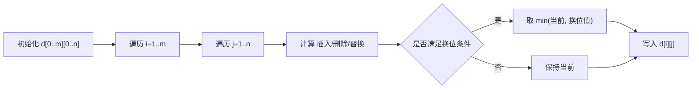

# 学习笔记：算法_相似度

- **主题**：字符串相似度/距离算法综述与实战（含 Damerau–Levenshtein 详解）
- **场景**：IDE 插件中为“无法解析的表达式”提供基于相似度的快速修复与建议
- **目标**：理解常见算法特性，选型与调参，结合 Kotlin 示例快速落地

## 总览

- **距离 vs 相似度**：
  - 距离（distance）越小越相近，典型如编辑距离；相似度（similarity）越大越相近，常通过归一化把距离变成分数。
- **度量性质（metric）**：是否满足非负性、对称性、恒等性、三角不等式。某些算法不是严格度量（如 Jaro/Winkler）。
- **分词/片段**：snake_case、kebab-case、点分段等可作为“结构性提示”，先做前缀/片段过滤，再做细粒度距离计算以控时。

### 常见算法对比

| 算法 | 类型 | 取值范围 | 是否度量 | 时间复杂度 | 适用场景 | 优点 | 局限 |
|---|---|---|---|---|---|---|---|
| Levenshtein | 编辑距离 | [0, max(m,n)] | 是 | O(mn) | 一般错别字、插删改 | 简洁、通用 | 不支持字符换位作为一步 |
| Damerau–Levenshtein (OSA) | 编辑距离 | 同上 | 否（OSA 变体） | O(mn) | 误打邻位交换（ab→ba） | 对交换敏感 | OSA 仅允许一次相邻换位；非完全 Damerau |
| Damerau–Levenshtein (完整) | 编辑距离 | 同上 | 是 | O(mn) | 多次/非相邻换位 | 更接近人类打字 | 实现更复杂，常数更大 |
| Hamming | 编辑距离 | [0, n] | 是 | O(n) | 等长字符串比对 | 极快 | 仅等长；不支持插删 |
| Jaro | 字符匹配比对 | [0,1] | 否 | O(m+n) | 短字符串、人名 | 对调换友好 | 公式相对复杂 |
| Jaro–Winkler | Jaro 增强 | [0,1] | 否 | O(m+n) | 前缀重要的短串 | 奖励共同前缀 | 偏好前缀相同的项 |
| LCS 相似度 | 序列相似度 | [0,1] | 否 | O(mn) | 顺序保留重要 | 捕捉公共子序列 | 对插删改权重不均 |
| Jaccard（n-gram） | 集合相似度 | [0,1] | 否 | 视实现 | 词/字符 n-gram | 简单直观 | 膨胀与噪声敏感 |
| 余弦相似度（TF/IDF） | 向量相似度 | [-1,1] | 否 | 视维度 | 文本语义相似度 | 利用统计权重 | 需建模/权重 |

> 实务建议：在交互式“联想/修复”中，常用“前缀/片段”做快速筛选，再用“编辑距离”做精排，必要时引入 Jaro–Winkler 优先共同前缀。

## Damerau–Levenshtein 详解

- **定义**：在 Levenshtein 的插入/删除/替换三种操作基础上，增加“相邻字符换位（transposition）”。
- **变体**：
  - **OSA (Optimal String Alignment)**：仅允许一次相邻换位，不允许跨越或多次对同对字符换位（更快、更易实现）。
  - **完整 Damerau**：允许多次、非相邻的换位，满足三角不等式，更符合真实打字错误，但实现与常数更重。
- **复杂度**：典型 DP 实现 O(mn) 时间与 O(mn) 空间（可做滚动数组优化）。
- **归一化相似度**：`sim = 1 - dist / max(len(a), len(b))`，范围 [0,1]，越大越相似。
- **边界**：若任何一方为空，`dist = 另一方长度`；完全相同则 `dist = 0`，`sim = 1`。

### DP 关系（OSA 版）

- 设 `d[i][j]` 为 `a[0..i)` 到 `b[0..j)` 的最小代价。
- 递推：
  - 插入：`d[i][j-1] + 1`
  - 删除：`d[i-1][j] + 1`
  - 替换：`d[i-1][j-1] + cost(a[i-1] != b[j-1])`
  - 换位（若 `i>1,j>1` 且 `a[i-1]=b[j-2], a[i-2]=b[j-1]`）：`d[i-2][j-2] + 1`



### 示例（OSA）

- `a = "ca"`, `b = "acb"`
  - 通过一次相邻换位（`c` 与 `a`）+ 插入 `b`，最少 2 步；`dist=2`，`sim = 1 - 2/3 ≈ 0.333`。

## Kotlin 实现示例

### 1) OSA（项目内已使用的变体）

```kotlin
// OSA 变体：允许一次相邻换位（Optimal String Alignment）
fun damerauOsA(a: String, b: String): Int {
    val m = a.length
    val n = b.length
    if (m == 0) return n
    if (n == 0) return m
    val d = Array(m + 1) { IntArray(n + 1) }
    for (i in 0..m) d[i][0] = i
    for (j in 0..n) d[0][j] = j
    for (i in 1..m) {
        for (j in 1..n) {
            val cost = if (a[i - 1] == b[j - 1]) 0 else 1
            var v = minOf(
                d[i - 1][j] + 1,       // 删除
                d[i][j - 1] + 1,       // 插入
                d[i - 1][j - 1] + cost // 替换
            )
            if (i > 1 && j > 1 && a[i - 1] == b[j - 2] && a[i - 2] == b[j - 1]) {
                v = minOf(v, d[i - 2][j - 2] + 1) // 相邻换位
            }
            d[i][j] = v
        }
    }
    return d[m][n]
}

fun normalizedSimilarity(a: String, b: String): Double {
    val dist = damerauOsA(a, b)
    val denom = maxOf(a.length, b.length).coerceAtLeast(1)
    return 1.0 - dist.toDouble() / denom
}
```

### 2) Jaro–Winkler（简化版）

```kotlin
fun jaroWinkler(a: String, b: String, prefixScale: Double = 0.1): Double {
    if (a == b) return 1.0
    val m = maxOf(a.length, b.length)
    val matchDistance = m / 2 - 1
    val aMatches = BooleanArray(a.length)
    val bMatches = BooleanArray(b.length)
    var matches = 0
    var transpositions = 0
    for (i in a.indices) {
        val start = maxOf(0, i - matchDistance)
        val end = minOf(i + matchDistance + 1, b.length)
        for (j in start until end) {
            if (bMatches[j]) continue
            if (a[i] != b[j]) continue
            aMatches[i] = true
            bMatches[j] = true
            matches++
            break
        }
    }
    if (matches == 0) return 0.0
    var k = 0
    for (i in a.indices) if (aMatches[i]) {
        while (!bMatches[k]) k++
        if (a[i] != b[k]) transpositions++
        k++
    }
    val jaro = (matches / a.length.toDouble() + matches / b.length.toDouble() + (matches - transpositions / 2.0) / matches) / 3.0
    var lcp = 0
    val maxPrefix = 4
    while (lcp < minOf(maxPrefix, a.length, b.length) && a[lcp] == b[lcp]) lcp++
    return jaro + lcp * prefixScale * (1 - jaro)
}
```

### 3) 在项目中的落地示例

```kotlin
import icu.windea.pls.core.match.similarity.*

val input = "foo_bar"
val candidates = listOf("foo_bar_a", "foo_a_bar", "a_foo_bar", "fooa", "foo_b", "fob_bar")
val options = SimilarityMatchOptions(
    ignoreCase = true,      // 字符串字面量建议忽略大小写
    typoTopN = 5,
    typoMinScore = 0.6,
    enablePrefixMatch = true,
    enableSnippetMatch = true,
    enableTypoMatch = true
)
val results: List<SimilarityMatchResult> =
    SimilarityMatchService.findBestMatches(input, candidates, options)
// 结果顺序：前缀 → 片段 → 错字；并已去重
```

## 实战建议（选型与调参）

- **三段式管线**：先前缀/片段快速过滤，再错字精排（Top-N + 阈值），保证交互速度。
- **大小写**：字符串字面量通常忽略大小写；布尔/动态引用保持大小写敏感。
- **阈值与 Top-N**：`typoMinScore≈0.6~0.75`、`typoTopN≈3~10`，视候选规模与误报容忍度调整。
- **预过滤**：首字符、长度差（例如 `|len(a)-len(b)| <= 2`）等启发式可显著降本。
- **分词/片段**：snake_case/点分段可作为结构性线索，优先匹配首片段并保序。
- **缓存**：公用候选集的多次查询可按（文件/会话）级缓存，以减少重复计算。

## 可扩展内容

- **更多算法**：
  - 加权 Levenshtein、编辑距离 with 形近/音近权重
  - Monge–Elkan、SoftTFIDF、SimHash/LSH（近似最近邻）
- **数据结构**：BK-Tree、VP-Tree，适合快速最近邻检索（编辑距离度量）
- **索引**：n-gram 倒排索引 + 候选粗召回 + 细排
- **语音编码**：Soundex、Double Metaphone，适用于英文人名/读音相近
- **评测**：Precision/Recall、MRR、nDCG 等检索指标

## 参考链接

- Damerau–Levenshtein（Wikipedia）：https://en.wikipedia.org/wiki/Damerau%E2%80%93Levenshtein_distance
- Levenshtein（Wikipedia）：https://en.wikipedia.org/wiki/Levenshtein_distance
- Jaro–Winkler（Wikipedia）：https://en.wikipedia.org/wiki/Jaro%E2%80%93Winkler_distance
- SimMetrics（Java 库）：https://github.com/Simmetrics/simmetrics
- Apache Commons Text（相似度/距离）：https://commons.apache.org/proper/commons-text/
- BK-Tree（Wikipedia）：https://en.wikipedia.org/wiki/BK-tree
