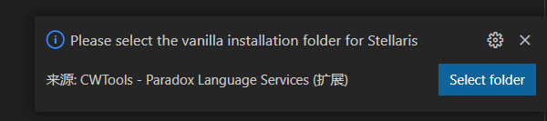
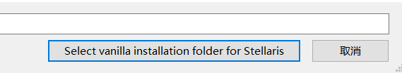
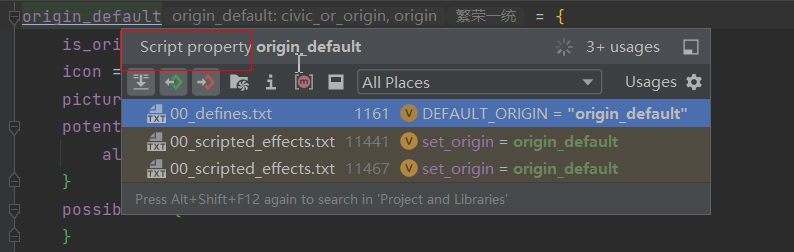

# BUGS

## 0.5 *

* [ ] 将文件中UTF8编码不为32的空格视为语法错误，但允许跳过语法错误继续解析（例：UTF8编码为160的空格）

* [X] 完善本地化文本（localisationText）的解析规则：允许单独的美元符号（`$`）

* [X] 完善本地化文本（localisationText）的解析规则：本地化文本中连续的左方括号会起到转义的效果，之后的方括号中的内容不再视为本地化命令（localisationCommand）

* [X] 完善脚本文件（scriptFile）的解析规则：分隔符之前允许换行

* [ ] 对于脚本颜色（scriptColor），颜色设置应当同步更改到文件中（目前仅限于第一次更改会同步）

* [ ] 对于脚本颜色（scriptColor），颜色设置应该保持颜色类型（`rgb` `hsv`等）

* [X] 是否缺失event namespace的检查，应当仅对于events目录下的脚本文件（scriptFile）生效


* [ ] 当项目中存在模组文件夹（基于`descriptor.mod`）时，应当弹出通知要求玩家选择对应的原版游戏文件夹（参考CwTools）





* [X] BUG：查找引用的对象名不准确



* [X] BUG：当要添加或移除文件的BOM时，没有在物理层面上添加机票移除

* [X] ~~BUG：当进行代码提示时，无法显示对应的快速文档和快速定义~~（测试环境问题或者IDE BUG？）

* [X] BUG：无法解析`trait.species_trait`（定义的子类型识别不准确）

```
types = {
	type[trait] = {
		path = "game/common/traits"

		subtype[leader_trait] = {
			leader_trait = { }
			leader_trait = all
		}
		subtype[ruler_trait] = {
			leader_class = { ruler }
		}
		subtype[scientist_trait] = {
			leader_class = { scientist }
		}
		subtype[species_trait] = {
			## cardinality = 0..1
			leader_trait = no
		}

		localisation = {
			## required
			Name = "$"
			## required
			Description = "$_desc"
		}
	}
}
```