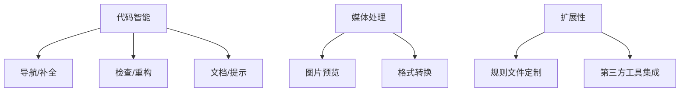

# 探索_1_项目概览

## 基础定位
- IntelliJ 插件专为 Paradox 游戏模组开发设计
- 核心支持：Stellaris（群星），兼容其他 P社游戏

## 核心能力
### 语言支持
- 脚本语言：游戏逻辑编码
- 本地化语言：多语言文本管理
- CSV 语言：结构化数据处理
- CWT 规则语言：游戏规则定义

### 核心功能

## 技术亮点
- **自动目录识别**：智能定位游戏/模组路径
- **多维导航系统**：五位一体跳转模型（声明/类型/规则/本地化/图片）
- **规则驱动架构**：基于 CWT 规则文件实现功能扩展

## 使用场景
1. 模组初始化：`descriptor.mod` 配置
2. 开发阶段：实时代码辅助+检查
3. 调试阶段：层级关系分析

## 演进方向
⚠️ **Stellaris 高级特性**：需要加强复杂语法支持
🌍 **多游戏兼容**：扩展 VIC3/CK3 等游戏深度支持
🤖 **AI 集成**：探索 LLM 在代码生成的应用
