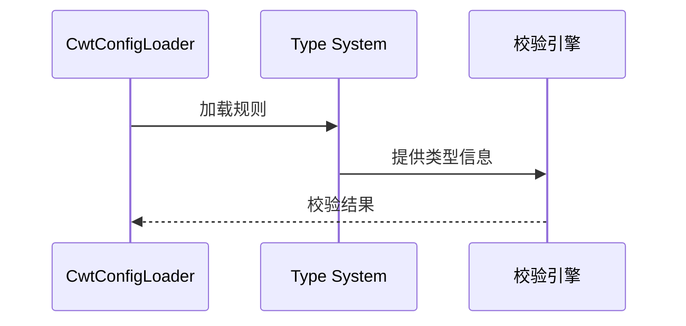

# 探索_3_CWT规则支持

## 语言基础设施
```xml
<fileType name="CWT" fieldName="cwt" .../>
<lang.parserDefinition language="CWT" .../>
<lang.syntaxHighlighterFactory language="CWT" .../>
```
- **完整语言支持**：从文件类型到语法解析

## 智能功能矩阵
| 功能 | 实现类 |
|------|--------|
| 语义注解 | `cwt.annotator` |
| 代码补全 | `cwt.completion.contributor` |
| 引用解析 | `cwt.reference.contributor` |
| 用法查找 | `cwt.findUsagesProvider` |

## 规则处理流程


## 扩展能力
1. **自定义规则**：通过配置文件扩展语法
2. **静态分析**：集成 Tiger 工具
3. **动态求值**：表达式求值引擎

## 优化方向
🧩 **规则热重载**：开发无需重启 IDE 的规则刷新机制
🔗 **跨规则引用**：增强不同规则文件间的引用解析
