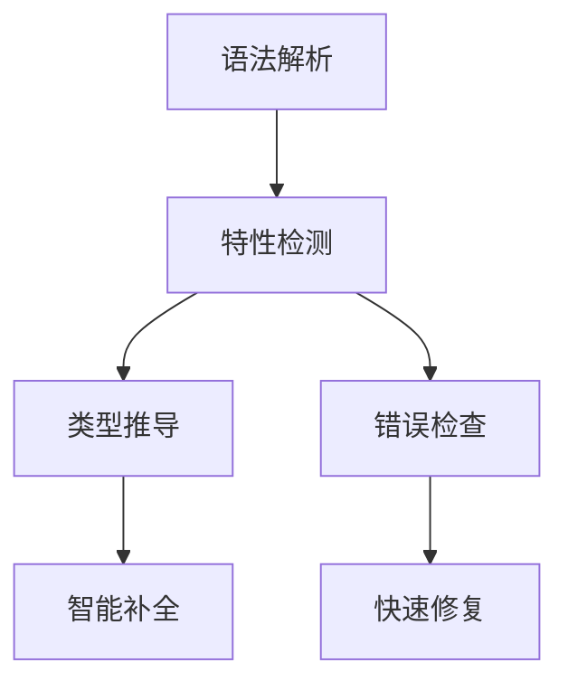

# 探索_8_语言特性支持

## 特性架构

## 核心特性矩阵
| 特性 | 作用域 | 关键接口 |
|------|--------|----------|
| 宏系统 | 文件级 | `MacroExpander` |
| 类型推断 | 表达式级 | `TypeInferenceEngine` |
| 文档生成 | 声明级 | `DocCommentProcessor` |

## 实现策略
1. **增量处理**：
   - 局部语法树更新
   - 轻量级特性重载
2. **隔离设计**：
   - 特性间无状态交互
   - 沙箱式执行环境

## 演进路线
🚀 **特性市场**：建立可插拔特性仓库
🌉 **桥接层**：实现跨语言特性共享机制
