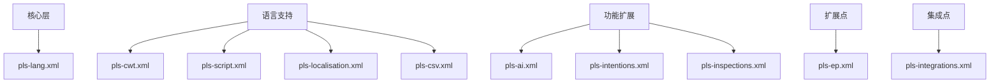

# 探索_2_插件架构

## 核心依赖
| 类型 | 依赖项 | 功能 |
|------|--------|------|
| **必需** | `com.intellij.modules.lang` | IntelliJ 语言基础支持 |
|  | `com.intellij.platform.images` | 图片处理核心 |
| **可选** | `org.intellij.plugins.markdown` | Markdown 支持 |
|  | `com.intellij.diagram` | 图表功能 |
|  | `cn.yiiguxing.plugin.translate` | 翻译集成 |

## 模块化架构

## 关键设计
1. **资源隔离**
   - 多文件配置分离关注点
   - 资源包 `messages.PlsBundle` 实现国际化
2. **动态加载**
   - 可选依赖按需激活
   - 配置分离降低启动开销
3. **扩展机制**
   - `pls-ep.xml` 提供自定义扩展点
   - `pls-integrations.xml` 标准化第三方集成

## 演进建议
🔌 **插件间协作**：加强翻译插件的深度集成
⚡ **按需加载**：优化大型模块的延迟加载机制
