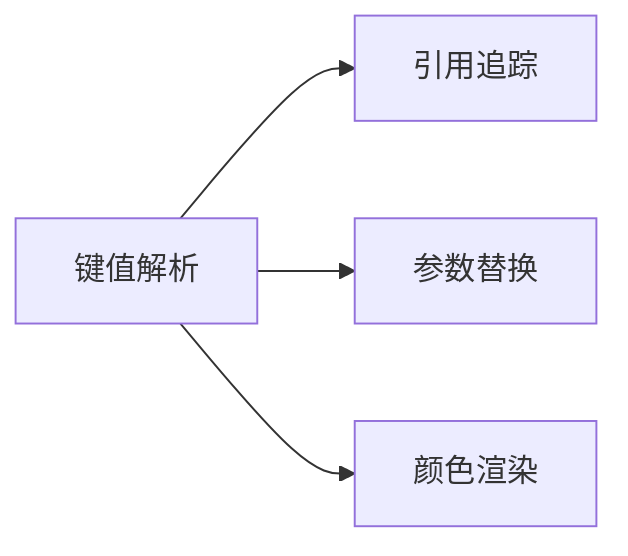

# 探索_5_本地化支持

## 语言基础设施
```xml
<fileType name="Localisation" .../>
<lang.parserDefinition language="Localisation" .../>
```
- 支持 `.yml` 本地化文件

## 核心功能
### 多语言处理


### 编辑器增强
| 功能 | 实现类 |
|------|--------|
| 引号处理 | `localisation.quoteHandler` |
| 代码折叠 | `localisation.foldingBuilder` |
| 注释支持 | `localisation.commenter` |
| 颜色渲染 | `localisation.colorProvider` |

## 高级特性
1. **参数化文本**：
   - 支持 `%s` 等占位符
   - 嵌套参数解析
2. **快速修复**：
   - 缺失键值快速创建
   - 格式错误自动校正
3. **模板系统**：
   - 标准本地化模板
   - 带参数模板

## 演进方向
🌐 **机器翻译集成**：加强翻译插件协作
🎨 **富文本预览**：开发 WYSIWYG 本地化编辑器
