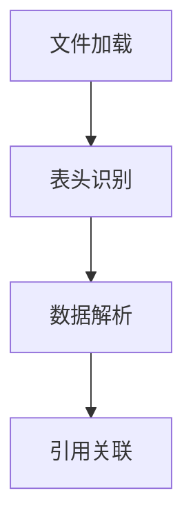

# 探索_6_CSV支持

## 语言基础设施
```xml
<fileType name="CSV" .../>
<lang.parserDefinition language="CSV" .../>
```
- 支持游戏数据表格文件

## 核心功能
### 表格处理


### 智能辅助
| 功能 | 实现类 |
|------|--------|
| 列名补全 | `csv.completion.contributor` |
| 跨表引用 | `csv.reference.contributor` |
| 数据追踪 | `csv.findUsagesProvider` |
| 格式修复 | `csv.errorQuickFixProvider` |

## 高级特性
1. **结构感知**：
   - 自动识别表头与数据列
   - 引号包裹字段解析
2. **数据关联**：
   - 关联游戏脚本实体
   - 跨文件数据引用
3. **验证引擎**：
   - 列数一致性检查
   - 数据类型推断

## 演进方向
📊 **可视化编辑器**：开发表格数据预览器
🔗 **双向同步**：实现与脚本数据的实时同步
