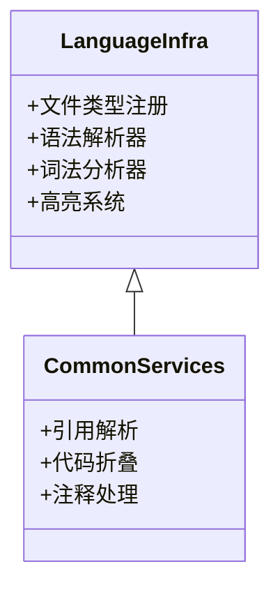

# 探索_7_语言基础

## 核心架构

## 关键组件
| 功能 | 描述 |
|------|------|
| 元素操作器 | 提供跨语言文本编辑支持 |
| 结构视图 | 统一文件结构展示框架 |
| 导航栏 | 语言无关的快速导航 |

## 设计理念
1. **可扩展架构**：
   - 插件式语言支持
   - 服务接口标准化
2. **复用优先**：
   - 公共组件跨语言共享
   - 基础功能统一实现

## 演进方向
🧩 **语言适配器**：开发快速接入新语言的框架
🔌 **服务扩展点**：增强跨语言服务扩展能力
